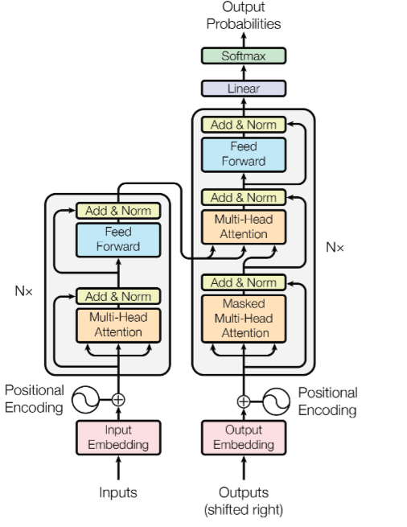

# Attention is all you need

#### Encoder :

Why we use this Encoder? 

Tesign the things : 

# 

## Input

$$
X \in \mathbb{R}^{n \times d_{\text{model}}}
$$

## Query, Key, Value

$$
Q = XW_Q
$$

$$
K = XW_K
$$

$$
V = XW_V
$$

## Scaled Dot-Product Attention

$$
\operatorname{Attention}(Q,K,V)
=
\operatorname{softmax}
\left(
\frac{QK^T}{\sqrt{d_k}}
\right)V
$$

## Attention Scores

$$
S = \frac{QK^T}{\sqrt{d_k}}
$$

## Attention Weights

$$
A = \operatorname{softmax}(S)
$$

## Attention Output

$$
Z = AV
$$

Therefore:

$$
\boxed{
Z =
\operatorname{softmax}
\left(
\frac{QK^T}{\sqrt{d_k}}
\right)V
}
$$

## Multi-Head Attention

$$
head_i =
\operatorname{Attention}
(QW_Q^{(i)},KW_K^{(i)},VW_V^{(i)})
$$

$$
\operatorname{MHA}(Q,K,V)
=
\operatorname{Concat}
(head_1,\ldots,head_h)W_O
$$

## Causal Masking

$$
M_{ij}
=
\begin{cases}
0, & j \leq i \\
-\infty, & j > i
\end{cases}
$$

$$
A =
\operatorname{softmax}
\left(
\frac{QK^T}{\sqrt{d_k}} + M
\right)
$$

## Positional Encoding

$$
PE_{(pos,2i)}
=
\sin
\left(
\frac{pos}{10000^{2i/d_{\text{model}}}}
\right)
$$

$$
PE_{(pos,2i+1)}
=
\cos
\left(
\frac{pos}{10000^{2i/d_{\text{model}}}}
\right)
$$

## Transformer Feed-Forward Network

$$
FFN(x)
=
\sigma(xW_1+b_1)W_2+b_2
$$

For SwiGLU:

$$
SwiGLU(x)
=
\operatorname{SiLU}(xW_g)
\odot
(xW_u)
$$

$$
FFN(x)
=
SwiGLU(x)W_d
$$

## Residual Connection

$$
x' = x + F(x)
$$

## Layer Normalization

$$
\operatorname{LayerNorm}(x)
=
\gamma
\frac{x-\mu}{\sqrt{\sigma^2+\epsilon}}
+\beta
$$

## RMSNorm

$$
\operatorname{RMSNorm}(x)
=
\gamma
\frac{x}
{\sqrt{
\frac{1}{d}
\sum_{i=1}^{d}x_i^2+\epsilon
}}
$$

## Transformer Block

$$
x' = x + \operatorname{Attention}(\operatorname{Norm}(x))
$$

$$
y = x' + FFN(\operatorname{Norm}(x'))
$$

## Language Model Output

$$
H = \operatorname{Transformer}(X)
$$

$$
z = HW_{\text{vocab}}
$$

$$
P(\text{token}\mid X)
=
\operatorname{softmax}(z)
$$

## Cross Entropy Loss

$$
\mathcal{L}
=
-\sum_{t=1}^{T}
\log P(y_t\mid y_{<t},x)
$$

## Autoregressive Generation

$$
P(x_1,\ldots,x_T)
=
\prod_{t=1}^{T}
P(x_t\mid x_{<t})
$$

![[svgviewer-output.svg|191]]