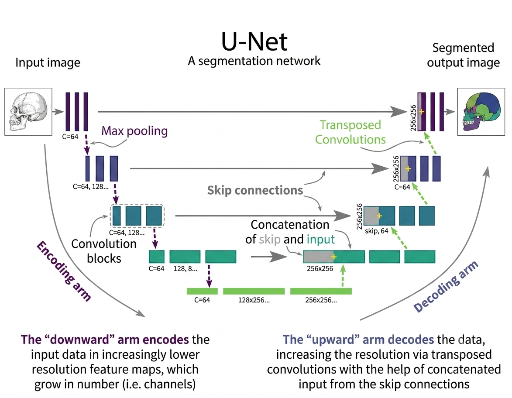

U-Net is a **CNN architecture for image segmentation**, where the goal is to classify every pixel of an image. It is widely used in **medical imaging** and works well with relatively small labeled datasets.


## How U-Net Works?


U-Net performs segmentation by first understanding **what is present** in the image and then recovering **where those features are located**.

1. **Input Image** → The image is given to the network, usually as an RGB or grayscale image.

2. **Encoder — Feature Extraction** → Convolutional layers extract features such as edges, textures, shapes, and eventually higher-level objects. Max pooling reduces the spatial size while increasing the number of feature channels.

3. **Bottleneck — High-Level Representation** → At the deepest layer, the image has the smallest spatial resolution but contains highly abstract semantic information. This represents the most important features learned by the network.

4. **Decoder — Reconstruction** → The decoder uses upsampling to gradually increase the spatial resolution and reconstruct the segmentation at a finer level.

5. **Skip Connections — Preserve Details** → Features from the encoder are passed directly to corresponding decoder layers and concatenated with them. This restores spatial details lost during pooling, helping the model accurately identify object boundaries.

6. **Final Prediction** → A $1\times1$ convolution converts the final feature maps into pixel-level class predictions.

For binary segmentation:

$$
H \times W \times C \rightarrow H \times W \times 1
$$

For multi-class segmentation:

$$
H \times W \times C \rightarrow H \times W \times K
$$

where $K$ is the number of classes.

> **In simple terms:** The encoder learns **what is in the image**, the bottleneck captures the most important features, and the decoder determines **where those features belong**, while skip connections preserve the details needed for accurate segmentation.

## Architecture

U-Net has three main parts:

- **Encoder (Contracting Path)**
- **Bottleneck**
- **Decoder (Expansive Path)**

### 1. Encoder

The encoder extracts features while reducing spatial resolution.

```text
3×3 Conv → ReLU
3×3 Conv → ReLU
2×2 Max Pool

```

As the network gets deeper:

- Spatial dimensions ↓
- Feature channels ↑
- Features become more abstract

The encoder learns **what is present** in the image.

### 2. Bottleneck

The deepest part contains the most compressed and abstract representation.

```
3×3 Conv → ReLU
3×3 Conv → ReLU
```

### 3. Decoder

The decoder gradually restores spatial resolution.

```
Upsampling
    ↓
Skip Connection
    ↓
Concatenation
    ↓
3×3 Conv → ReLU
3×3 Conv → ReLU
```

The decoder learns **where the features are located**.

## Skip Connections

U-Net's key feature is the **skip connection**.

Encoder features are directly passed to the corresponding decoder layers.

```
Encoder ─────────────→ Decoder
   ↓                      ↑
Pooling                Upsampling
```

Pooling removes spatial details, while skip connections restore these fine-grained features.

They help preserve:

- Object boundaries
- Spatial information
- Fine details
- Precise localization

## How U-Net Works

```
Input Image
     ↓
   Encoder
     ↓
Downsampling
     ↓
 Bottleneck
     ↓
 Upsampling
     ↑
Skip Connections
     ↓
   Decoder
     ↓
  1×1 Conv
     ↓
Segmentation Map
```

The network first **compresses** the image to learn semantic features and then **expands** it to produce pixel-level predictions.

## Final Prediction

A **1×1 convolution** converts decoder feature maps into class predictions.

For binary segmentation:

H×W×C→H×W×1H \times W \times C \rightarrow H \times W \times 1

For multi-class segmentation:

H×W×C→H×W×KH \times W \times C \rightarrow H \times W \times K

where $K$ is the number of classes.

Each pixel is assigned a class such as:

```
Background
Tumor
Organ
Road
Person
```

## Original U-Net

The original U-Net used a **572×572 input** and produced a **388×388 output** because it used valid convolutions without padding.

Modern implementations commonly use padding, allowing:

Input Size=Output SizeInput\ Size = Output\ Size


## Implementation 

```python
import torch
import torch.nn as nn
import torch.nn.functional as F
from typing import List, Tuple, Optional

# ============================================
# Double Convolution Block
# ============================================

class DoubleConv(nn.Module):
    """
    Double Convolution Block: (Conv -> BN -> ReLU) x 2
    
    Args:
        in_channels: Input channels
        out_channels: Output channels
        mid_channels: Middle channels (optional)
        dropout: Dropout rate
    """
    
    def __init__(
        self,
        in_channels: int,
        out_channels: int,
        mid_channels: Optional[int] = None,
        dropout: float = 0.0
    ):
        super().__init__()
        
        if mid_channels is None:
            mid_channels = out_channels
            
        self.double_conv = nn.Sequential(
            nn.Conv2d(in_channels, mid_channels, kernel_size=3, padding=1, bias=False),
            nn.BatchNorm2d(mid_channels),
            nn.ReLU(inplace=True),
            nn.Dropout2d(dropout),
            nn.Conv2d(mid_channels, out_channels, kernel_size=3, padding=1, bias=False),
            nn.BatchNorm2d(out_channels),
            nn.ReLU(inplace=True),
            nn.Dropout2d(dropout),
        )
    
    def forward(self, x):
        return self.double_conv(x)


# ============================================
# Downsampling Block
# ============================================

class Down(nn.Module):
    """
    Downsampling Block: MaxPool -> DoubleConv
    
    Args:
        in_channels: Input channels
        out_channels: Output channels
        dropout: Dropout rate
    """
    
    def __init__(self, in_channels: int, out_channels: int, dropout: float = 0.0):
        super().__init__()
        self.maxpool_conv = nn.Sequential(
            nn.MaxPool2d(2),
            DoubleConv(in_channels, out_channels, dropout=dropout)
        )
    
    def forward(self, x):
        return self.maxpool_conv(x)


# ============================================
# Upsampling Block
# ============================================

class Up(nn.Module):
    """
    Upsampling Block: Upsample -> DoubleConv with skip connection
    
    Args:
        in_channels: Input channels
        out_channels: Output channels
        bilinear: Use bilinear interpolation or transpose convolution
        dropout: Dropout rate
    """
    
    def __init__(
        self,
        in_channels: int,
        out_channels: int,
        bilinear: bool = True,
        dropout: float = 0.0
    ):
        super().__init__()
        
        if bilinear:
            self.up = nn.Upsample(scale_factor=2, mode='bilinear', align_corners=True)
            self.conv = DoubleConv(in_channels, out_channels, dropout=dropout)
        else:
            self.up = nn.ConvTranspose2d(
                in_channels // 2,
                in_channels // 2,
                kernel_size=2,
                stride=2
            )
            self.conv = DoubleConv(in_channels, out_channels, dropout=dropout)
    
    def forward(self, x1, x2):
        x1 = self.up(x1)
        
        # Handle different spatial dimensions
        diff_y = x2.size()[2] - x1.size()[2]
        diff_x = x2.size()[3] - x1.size()[3]
        
        x1 = F.pad(x1, [
            diff_x // 2,
            diff_x - diff_x // 2,
            diff_y // 2,
            diff_y - diff_y // 2,
        ])
        
        # Concatenate skip connection
        x = torch.cat([x2, x1], dim=1)
        return self.conv(x)


# ============================================
# Out Convolution (Final Layer)
# ============================================

class OutConv(nn.Module):
    """
    Output Convolution: 1x1 conv to produce final segmentation map
    
    Args:
        in_channels: Input channels
        out_channels: Number of classes
    """
    
    def __init__(self, in_channels: int, out_channels: int):
        super().__init__()
        self.conv = nn.Conv2d(in_channels, out_channels, kernel_size=1)
    
    def forward(self, x):
        return self.conv(x)


# ============================================
# U-Net Architecture
# ============================================

class UNet(nn.Module):
    """
    U-Net: Convolutional Networks for Biomedical Image Segmentation
    
    Args:
        n_channels: Number of input channels
        n_classes: Number of output classes
        features: List of feature maps at each level
        bilinear: Use bilinear interpolation instead of transpose conv
        dropout: Dropout rate (applied after each conv block)
        deep_supervision: Enable deep supervision (multi-scale outputs)
    """
    
    def __init__(
        self,
        n_channels: int = 3,
        n_classes: int = 1,
        features: List[int] = [64, 128, 256, 512, 1024],
        bilinear: bool = True,
        dropout: float = 0.0,
        deep_supervision: bool = False,
    ):
        super().__init__()
        
        self.n_channels = n_channels
        self.n_classes = n_classes
        self.bilinear = bilinear
        self.deep_supervision = deep_supervision
        
        # Encoder (Downsampling Path)
        self.inc = DoubleConv(n_channels, features[0], dropout=dropout)
        self.down1 = Down(features[0], features[1], dropout=dropout)
        self.down2 = Down(features[1], features[2], dropout=dropout)
        self.down3 = Down(features[2], features[3], dropout=dropout)
        
        factor = 2 if bilinear else 1
        self.down4 = Down(features[3], features[4] // factor, dropout=dropout)
        
        # Decoder (Upsampling Path)
        self.up1 = Up(
            features[4], features[3] // factor,
            bilinear=bilinear, dropout=dropout
        )
        self.up2 = Up(
            features[3], features[2] // factor,
            bilinear=bilinear, dropout=dropout
        )
        self.up3 = Up(
            features[2], features[1] // factor,
            bilinear=bilinear, dropout=dropout
        )
        self.up4 = Up(
            features[1], features[0],
            bilinear=bilinear, dropout=dropout
        )
        
        # Output
        self.outc = OutConv(features[0], n_classes)
        
        # Deep supervision outputs (optional)
        if deep_supervision:
            self.out1 = OutConv(features[3] // factor, n_classes)
            self.out2 = OutConv(features[2] // factor, n_classes)
            self.out3 = OutConv(features[1] // factor, n_classes)
    
    def forward(self, x):
        # Encoder
        x1 = self.inc(x)          # 1st level
        x2 = self.down1(x1)       # 2nd level
        x3 = self.down2(x2)       # 3rd level
        x4 = self.down3(x3)       # 4th level
        x5 = self.down4(x4)       # Bottleneck
        
        # Decoder
        x = self.up1(x5, x4)
        if self.deep_supervision:
            d1 = self.out1(x)
        
        x = self.up2(x, x3)
        if self.deep_supervision:
            d2 = self.out2(x)
        
        x = self.up3(x, x2)
        if self.deep_supervision:
            d3 = self.out3(x)
        
        x = self.up4(x, x1)
        x = self.outc(x)
        
        if self.deep_supervision:
            return x, d1, d2, d3
        
        return x


# ============================================
# U-Net with Attention Gates
# ============================================

class AttentionGate(nn.Module):
    """
    Attention Gate for U-Net
    
    Args:
        F_g: Number of gating channels
        F_l: Number of local channels
        F_int: Number of intermediate channels
    """
    
    def __init__(self, F_g: int, F_l: int, F_int: int):
        super().__init__()
        
        self.W_g = nn.Sequential(
            nn.Conv2d(F_g, F_int, kernel_size=1, stride=1, padding=0, bias=True),
            nn.BatchNorm2d(F_int)
        )
        
        self.W_x = nn.Sequential(
            nn.Conv2d(F_l, F_int, kernel_size=1, stride=1, padding=0, bias=True),
            nn.BatchNorm2d(F_int)
        )
        
        self.psi = nn.Sequential(
            nn.Conv2d(F_int, 1, kernel_size=1, stride=1, padding=0, bias=True),
            nn.BatchNorm2d(1),
            nn.Sigmoid()
        )
        
        self.relu = nn.ReLU(inplace=True)
    
    def forward(self, g, x):
        g1 = self.W_g(g)
        x1 = self.W_x(x)
        psi = self.relu(g1 + x1)
        psi = self.psi(psi)
        return x * psi


class AttentionUp(nn.Module):
    """Upsampling block with Attention Gate"""
    
    def __init__(
        self,
        in_channels: int,
        out_channels: int,
        bilinear: bool = True,
        dropout: float = 0.0
    ):
        super().__init__()
        
        if bilinear:
            self.up = nn.Upsample(scale_factor=2, mode='bilinear', align_corners=True)
        else:
            self.up = nn.ConvTranspose2d(
                in_channels // 2,
                in_channels // 2,
                kernel_size=2,
                stride=2
            )
        
        self.attn = AttentionGate(
            F_g=in_channels // 2,
            F_l=in_channels // 2,
            F_int=in_channels // 4
        )
        
        self.conv = DoubleConv(in_channels, out_channels, dropout=dropout)
    
    def forward(self, x1, x2):
        x1 = self.up(x1)
        
        # Apply attention
        x2 = self.attn(g=x1, x=x2)
        
        # Concatenate
        x = torch.cat([x2, x1], dim=1)
        return self.conv(x)


class AttentionUNet(nn.Module):
    """U-Net with Attention Gates (Attention U-Net)"""
    
    def __init__(
        self,
        n_channels: int = 3,
        n_classes: int = 1,
        features: List[int] = [64, 128, 256, 512, 1024],
        bilinear: bool = True,
        dropout: float = 0.0,
    ):
        super().__init__()
        
        # Encoder
        self.inc = DoubleConv(n_channels, features[0], dropout=dropout)
        self.down1 = Down(features[0], features[1], dropout=dropout)
        self.down2 = Down(features[1], features[2], dropout=dropout)
        self.down3 = Down(features[2], features[3], dropout=dropout)
        
        factor = 2 if bilinear else 1
        self.down4 = Down(features[3], features[4] // factor, dropout=dropout)
        
        # Decoder with Attention
        self.up1 = AttentionUp(
            features[4], features[3] // factor,
            bilinear=bilinear, dropout=dropout
        )
        self.up2 = AttentionUp(
            features[3], features[2] // factor,
            bilinear=bilinear, dropout=dropout
        )
        self.up3 = AttentionUp(
            features[2], features[1] // factor,
            bilinear=bilinear, dropout=dropout
        )
        self.up4 = AttentionUp(
            features[1], features[0],
            bilinear=bilinear, dropout=dropout
        )
        
        # Output
        self.outc = OutConv(features[0], n_classes)
    
    def forward(self, x):
        # Encoder
        x1 = self.inc(x)
        x2 = self.down1(x1)
        x3 = self.down2(x2)
        x4 = self.down3(x3)
        x5 = self.down4(x4)
        
        # Decoder
        x = self.up1(x5, x4)
        x = self.up2(x, x3)
        x = self.up3(x, x2)
        x = self.up4(x, x1)
        x = self.outc(x)
        
        return x


# ============================================
# Loss Functions
# ============================================

class CombinedLoss(nn.Module):
    """
    Combined Loss: BCE + Dice Loss for segmentation
    """
    
    def __init__(self, bce_weight: float = 0.5, dice_weight: float = 0.5):
        super().__init__()
        self.bce_weight = bce_weight
        self.dice_weight = dice_weight
        self.bce = nn.BCEWithLogitsLoss()
    
    def forward(self, pred, target):
        bce_loss = self.bce(pred, target)
        dice_loss = self.dice_loss(pred, target)
        return self.bce_weight * bce_loss + self.dice_weight * dice_loss
    
    def dice_loss(self, pred, target):
        pred = torch.sigmoid(pred)
        smooth = 1e-6
        intersection = (pred * target).sum()
        union = pred.sum() + target.sum()
        return 1 - (2. * intersection + smooth) / (union + smooth)


class DiceLoss(nn.Module):
    """Dice Loss for multi-class segmentation"""
    
    def __init__(self, smooth: float = 1e-6):
        super().__init__()
        self.smooth = smooth
    
    def forward(self, pred, target):
        # pred: (batch, classes, h, w), target: (batch, classes, h, w)
        pred = torch.softmax(pred, dim=1)
        
        intersection = (pred * target).sum(dim=(2, 3))
        union = pred.sum(dim=(2, 3)) + target.sum(dim=(2, 3))
        
        dice = (2. * intersection + self.smooth) / (union + self.smooth)
        return 1 - dice.mean()


class FocalLoss(nn.Module):
    """Focal Loss for imbalanced segmentation"""
    
    def __init__(self, alpha: float = 0.25, gamma: float = 2.0):
        super().__init__()
        self.alpha = alpha
        self.gamma = gamma
        self.bce = nn.BCEWithLogitsLoss(reduction='none')
    
    def forward(self, pred, target):
        bce_loss = self.bce(pred, target)
        pt = torch.exp(-bce_loss)  # Prevents nans
        
        focal_loss = self.alpha * (1 - pt) ** self.gamma * bce_loss
        return focal_loss.mean()


# ============================================
# Utilities
# ============================================

def count_parameters(model: nn.Module) -> int:
    """Count number of trainable parameters"""
    return sum(p.numel() for p in model.parameters() if p.requires_grad)


def get_model_size(model: nn.Module) -> float:
    """Get model size in MB"""
    param_size = 0
    for param in model.parameters():
        param_size += param.nelement() * param.element_size()
    buffer_size = 0
    for buffer in model.buffers():
        buffer_size += buffer.nelement() * buffer.element_size()
    return (param_size + buffer_size) / 1024**2  # MB


# ============================================
# Usage Example
# ============================================

if __name__ == "__main__":
    print("=" * 60)
    print("U-Net Example")
    print("=" * 60)
    
    # Create U-Net
    model = UNet(
        n_channels=3,
        n_classes=1,
        features=[64, 128, 256, 512, 1024],
        bilinear=True,
        dropout=0.1,
        deep_supervision=False
    )
    
    print(f"Model: U-Net")
    print(f"Total parameters: {count_parameters(model):,}")
    print(f"Model size: {get_model_size(model):.2f} MB")
    
    # Forward pass
    x = torch.randn(2, 3, 572, 572)  # Standard U-Net input size
    output = model(x)
    print(f"\nInput shape: {x.shape}")
    print(f"Output shape: {output.shape}")
    
    print("\n" + "=" * 60)
    print("Attention U-Net Example")
    print("=" * 60)
    
    # Create Attention U-Net
    model_attn = AttentionUNet(
        n_channels=3,
        n_classes=1,
        features=[64, 128, 256, 512, 1024],
        bilinear=True,
        dropout=0.1
    )
    
    print(f"Model: Attention U-Net")
    print(f"Total parameters: {count_parameters(model_attn):,}")
    print(f"Model size: {get_model_size(model_attn):.2f} MB")
    
    # Forward pass
    x = torch.randn(2, 3, 572, 572)
    output = model_attn(x)
    print(f"\nInput shape: {x.shape}")
    print(f"Output shape: {output.shape}")
    
    print("\n" + "=" * 60)
    print("Deep Supervision U-Net Example")
    print("=" * 60)
    
    # Create U-Net with deep supervision
    model_deep = UNet(
        n_channels=3,
        n_classes=1,
        features=[64, 128, 256, 512, 1024],
        bilinear=True,
        dropout=0.1,
        deep_supervision=True
    )
    
    print(f"Model: U-Net (with Deep Supervision)")
    print(f"Total parameters: {count_parameters(model_deep):,}")
    
    x = torch.randn(2, 3, 572, 572)
    outputs = model_deep(x)
    print(f"\nNumber of outputs: {len(outputs)}")
    for i, out in enumerate(outputs):
        print(f"  Output {i}: {out.shape}")

## Key Idea

> **U-Net = Encoder + Bottleneck + Decoder + Skip Connections**

- **Encoder** → learns _what_ is in the image.
- **Decoder** → learns _where_ it is.
- **Skip connections** → preserve spatial details.