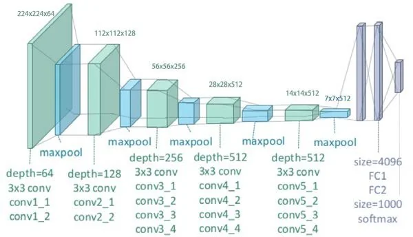

## VGG-Net Architeture 


**VGG-19** is a deep Convolutional Neural Network (CNN) architecture introduced by the Visual Geometry Group at the University of Oxford.

VGG models are known for their **simple and uniform architecture**, primarily using stacked **3×3 convolutional filters**.

### Key Characteristics

* Uses small **3×3 convolution filters**
* Stacks multiple convolution layers to increase network depth
* Uses **ReLU** activation after convolution layers
* Uses **2×2 max pooling** to reduce spatial dimensions
* Number of filters increases with depth
* Ends with fully connected layers for classification


## VGG-19 Architecture

### Basic Specifications

| Component                   | Details         |
| --------------------------- | --------------- |
| **Total Weight Layers**     | 19              |
| **Convolutional Layers**    | 16              |
| **Fully Connected Layers**  | 3               |
| **Convolution Kernel**      | 3×3             |
| **Pooling**                 | 2×2 Max Pooling |
| **Activation**              | ReLU            |
| **Original Input Size**     | 224×224×3       |
| **Original Output Classes** | 1000            |

> **Note:** The 19 weight layers are **16 convolutional layers + 3 fully connected layers**. Pooling layers are not counted as weight layers.


### Convolutional Blocks

VGG-19 is organized into **5 convolutional blocks**.

| Block       | Conv Layers | Filters | Kernel | Pooling     |
| ----------- | ----------: | ------: | ------ | ----------- |
| **Block 1** |           2 |      64 | 3×3    | 2×2 MaxPool |
| **Block 2** |           2 |     128 | 3×3    | 2×2 MaxPool |
| **Block 3** |           4 |     256 | 3×3    | 2×2 MaxPool |
| **Block 4** |           4 |     512 | 3×3    | 2×2 MaxPool |
| **Block 5** |           4 |     512 | 3×3    | 2×2 MaxPool |

### Filter Progression

```text
64 → 128 → 256 → 512 → 512
```

As the network becomes deeper:

* **Spatial dimensions decrease**
* **Number of feature channels increases**
* **Feature complexity increases**


## Detailed Architecture

### Block 1

```text
Input
  ↓
Conv 3×3, 64
  ↓
ReLU
  ↓
Conv 3×3, 64
  ↓
ReLU
  ↓
MaxPool 2×2
```

### Block 2

```text
Conv 3×3, 128
  ↓
ReLU
  ↓
Conv 3×3, 128
  ↓
ReLU
  ↓
MaxPool 2×2
```

### Block 3

```text
Conv 3×3, 256
  ↓
ReLU
  ↓
Conv 3×3, 256
  ↓
ReLU
  ↓
Conv 3×3, 256
  ↓
ReLU
  ↓
Conv 3×3, 256
  ↓
ReLU
  ↓
MaxPool 2×2
```

### Block 4

```text
Conv 3×3, 512
  ↓
ReLU
  ↓
Conv 3×3, 512
  ↓
ReLU
  ↓
Conv 3×3, 512
  ↓
ReLU
  ↓
Conv 3×3, 512
  ↓
ReLU
  ↓
MaxPool 2×2
```

### Block 5

```text
Conv 3×3, 512
  ↓
ReLU
  ↓
Conv 3×3, 512
  ↓
ReLU
  ↓
Conv 3×3, 512
  ↓
ReLU
  ↓
Conv 3×3, 512
  ↓
ReLU
  ↓
MaxPool 2×2
```


### Fully Connected Layers

After the convolutional blocks, the extracted features are passed to fully connected layers.

| Layer   | Neurons | Activation |
| ------- | ------: | ---------- |
| **FC1** |    4096 | ReLU       |
| **FC2** |    4096 | ReLU       |
| **FC3** |    1000 | Softmax    |

The final layer produces probabilities for the **1000 ImageNet classes** in the original VGG-19 configuration.


## Complete Architecture Flow

```text
                    VGG-19
                      │
                      ▼
              Input: 224×224×3
                      │
                      ▼
        ┌─────────────────────────┐
        │ Block 1                 │
        │ Conv 3×3, 64 × 2        │
        │ ReLU                    │
        │ MaxPool                 │
        └─────────────────────────┘
                      │
                      ▼
        ┌─────────────────────────┐
        │ Block 2                 │
        │ Conv 3×3, 128 × 2       │
        │ ReLU                    │
        │ MaxPool                 │
        └─────────────────────────┘
                      │
                      ▼
        ┌─────────────────────────┐
        │ Block 3                 │
        │ Conv 3×3, 256 × 4       │
        │ ReLU                    │
        │ MaxPool                 │
        └─────────────────────────┘
                      │
                      ▼
        ┌─────────────────────────┐
        │ Block 4                 │
        │ Conv 3×3, 512 × 4       │
        │ ReLU                    │
        │ MaxPool                 │
        └─────────────────────────┘
                      │
                      ▼
        ┌─────────────────────────┐
        │ Block 5                 │
        │ Conv 3×3, 512 × 4       │
        │ ReLU                    │
        │ MaxPool                 │
        └─────────────────────────┘
                      │
                      ▼
                  Flatten
                      │
                      ▼
                 FC: 4096
                      │
                      ▼
                 FC: 4096
                      │
                      ▼
                 FC: 1000
                      │
                      ▼
                Softmax
                      │
                      ▼
             Class Probabilities
```


## Feature Progression

The key idea behind VGG-19 is that **spatial resolution decreases while feature depth increases**.

```text
Input
224 × 224 × 3
       │
       ▼
224 × 224 × 64
       │
    MaxPool
       ▼
112 × 112 × 64
       │
       ▼
112 × 112 × 128
       │
    MaxPool
       ▼
56 × 56 × 128
       │
       ▼
56 × 56 × 256
       │
    MaxPool
       ▼
28 × 28 × 256
       │
       ▼
28 × 28 × 512
       │
    MaxPool
       ▼
14 × 14 × 512
       │
       ▼
14 × 14 × 512
       │
    MaxPool
       ▼
7 × 7 × 512
       │
       ▼
     Flatten
       │
       ▼
    4096 → 4096 → 1000
```


## Why 3×3 Convolutions?

VGG's main design choice was to repeatedly use small **3×3 filters** instead of larger filters.

For example:

```text
Large Filter:

7×7
 ↓
Single convolution
```

can be replaced conceptually by:

```text
3×3
 ↓
3×3
 ↓
3×3
```

Stacking small filters provides:

* More nonlinear transformations
* Fewer parameters in many comparable configurations
* A larger effective receptive field
* A simple and consistent architecture


## Architectural Design Principles

| Principle                | Description                                                     |
| ------------------------ | --------------------------------------------------------------- |
| **Small Filters**        | Uses 3×3 convolution filters throughout the network             |
| **Deep Architecture**    | Multiple convolution layers learn increasingly complex features |
| **ReLU**                 | Adds non-linearity after convolution layers                     |
| **Max Pooling**          | Reduces spatial dimensions                                      |
| **Increasing Channels**  | Feature channels increase from 64 → 512                         |
| **Uniform Design**       | Repeats the same basic convolution pattern                      |
| **Fully Connected Head** | Converts extracted features into class predictions              |


## What Does VGG Learn?

The network progressively learns more complex visual representations.

```text
Early Layers
     ↓
Edges
     ↓
Textures
     ↓
Shapes
     ↓
Object Parts
     ↓
Complex Objects
     ↓
Classification
```

For example:

```text
Layer 1
  → Edges

Layer 2
  → Simple textures

Layer 5
  → Patterns and shapes

Deeper layers
  → Object parts

Final layers
  → High-level object representation
```


## VGG-16 vs VGG-19

| Feature             |    VGG-16 | VGG-19 |
| ------------------- | --------: | -----: |
| Conv Layers         |        13 |     16 |
| FC Layers           |         3 |      3 |
| Total Weight Layers |        16 |     19 |
| Main Difference     | Shallower | Deeper |
| Architecture Style  |      Same |   Same |

The main difference is that **VGG-19 adds three additional convolutional layers** compared with VGG-16.


## Limitations

Despite its simplicity, VGG-19 has several disadvantages:

* Very large number of parameters
* High memory usage
* Computationally expensive
* Slow compared with many modern architectures
* Deep networks can be difficult to optimize without architectural improvements such as residual connections

This is one reason architectures such as **ResNet** became important.

## VGG-19 Implementation:
```python
import torch
import torch.nn as nn

class VGG19(nn.Module):
    def __init__(self, num_classes=1000):
        super().__init__()

        self.features = nn.Sequential(

            # Block 1
            nn.Conv2d(3, 64, kernel_size=3, padding=1),
            nn.ReLU(inplace=True),

            nn.Conv2d(64, 64, kernel_size=3, padding=1),
            nn.ReLU(inplace=True),

            nn.MaxPool2d(kernel_size=2, stride=2),

            # Block 2
            nn.Conv2d(64, 128, kernel_size=3, padding=1),
            nn.ReLU(inplace=True),

            nn.Conv2d(128, 128, kernel_size=3, padding=1),
            nn.ReLU(inplace=True),

            nn.MaxPool2d(kernel_size=2, stride=2),

            # Block 3
            nn.Conv2d(128, 256, kernel_size=3, padding=1),
            nn.ReLU(inplace=True),

            nn.Conv2d(256, 256, kernel_size=3, padding=1),
            nn.ReLU(inplace=True),

            nn.Conv2d(256, 256, kernel_size=3, padding=1),
            nn.ReLU(inplace=True),

            nn.Conv2d(256, 256, kernel_size=3, padding=1),
            nn.ReLU(inplace=True),

            nn.MaxPool2d(kernel_size=2, stride=2),

            # Block 4
            nn.Conv2d(256, 512, kernel_size=3, padding=1),
            nn.ReLU(inplace=True),

            nn.Conv2d(512, 512, kernel_size=3, padding=1),
            nn.ReLU(inplace=True),

            nn.Conv2d(512, 512, kernel_size=3, padding=1),
            nn.ReLU(inplace=True),

            nn.Conv2d(512, 512, kernel_size=3, padding=1),
            nn.ReLU(inplace=True),

            nn.MaxPool2d(kernel_size=2, stride=2),

            # Block 5
            nn.Conv2d(512, 512, kernel_size=3, padding=1),
            nn.ReLU(inplace=True),

            nn.Conv2d(512, 512, kernel_size=3, padding=1),
            nn.ReLU(inplace=True),

            nn.Conv2d(512, 512, kernel_size=3, padding=1),
            nn.ReLU(inplace=True),

            nn.Conv2d(512, 512, kernel_size=3, padding=1),
            nn.ReLU(inplace=True),

            nn.MaxPool2d(kernel_size=2, stride=2),
        )

        self.classifier = nn.Sequential(

            # 7 × 7 × 512 = 25088
            nn.Linear(512 * 7 * 7, 4096),
            nn.ReLU(inplace=True),
            nn.Dropout(),

            nn.Linear(4096, 4096),
            nn.ReLU(inplace=True),
            nn.Dropout(),

            nn.Linear(4096, num_classes)
        )

    def forward(self, x):
        x = self.features(x)

        x = torch.flatten(x, 1)

        x = self.classifier(x)

        return x
```

## Key Takeaway

> **VGG-19 = many small 3×3 convolutions + increasing channels + max pooling + fully connected classifier.**
