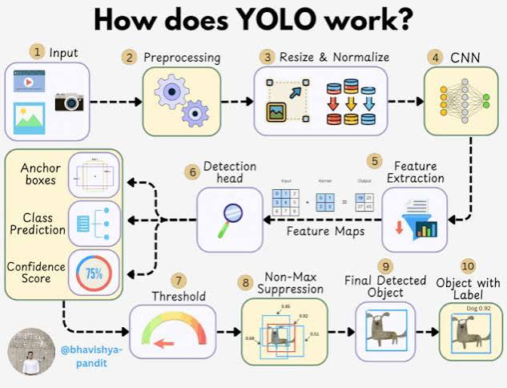
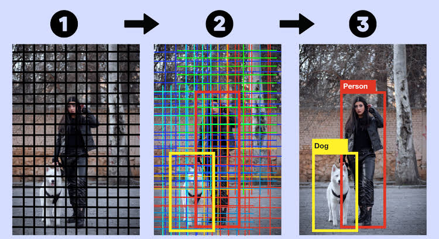

## YOLO — You Only Look Once

YOLO (You Only Look Once) is a **single-stage object detection** algorithm that predicts object classes and bounding boxes in a single forward pass.

* Fast and suitable for real-time detection.
* Performs localization and classification together.
* Treats object detection as a unified regression problem.


## YOLO Architecture

YOLOv1 uses a CNN to extract image features and produces object detections directly.

### 1. Input

The input image is resized to:

$$
448 \times 448
$$

Padding can be used to preserve the aspect ratio.

### 2. CNN Backbone

The original YOLOv1 architecture contains:

* **24 convolutional layers**
* **4 max-pooling layers**
The CNN extracts hierarchical visual features from the image.

---
### 3. Convolutions

YOLO uses:

* **1 × 1 convolutions** → reduce channels and computation.
* **3 × 3 convolutions** → extract spatial features.

### 4. Fully Connected Layers

The CNN features are passed through **2 fully connected layers**.

The final output contains:

$$
1470
$$

values, reshaped into:

$$
7 \times 7 \times 30
$$


## Grid-Based Detection

YOLO divides the image into an:

$$
S \times S
$$

grid.

Each grid cell is responsible for detecting objects whose **center falls inside that cell**.

For YOLOv1:

$$
S=7,\quad B=2,\quad C=20
$$

Therefore:

$$
S \times S \times (5B+C)
$$

$$
=7\times7\times(2\times5+20)
$$

$$
=7\times7\times30
$$


## Bounding Box Prediction

Each bounding box predicts:

$$
(x,y,w,h,confidence)
$$

* $(x,y)$ → box center relative to the grid cell.
* $(w,h)$ → box width and height.
* **Confidence** → object presence and localization quality.

The confidence is:

$$
Confidence=P(Object)\times IoU
$$

where IoU (Intersection over Union) measures the overlap between predicted and ground-truth boxes.


## Class Prediction

Each grid cell also predicts conditional class probabilities:

$$
P(Class_i\mid Object)
$$

The final class-specific confidence is:

$$
P(Class_i\mid Object)\times Confidence
$$

This produces the confidence for each **box–class combination**.


## YOLO Loss

YOLOv1 uses a **sum-squared error loss** combining localization, confidence, and classification.

### 1. Localization Loss

Measures bounding-box coordinate errors:

$$
(x,y,w,h)
$$

Width and height use square roots:

$$
(\sqrt{w}-\sqrt{\hat w})^2
$$

This gives relatively more importance to errors in smaller boxes.

### 2. Confidence Loss

Measures objectness prediction.

YOLO uses different weights for:

* Boxes responsible for objects.
* Boxes containing no object.

The weighting factor $\lambda_{noobj}$ prevents background boxes from dominating training.

### 3. Classification Loss

Measures the error between predicted and ground-truth class probabilities.

## Training

YOLOv1 was first **pretrained on ImageNet** for feature learning and then fine-tuned for object detection.

A smaller **Fast YOLO** variant reduces the number of layers and filters to achieve faster inference.

---

## Inference Pipeline

```text
Image
  ↓
Resize
  ↓
CNN Feature Extraction
  ↓
7 × 7 × 30 Predictions
  ↓
Bounding Boxes + Class Probabilities
  ↓
Confidence Calculation
  ↓
NMS
  ↓
Final Detections
```

### Non-Maximum Suppression (NMS)

Multiple boxes may predict the same object.

NMS:

1. Selects the highest-confidence box.
2. Removes highly overlapping boxes.
3. Repeats until the remaining detections are finalized.


## Why YOLO?

* **Real-time** → single forward pass.
* **End-to-end** → localization + classification.
* **Global context** → processes the complete image.
* **Efficient** → faster than many two-stage detectors.

## Limitations of YOLOv1

* Struggles with **small objects**.
* Limited when **multiple objects occupy the same grid cell**.
* Localization can be less accurate than two-stage detectors.

> **Core idea:** YOLO divides an image into a grid and directly predicts bounding boxes, confidence scores, and class probabilities in one forward pass.

## IMplementation
```python 
import torch
import torch.nn as nn
import torch.nn.functional as F
import math
from typing import List, Tuple, Optional

# ============================================
# YOLO v1 Architecture (Original)
# ============================================

class YOLOv1(nn.Module):
    """
    YOLO: You Only Look Once - Unified Real-Time Object Detection
    
    Args:
        S: Grid size (S x S)
        B: Number of bounding boxes per grid cell
        C: Number of classes
    """
    
    def __init__(self, S: int = 7, B: int = 2, C: int = 20):
        super().__init__()
        self.S = S
        self.B = B
        self.C = C
        
        # Backbone: 24 Convolutional Layers + 2 Fully Connected
        self.features = self._make_features()
        self.classifier = self._make_classifier()
        
        # Initialize weights
        self._initialize_weights()
    
    def _make_features(self):
        """YOLO backbone with 24 conv layers + 4 maxpool layers"""
        layers = []
        
        # Block 1
        layers += [
            nn.Conv2d(3, 64, 7, 2, 3),
            nn.LeakyReLU(0.1, inplace=True),
            nn.MaxPool2d(2, 2),
        ]
        
        # Block 2
        layers += [
            nn.Conv2d(64, 192, 3, 1, 1),
            nn.LeakyReLU(0.1, inplace=True),
            nn.MaxPool2d(2, 2),
        ]
        
        # Block 3
        layers += [
            nn.Conv2d(192, 128, 1, 1, 0),
            nn.LeakyReLU(0.1, inplace=True),
            nn.Conv2d(128, 256, 3, 1, 1),
            nn.LeakyReLU(0.1, inplace=True),
            nn.Conv2d(256, 256, 1, 1, 0),
            nn.LeakyReLU(0.1, inplace=True),
            nn.Conv2d(256, 512, 3, 1, 1),
            nn.LeakyReLU(0.1, inplace=True),
            nn.MaxPool2d(2, 2),
        ]
        
        # Block 4
        for _ in range(4):
            layers += [
                nn.Conv2d(512, 256, 1, 1, 0),
                nn.LeakyReLU(0.1, inplace=True),
                nn.Conv2d(256, 512, 3, 1, 1),
                nn.LeakyReLU(0.1, inplace=True),
            ]
        layers += [nn.Conv2d(512, 512, 1, 1, 0), nn.LeakyReLU(0.1, inplace=True)]
        layers += [nn.Conv2d(512, 1024, 3, 1, 1), nn.LeakyReLU(0.1, inplace=True)]
        layers += [nn.MaxPool2d(2, 2)]
        
        # Block 5
        for _ in range(2):
            layers += [
                nn.Conv2d(1024, 512, 1, 1, 0),
                nn.LeakyReLU(0.1, inplace=True),
                nn.Conv2d(512, 1024, 3, 1, 1),
                nn.LeakyReLU(0.1, inplace=True),
            ]
        layers += [
            nn.Conv2d(1024, 1024, 3, 1, 1),
            nn.LeakyReLU(0.1, inplace=True),
            nn.Conv2d(1024, 1024, 3, 2, 1),
            nn.LeakyReLU(0.1, inplace=True),
        ]
        
        # Block 6
        layers += [
            nn.Conv2d(1024, 1024, 3, 1, 1),
            nn.LeakyReLU(0.1, inplace=True),
            nn.Conv2d(1024, 1024, 3, 1, 1),
            nn.LeakyReLU(0.1, inplace=True),
        ]
        
        return nn.Sequential(*layers)
    
    def _make_classifier(self):
        """Fully connected layers for detection"""
        return nn.Sequential(
            nn.Flatten(),
            nn.Linear(1024 * 7 * 7, 4096),
            nn.LeakyReLU(0.1, inplace=True),
            nn.Dropout(0.5),
            nn.Linear(4096, self.S * self.S * (self.B * 5 + self.C)),
        )
    
    def _initialize_weights(self):
        for m in self.modules():
            if isinstance(m, nn.Conv2d):
                nn.init.kaiming_normal_(m.weight, mode='fan_out', nonlinearity='leaky_relu')
            elif isinstance(m, nn.Linear):
                nn.init.normal_(m.weight, 0, 0.01)
                nn.init.constant_(m.bias, 0)
    
    def forward(self, x):
        x = self.features(x)
        x = self.classifier(x)
        return x


# ============================================
# YOLO Loss Function
# ============================================

class YOLOLoss(nn.Module):
    """
    YOLO v1 Loss Function
    
    Args:
        S: Grid size
        B: Number of bounding boxes
        C: Number of classes
        lambda_coord: Coordinate loss weight
        lambda_noobj: No-object loss weight
    """
    
    def __init__(
        self,
        S: int = 7,
        B: int = 2,
        C: int = 20,
        lambda_coord: float = 5.0,
        lambda_noobj: float = 0.5,
    ):
        super().__init__()
        self.S = S
        self.B = B
        self.C = C
        self.lambda_coord = lambda_coord
        self.lambda_noobj = lambda_noobj
        self.mse = nn.MSELoss(reduction='sum')
    
    def forward(self, predictions, targets):
        """
        Args:
            predictions: (batch_size, S*S*(B*5+C))
            targets: (batch_size, S, S, B*5+C)
        """
        batch_size = predictions.size(0)
        predictions = predictions.view(batch_size, self.S, self.S, self.B * 5 + self.C)
        
        # Split predictions
        pred_boxes = predictions[..., :self.B * 5].view(batch_size, self.S, self.S, self.B, 5)
        pred_class = predictions[..., self.B * 5:]
        
        # Split target
        target_boxes = targets[..., :self.B * 5].view(batch_size, self.S, self.S, self.B, 5)
        target_class = targets[..., self.B * 5:]
        
        # Find responsible boxes
        # Get target objectness (1 if object exists)
        target_obj = target_boxes[..., 4]  # (batch, S, S, B)
        
        # Find which box has highest IOU (simplified: use first box)
        resp_box_mask = target_obj > 0  # (batch, S, S, B)
        
        # Coordinate loss (for responsible boxes)
        coord_loss = 0
        # x, y loss
        coord_loss += self.mse(
            pred_boxes[resp_box_mask][..., 0],
            target_boxes[resp_box_mask][..., 0]
        )
        coord_loss += self.mse(
            pred_boxes[resp_box_mask][..., 1],
            target_boxes[resp_box_mask][..., 1]
        )
        # w, h loss (sqrt)
        pred_w = torch.sqrt(pred_boxes[resp_box_mask][..., 2] + 1e-6)
        target_w = torch.sqrt(target_boxes[resp_box_mask][..., 2] + 1e-6)
        pred_h = torch.sqrt(pred_boxes[resp_box_mask][..., 3] + 1e-6)
        target_h = torch.sqrt(target_boxes[resp_box_mask][..., 3] + 1e-6)
        coord_loss += self.mse(pred_w, target_w)
        coord_loss += self.mse(pred_h, target_h)
        
        # Objectness loss
        obj_loss = self.mse(
            pred_boxes[resp_box_mask][..., 4],
            target_boxes[resp_box_mask][..., 4]
        )
        
        # No-object loss
        noobj_mask = ~resp_box_mask
        noobj_loss = self.mse(
            pred_boxes[noobj_mask][..., 4],
            target_boxes[noobj_mask][..., 4]
        )
        
        # Class loss
        class_loss = self.mse(
            pred_class[target_obj.sum(dim=-1) > 0],
            target_class[target_obj.sum(dim=-1) > 0]
        )
        
        # Total loss
        total_loss = (
            self.lambda_coord * coord_loss +
            obj_loss +
            self.lambda_noobj * noobj_loss +
            class_loss
        ) / batch_size
        
        return total_loss


# ============================================
# YOLO Detection Utils
# ============================================

def decode_predictions(
    predictions: torch.Tensor,
    S: int = 7,
    B: int = 2,
    C: int = 20,
    image_size: int = 448,
    conf_threshold: float = 0.5,
    nms_threshold: float = 0.5
) -> List[torch.Tensor]:
    """
    Decode YOLO predictions into bounding boxes
    
    Returns:
        List of detections per image: (x1, y1, x2, y2, confidence, class)
    """
    batch_size = predictions.size(0)
    predictions = predictions.view(batch_size, S, S, B * 5 + C)
    
    all_detections = []
    cell_size = image_size / S
    
    for b in range(batch_size):
        detections = []
        for i in range(S):
            for j in range(S):
                for k in range(B):
                    # Get box
                    box = predictions[b, i, j, k * 5:(k + 1) * 5]
                    confidence = torch.sigmoid(box[4])
                    
                    if confidence < conf_threshold:
                        continue
                    
                    # Get class probabilities
                    class_probs = torch.sigmoid(predictions[b, i, j, B * 5:])
                    class_id = torch.argmax(class_probs)
                    class_conf = class_probs[class_id] * confidence
                    
                    if class_conf < conf_threshold:
                        continue
                    
                    # Decode coordinates (relative to cell)
                    x = (box[0] + j) * cell_size
                    y = (box[1] + i) * cell_size
                    w = box[2] * image_size
                    h = box[3] * image_size
                    
                    # Convert to (x1, y1, x2, y2)
                    x1 = x - w / 2
                    y1 = y - h / 2
                    x2 = x + w / 2
                    y2 = y + h / 2
                    
                    detections.append([x1, y1, x2, y2, class_conf, class_id])
        
        if len(detections) > 0:
            detections = torch.tensor(detections)
            detections = non_max_suppression(detections, nms_threshold)
            all_detections.append(detections)
        else:
            all_detections.append(torch.empty((0, 6)))
    
    return all_detections


def non_max_suppression(
    detections: torch.Tensor,
    nms_threshold: float = 0.5
) -> torch.Tensor:
    """Apply Non-Maximum Suppression"""
    if detections.size(0) == 0:
        return detections
    
    # Sort by confidence
    scores = detections[:, 4]
    _, idx = scores.sort(descending=True)
    detections = detections[idx]
    
    # NMS
    keep = []
    while detections.size(0) > 0:
        keep.append(detections[0])
        
        if detections.size(0) == 1:
            break
        
        # Compute IOU with remaining boxes
        ious = compute_iou(detections[0, :4], detections[1:, :4])
        detections = detections[1:][ious < nms_threshold]
    
    return torch.stack(keep) if keep else torch.empty((0, 6))


def compute_iou(box1: torch.Tensor, boxes: torch.Tensor) -> torch.Tensor:
    """Compute IOU between box1 and multiple boxes"""
    # box1: (4,), boxes: (N, 4)
    # Format: (x1, y1, x2, y2)
    
    x1 = torch.max(box1[0], boxes[:, 0])
    y1 = torch.max(box1[1], boxes[:, 1])
    x2 = torch.min(box1[2], boxes[:, 2])
    y2 = torch.min(box1[3], boxes[:, 3])
    
    intersection = torch.clamp(x2 - x1, min=0) * torch.clamp(y2 - y1, min=0)
    
    area1 = (box1[2] - box1[0]) * (box1[3] - box1[1])
    area2 = (boxes[:, 2] - boxes[:, 0]) * (boxes[:, 3] - boxes[:, 1])
    
    union = area1 + area2 - intersection
    return intersection / (union + 1e-6)


# ============================================
# YOLO v2 (with Anchor Boxes) - Simplified
# ============================================

class YOLOv2(nn.Module):
    """
    YOLO v2 with Darknet-19 backbone and anchor boxes
    """
    
    def __init__(self, num_classes: int = 20, num_anchors: int = 5):
        super().__init__()
        self.num_classes = num_classes
        self.num_anchors = num_anchors
        
        # Darknet-19 backbone (simplified)
        self.backbone = self._make_darknet19()
        
        # Detection head
        self.detection = nn.Sequential(
            nn.Conv2d(1024, 1024, 3, 1, 1),
            nn.BatchNorm2d(1024),
            nn.LeakyReLU(0.1, inplace=True),
            nn.Conv2d(1024, num_anchors * (5 + num_classes), 1),
        )
        
        self._initialize_weights()
    
    def _make_darknet19(self):
        """Simplified Darknet-19 backbone"""
        layers = []
        
        # Conv blocks with maxpool
        config = [
            (32, 3, 1),  # conv, maxpool
            (64, 3, 2),
            (128, 3, 1), (64, 1, 0), (128, 3, 1),  # maxpool
            (256, 3, 1), (128, 1, 0), (256, 3, 1),  # maxpool
            (512, 3, 1), (256, 1, 0), (512, 3, 1), (256, 1, 0), (512, 3, 1),  # maxpool
            (1024, 3, 1), (512, 1, 0), (1024, 3, 1), (512, 1, 0), (1024, 3, 1),
        ]
        
        in_channels = 3
        for c, k, p in config:
            layers += [
                nn.Conv2d(in_channels, c, k, 1 if c > 64 else 1, p),
                nn.BatchNorm2d(c),
                nn.LeakyReLU(0.1, inplace=True),
                nn.MaxPool2d(2, 2) if c in [64, 128, 256, 512] else nn.Identity(),
            ]
            in_channels = c
        
        return nn.Sequential(*layers)
    
    def _initialize_weights(self):
        for m in self.modules():
            if isinstance(m, nn.Conv2d):
                nn.init.kaiming_normal_(m.weight, mode='fan_out', nonlinearity='leaky_relu')
            elif isinstance(m, nn.BatchNorm2d):
                nn.init.constant_(m.weight, 1)
                nn.init.constant_(m.bias, 0)
    
    def forward(self, x):
        x = self.backbone(x)
        x = self.detection(x)
        return x


# ============================================
# Usage Example
# ============================================

if __name__ == "__main__":
    print("=" * 50)
    print("YOLO v1 Example")
    print("=" * 50)
    
    # Create model
    model = YOLOv1(S=7, B=2, C=20)
    
    # Print model info
    print(f"Total parameters: {sum(p.numel() for p in model.parameters()):,}")
    
    # Forward pass
    x = torch.randn(2, 3, 448, 448)
    output = model(x)
    print(f"Input shape: {x.shape}")
    print(f"Output shape: {output.shape}")
    print(f"Expected output: (batch, S*S*(B*5+C)) = (2, 7*7*(2*5+20)) = (2, 1470)")
    
    print("\n" + "=" * 50)
    print("YOLO v2 Example")
    print("=" * 50)
    
    # YOLO v2
    model_v2 = YOLOv2(num_classes=20, num_anchors=5)
    print(f"Total parameters: {sum(p.numel() for p in model_v2.parameters()):,}")
    
    x = torch.randn(2, 3, 416, 416)
    output = model_v2(x)
    print(f"Input shape: {x.shape}")
    print(f"Output shape: {output.shape}")
```