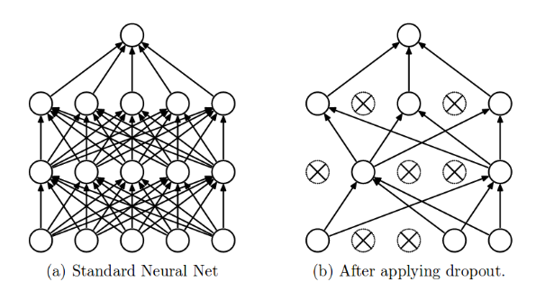
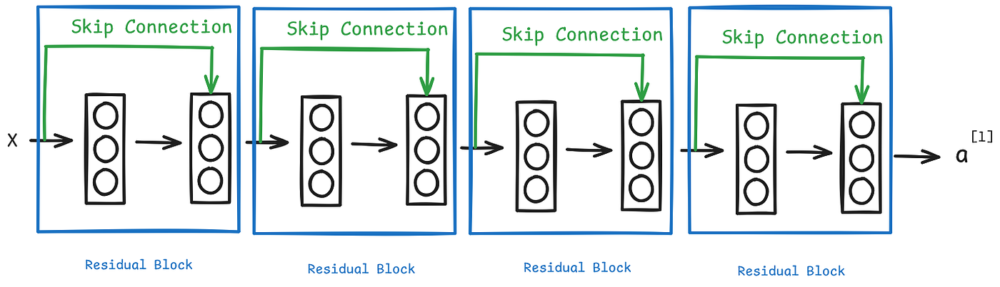

# Regularization & Structural Connections

## 1. Dropout

Dropout is a powerful **regularization technique** used to reduce overfitting in neural networks. During training, it randomly turns off (drops) a fraction of neurons, forcing the network to learn more robust and generalizable features instead of relying on specific neurons.


### Mathematical Mechanism

For a layer $l$, a binary mask vector is generated using a Bernoulli distribution:

$$
r^{[l]} \sim \text{Bernoulli}(p)
$$

where:

- $p$ = probability of keeping a neuron active
- $r^{[l]}$ = dropout mask

The mask is applied to the activations:

$$
a^{[l]}_{\text{dropped}} = a^{[l]} \odot r^{[l]}
$$

where $\odot$ denotes element-wise (Hadamard) multiplication.

### Inverted Dropout (Scaling)

To keep the expected activation values consistent during training and inference, the remaining active neurons are scaled by $\frac{1}{p}$:

$$
a^{[l]}_{\text{scaled}} = \frac{a^{[l]}_{\text{dropped}}}{p}
$$

### Key Points

- **Training:** Some neurons are randomly dropped and the remaining activations are scaled by $\frac{1}{p}$.
- **Inference/Test Time:** All neurons remain active and no scaling is required.


## 2. Residual Connections (Skip Connections)

Residual connections help solve the **vanishing gradient problem** in very deep neural networks. They create a shortcut path that allows information and gradients to flow directly through the network.

### Residual Learning

Instead of learning the desired mapping $H(x)$ directly, the network learns a residual function:

$$
F(x) = H(x) - x
$$

The original input is then added back:

$$
H(x) = F(x) + x
$$

The output of the residual block becomes:

$$
a^{[l]} = g(F(x) + x)
$$

where:

- $x$ = input to the block
- $F(x)$ = transformations learned by the block
- $g$ = activation function (commonly ReLU)
- 

### Architecture

```text
             ┌──────────────┐
       ┌────→│ Layer Matrix │──→ ReLU ──→ Output
       │     └──────────────┘        ▲
Input (x)                            │
       └─────────────────────────────┘
              Identity Skip
```
