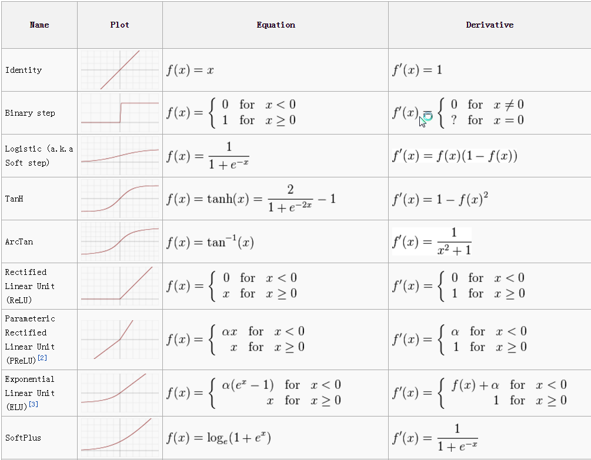

## Activation Functions
Activation functions introduce non-linear properties to neural networks, enabling them to learn complex patterns and high-dimensional decision boundaries.

>Non-linear properties means that the output of an activation function is not a linear combination of its inputs.

### Defination:

## Different Types of Activation Functions:
### 1. Sigmoid
Clips real-valued numbers into a tight probability range between $0$ and $1$. Used primarily in the output layer for binary classification tasks.

* **Mathematical Formula:**  
  $\sigma(z) = \frac{1}{1 + e^{-z}}$

* **Derivative (Gradient):**  
  $\sigma'(z) = \sigma(z)(1 - \sigma(z))$

* **Key Trade-off:** Susceptible to **vanishing gradients** during backpropagation because the derivative outputs approach $0$ for high or low input values.

### 2. Tanh (Hyperbolic Tangent)
Maps continuous input values to a zero-centered range between $-1$ and $1$, easing optimization trends for subsequent hidden layers.

* **Mathematical Formula:**  
  $\tanh(z) = \frac{e^z - e^{-z}}{e^z + e^{-z}} = \frac{2}{1 + e^{-2z}} - 1$

* **Derivative (Gradient):**  
  $\tanh'(z) = 1 - \tanh^2(z)$

* **Key Trade-off:** Zero-centered output yields better training convergence than Sigmoid, but still suffers from **vanishing gradients** at extreme inputs.

### 3. ReLU (Rectified Linear Unit)
The default activation choice for most deep hidden layers due to its exceptional computational efficiency and sparseness.

* **Mathematical Formula:**  
  $f(z) = \max(0, z)$

* **Derivative (Gradient):**  
  $f'(z) = \begin{cases} 1, & z > 0 \\ 0, & z \le 0 \end{cases}$

* **Key Trade-off:** Prevents vanishing gradients for positive inputs, but can cause the **"Dying ReLU" problem** where neurons permanently deactivate if input values stay below zero.

## 📊 Summary Matrix

| Function | Output Range | Shared Layer Position | Primary Use Case |
| :--- | :--- | :--- | :--- |
| **Sigmoid** | $(0, 1)$ | Output Layer | Binary Classification |
| **Tanh** | $(-1, 1)$ | Hidden Layers | Classical Shallow Nets |
| **ReLU** | $[0, \infty)$ | Hidden Layers | Deep Neural Networks (CNNs, MLPs) |
