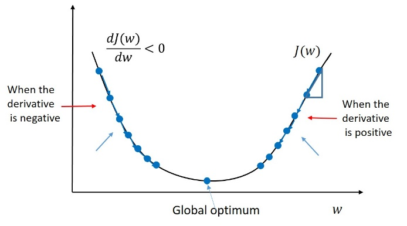

# Forward & Backward Propagation

These are the two core processes that allow a neural network to **learn from data**.

- **Forward Propagation** → Makes predictions
- **Backward Propagation** → Learns from mistakes
- **Gradient Descent** → Updates weights to improve predictions

## 1. Forward Propagation (Prediction Phase)

Forward propagation is the process of passing input data through the network to generate an output.

### Flow

```text
Input → Hidden Layer(s) → Output
```

### Step 1: Weighted Sum

Each neuron combines inputs with weights and adds a bias.

$$
z = Wx + b
$$

Think of it as:

> "How important is each input for making this decision?"

### Step 2: Activation Function

The weighted sum is passed through an activation function.

$$
a = g(z)
$$

Common activation functions:

- **ReLU** → Most common for hidden layers
- **Sigmoid** → Binary classification
- **Tanh** → Outputs between -1 and 1

### Result

The network produces a prediction.

Examples:

- Cat vs Dog Classification
- Spam Detection
- House Price Prediction


## 2. Loss Function (Measure Error)

After making a prediction, we compare it with the actual answer.

The loss function tells us:

> "How wrong is the model?"

Common loss functions:

- Binary Cross Entropy
- Categorical Cross Entropy
- Mean Squared Error (MSE)

Lower loss = Better predictions.

## 3. Backward Propagation (Learning Phase)

Backward propagation helps the network learn from its mistakes.

The error is propagated from the output layer back toward the input layer.

### Main Idea

When the prediction is wrong:

1. Identify which weights contributed to the error.
2. Calculate how much each weight contributed.
3. Adjust the weights accordingly.

This is achieved using the **Chain Rule** from calculus.


## 4. Gradients

A gradient tells us:

> "How much should a parameter change to reduce the loss?"

Mathematically:

$$
\frac{\partial L}{\partial W}
$$

where:

- $L$ = Loss
- $W$ = Weight

Interpretation:

- Large gradient → Large update
- Small gradient → Small update
- Zero gradient → No update


## 5. Gradient Descent (Optimization)

Once gradients are calculated, the model updates its parameters.

### Weight Update

$$
W_{new} = W_{old} - \eta \frac{\partial L}{\partial W}
$$

### Bias Update

$$
b_{new} = b_{old} - \eta \frac{\partial L}{\partial b}
$$

where:

- $\eta$ = Learning Rate


### Intuition

Imagine standing on a mountain:

- Loss = Height
- Gradient = Slope
- Goal = Reach the Bottom

Gradient Descent repeatedly takes steps downhill until the error becomes minimal.

## Complete Learning Cycle

```text
Input Data
    ↓
Forward Propagation
    ↓
Prediction
    ↓
Calculate Loss
    ↓
Backward Propagation
    ↓
Compute Gradients
    ↓
Gradient Descent
    ↓
Update Weights
    ↓
Repeat
```
