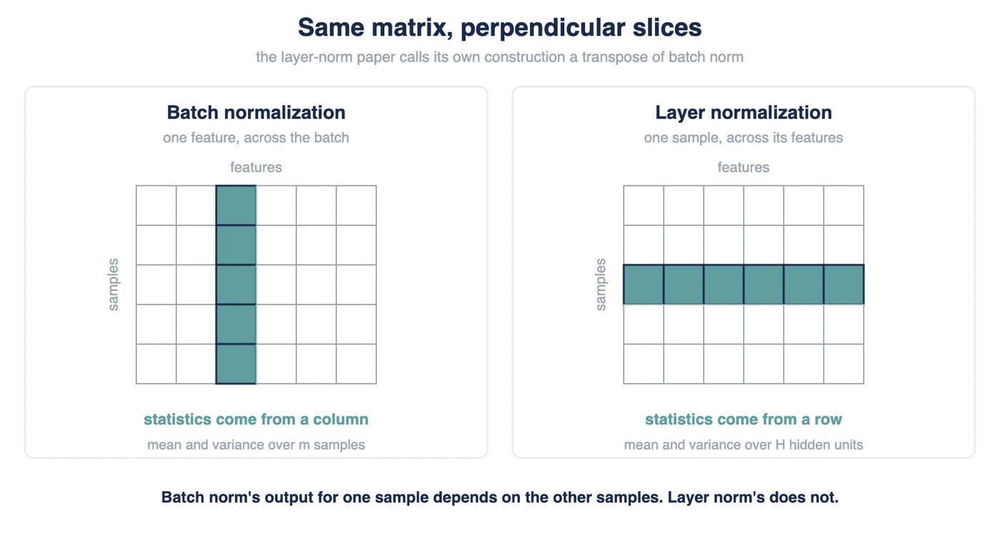

## Initialization & Normalization
Proper weight initialization and layer normalization prevent vanishing or exploding gradients, stabilizing and accelerating deep neural network training.

---

##  Weight Initialization

### 1. Xavier (Glorot) Initialization
Designed for layers using symmetric activation functions like **Sigmoid** or **Tanh**. It maintains variance across layers to prevent signals from fading away.

* **Glorot Uniform:** Weights are sampled from a uniform distribution bounded by:
  $$W \sim U\left(-\frac{\sqrt{6}}{\sqrt{\text{fan}_{\text{in}} + \text{fan}_{\text{out}}}}, \frac{\sqrt{6}}{\sqrt{\text{fan}_{\text{in}} + \text{fan}_{\text{out}}}}\right)$$
  *(where $\text{fan}_{\text{in}}$ is the number of input units and $\text{fan}_{\text{out}}$ is the number of output units)*

* **Glorot Normal:** Weights are sampled from a zero-centered normal distribution:
  $$W \sim N\left(0, \frac{2}{\text{fan}_{\text{in}} + \text{fan}_{\text{out}}}\right)$$

### 2. He (Kaiming) Initialization
Optimized explicitly for non-symmetric, rectified activation functions like **ReLU** or **Leaky ReLU**. It accounts for the zeroing out of negative activations.

* **He Uniform:** Weights are sampled uniformly within:
  $$W \sim U\left(-\frac{\sqrt{6}}{\sqrt{\text{fan}_{\text{in}}}}, \frac{\sqrt{6}}{\sqrt{\text{fan}_{\text{in}}}}\right)$$

* **He Normal:** Weights are sampled from a normal distribution with an adjusted variance:
  $$W \sim N\left(0, \frac{2}{\text{fan}_{\text{in}}}\right)$$

##  Normalization Layers

### 1. Batch Normalization
Normalizes activations across the mini-batch dimension. It scales features globally for each batch during training.

* **Mathematical Formula:**  
  $$\mu_B = \frac{1}{m} \sum_{i=1}^{m} x_i, \quad \sigma_B^2 = \frac{1}{m} \sum_{i=1}^{m} (x_i - \mu_B)^2$$
  $$\hat{x}_i = \frac{x_i - \mu_B}{\sqrt{\sigma_B^2 + \epsilon}}$$
  $$y_i = \gamma \hat{x}_i + \beta$$
  *(where $\epsilon$ prevents division by zero, while $\gamma$ and $\beta$ are learnable parameters)*

### 2. Layer Normalization
Normalizes activations across the feature/channel dimension for each individual sequence or sample. This is standard in Recurrent Neural Networks (RNNs) and **Transformers**.

* **Mathematical Formula:**  
  $$\mu_L = \frac{1}{H} \sum_{i=1}^{H} x_i, \quad \sigma_L^2 = \frac{1}{H} \sum_{i=1}^{H} (x_i - \mu_L)^2$$
  $$\hat{x}_i = \frac{x_i - \mu_L}{\sqrt{\sigma_L^2 + \epsilon}}$$
  *(where $H$ represents the total hidden dimension size of the current layer)*

##  Summary Table 

| Method Class | Technique | Best Paired Component | Dependency Matrix |
| :--- | :--- | :--- | :--- |
| **Initialization** | Xavier (Glorot) | Sigmoid / Tanh | $\text{fan}_{\text{in}}$ and $\text{fan}_{\text{out}}$ |
| **Initialization** | He (Kaiming) | ReLU / Leaky ReLU | $\text{fan}_{\text{in}}$ only |
| **Normalization** | Batch Norm | Feed-Forward Nets / CNNs | Mini-batch samples ($m$) |
| **Normalization** | Layer Norm | Transformers / RNNs | Hidden features ($H$) |
