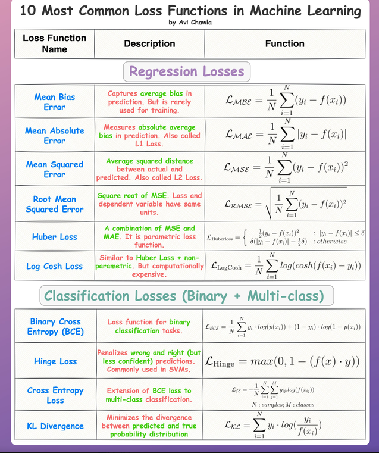

## Loss Functions

Loss functions measure the variance between the network's predicted target ($\hat{y}$) and the true label ($y$), providing the scalar error metric optimized during backpropagation.

## Different Types of Loss Functions

### 1. Mean Squared Error (MSE)
Calculates the average squared difference between predictions and actual targets. Primarily utilized in **regression models**.

* **Mathematical Formula:**  
  $\text{MSE} = \frac{1}{N} \sum_{i=1}^{N} (y_i - \hat{y}_i)^2$

* **Key Characteristics:** Heavily penalizes large outlier errors because errors are squared before averaging. 

### 2. Mean Absolute Error (MAE)
Computes the average absolute difference between target values and predictions. Used for **regression models** requiring outlier resilience.

* **Mathematical Formula:**  
  $\text{MAE} = \frac{1}{N} \sum_{i=1}^{N} |y_i - \hat{y}_i|$

* **Key Characteristics:** Provides robust performance in the presence of noise and outliers, but the absolute value derivative is undefined at exactly zero.

### 3. Binary Cross-Entropy (Log Loss)
Measures performance for probabilistic outputs bounded between $0$ and $1$. Used exclusively for **binary classification tasks**.

* **Mathematical Formula:**  
  $L = -\frac{1}{N} \sum_{i=1}^{N} [y_i \log(\hat{y}_i) + (1 - y_i) \log(1 - \hat{y}_i)]$

* **Key Characteristics:** Severely penalizes confidently incorrect predictions (e.g., predicting $0.99$ when the actual target label is $0$).

### 4. Categorical Cross-Entropy
Extends cross-entropy mechanics to multi-class scenarios where each sample belongs to exactly one label class.

* **Mathematical Formula:**  
  $L = -\frac{1}{N} \sum_{i=1}^{N} \sum_{c=1}^{C} y_{i,c} \log(\hat{y}_{i,c})$
  *(where $C$ is the total count of distinct classes)*

* **Key Characteristics:** Typically paired with a **Softmax** output activation layer to handle mutually exclusive target classes.

## Summary Table

| Loss Function | Primary Task | Output Layer Activation | Outlier Penalty |
| :--- | :--- | :--- | :--- |
| **MSE** | Regression | Linear / Identity | **High** (Squared) |
| **MAE** | Regression | Linear / Identity | **Low** (Linear) |
| **Binary Cross-Entropy** | Binary Classification | Sigmoid | **High** (Logarithmic) |
| **Categorical Cross-Entropy** | Multi-Class Classification | Softmax | **High** (Logarithmic) |
