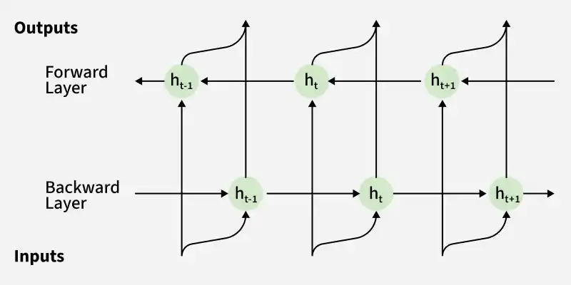

## What is BRNN?

**Bidirectional Recurrent Neural Networks (BRNNs)** are an advanced form of RNNs that process sequential data in **both forward and backward directions**. This allows the network to use **both past and future context**, improving understanding and prediction accuracy.

---

## Key Features

| Feature | Description |
|---------|-------------|
| **Dual Direction** | Processes sequences forward and backward |
| **Context Awareness** | Captures both past and future context |
| **Improved Accuracy** | Better than traditional RNNs |
| **Contextual Understanding** | Understands meaning using surrounding context |

---

## How BRNN Works

### Step 1: Input Sequence
A sequence of data points is provided as input, each represented as a vector.

### Step 2: Dual Direction Processing
The sequence is processed in **two directions**:

| Direction | Uses |
|-----------|------|
| **Forward** | Current input + Previous hidden state |
| **Backward** | Current input + Next hidden state |

### Step 3: Hidden State Computation
Hidden states are computed using weighted inputs and activation functions, retaining sequence information.

### Step 4: Output Generation
Outputs are generated from hidden states → used directly for prediction or passed to additional layers.

---

## Example

> In the sentence: *"I like **apple**. It is very healthy."*
> 
> A BRNN can identify that **"apple"** refers to the **fruit** using **future context** (the second sentence).

---

## Applications

| Domain | Applications |
|--------|--------------|
| **Natural Language Processing** | Machine translation, text classification, named entity recognition, sentiment analysis |
| **Speech Recognition** | Audio transcription, voice command recognition |
| **Sequence Analysis** | Time-series analysis, genomic sequence analysis |
| **Handwriting Recognition** | Handwritten text recognition |
| **Biomedical** | Protein structure prediction, drug discovery |

---

## Advantages of BRNN

| Advantage | Description |
|-----------|-------------|
| **Full Context** | Uses both past and future information |
| **Better Accuracy** | Outperforms unidirectional RNNs |
| **Contextual Understanding** | Captures dependencies from both directions |
| **Rich Representations** | Generates more informative hidden states |

---

## Limitations of BRNN

| Limitation | Description |
|------------|-------------|
| **Sequential Processing** | Still processes data sequentially (no parallelization) |
| **High Memory Usage** | Stores activations for both forward and backward passes |
| **Computational Cost** | Doubles the number of parameters vs standard RNN |
| **Not Suitable for Real-time** | Requires full sequence before prediction (can't use future context) |
| **Long Sequences** | Still struggles with very long sequences |
| **Training Time** | Slower than unidirectional RNNs |
| **Cannot Use Online** | Not suitable for streaming data where future context is unavailable |
| **Overfitting Risk** | More parameters → higher chance of overfitting on small datasets |

---

## BRNN vs Standard RNN

| Feature | Standard RNN | BRNN |
|---------|--------------|------|
| **Direction** | One (forward only) | Two (forward + backward) |
| **Context** | Past only | Past + Future |
| **Parameters** | Fewer | Double |
| **Training Speed** | Faster | Slower |
| **Accuracy** | Lower | Higher |
| **Memory Usage** | Lower | Higher |
| **Real-time Use** | Yes | No (needs full sequence) |