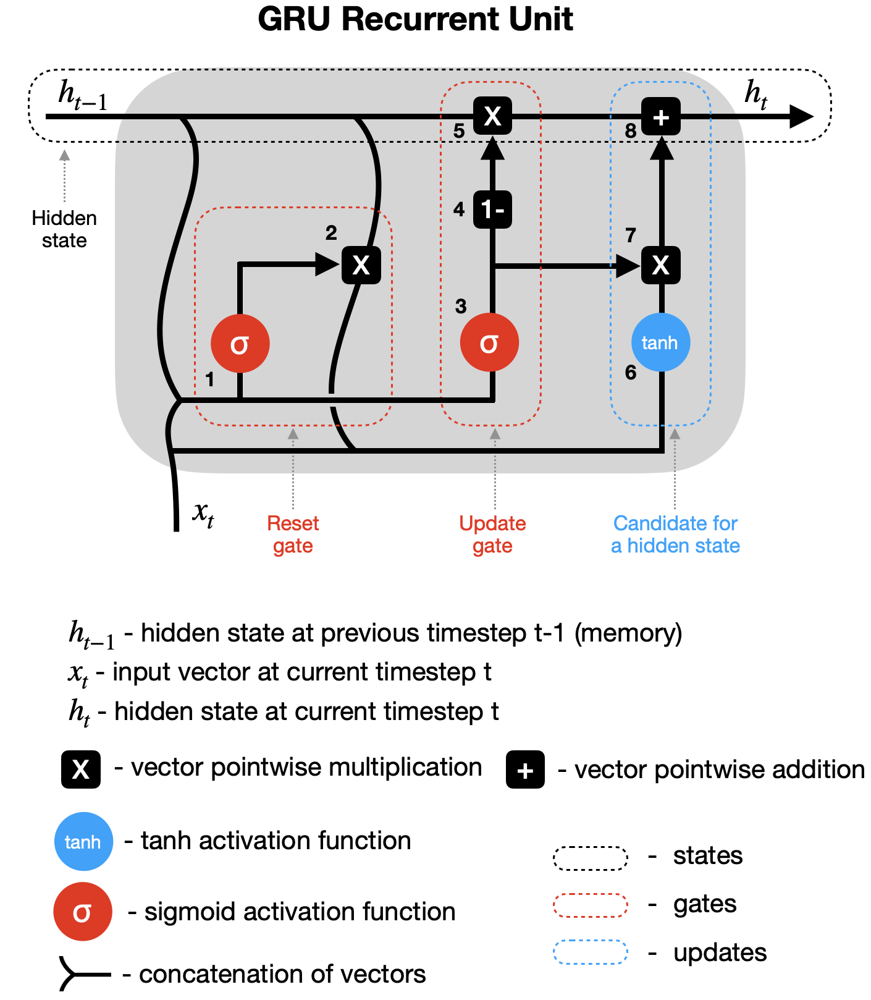

# Gated Recurrent Unit (GRU) Networks - Complete Notes

---

## 1. What is GRU?

**Gated Recurrent Unit (GRU)** is a type of Recurrent Neural Network (RNN) introduced by **Cho et al. in 2014**. It's a **simplified alternative to LSTM** that uses gating mechanisms to learn long-term dependencies efficiently.

### Key Features:
- Simplified version of LSTM
-  Uses only **2 gates** (Update + Reset) vs LSTM's 3 gates
-  Fewer parameters → faster training
-  Handles sequence and time-series data effectively
-  Widely used in NLP, speech processing, and forecasting

---

## 2. GRU vs LSTM Comparison

| Feature | LSTM | GRU |
|---------|------|-----|
| **Gates** | 3 (Input, Forget, Output) | 2 (Update, Reset) |
| **Cell State** | Yes (separate memory) | No (hidden state only) |
| **Training Speed** | Slower | Faster |
| **Computational Load** | Higher | Lower |
| **Parameters** | More | Fewer |
| **Performance** | Better for complex tasks | Comparable in many tasks |

---

## 3. Architecture - The Two Gates

### 3.1 Update Gate ($z_t$)
- Decides **how much past information to retain**
- Combines roles of LSTM's input and forget gates
- Values close to 1 = keep more past info
- Values close to 0 = keep more new info

### 3.2 Reset Gate ($r_t$)
- Decides **how much past information to forget**
- Controls influence of previous hidden state
- Values close to 0 = ignore past state
- Values close to 1 = use past state





## 4. Mathematical Equations

### 4.1 Reset Gate
$$r_t = \sigma(W_r \cdot [h_{t-1}, x_t] + b_r)$$

### 4.2 Update Gate
$$z_t = \sigma(W_z \cdot [h_{t-1}, x_t] + b_z)$$

### 4.3 Candidate Hidden State
$$\tilde{h}_t = \tanh(W_h \cdot [r_t \odot h_{t-1}, x_t] + b_h)$$

### 4.4 Final Hidden State
$$h_t = (1 - z_t) \odot h_{t-1} + z_t \odot \tilde{h}_t$$

### Where:
- $\sigma$ = Sigmoid activation (0 to 1)
- $\tanh$ = Hyperbolic tangent (-1 to +1)
- $\odot$ = Element-wise multiplication
- $[h_{t-1}, x_t]$ = Concatenation of previous hidden state and current input
- $W$ = Weight matrices
- $b$ = Bias terms

---

## 5. How GRU Handles Vanishing Gradients

Like LSTMs, GRUs are designed to address the **vanishing gradient problem**:

- Gating mechanisms regulate information flow
- Gradients can flow through update gate
- Important information preserved over long sequences
- Prevents gradients from shrinking too much

---

## Impementation
```python 
import torch
import torch.nn as nn
import torch.nn.functional as F
import numpy as np
from typing import Optional, Tuple, List, Any
from torch.utils.data import DataLoader, TensorDataset

# ============================================
# Basic GRU Layer
# ============================================

class GRULayer(nn.Module):
    """
    Basic GRU Layer
    
    Args:
        input_size: Number of input features
        hidden_size: Number of hidden units
        num_layers: Number of stacked GRU layers
        dropout: Dropout rate (between layers)
        bidirectional: Use bidirectional GRU
        batch_first: Batch first dimension
    """
    
    def __init__(
        self,
        input_size: int,
        hidden_size: int,
        num_layers: int = 1,
        dropout: float = 0.0,
        bidirectional: bool = False,
        batch_first: bool = True
    ):
        super().__init__()
        self.input_size = input_size
        self.hidden_size = hidden_size
        self.num_layers = num_layers
        self.dropout = dropout
        self.bidirectional = bidirectional
        self.batch_first = batch_first
        self.num_directions = 2 if bidirectional else 1
        
        # Create GRU layers
        self.gru = nn.GRU(
            input_size=input_size,
            hidden_size=hidden_size,
            num_layers=num_layers,
            dropout=dropout if num_layers > 1 else 0,
            bidirectional=bidirectional,
            batch_first=batch_first
        )
        
        # Dropout for output
        self.dropout_layer = nn.Dropout(dropout) if dropout > 0 else nn.Identity()
    
    def forward(
        self,
        x: torch.Tensor,
        hx: Optional[torch.Tensor] = None
    ) -> Tuple[torch.Tensor, torch.Tensor]:
        """
        Args:
            x: Input tensor (batch, seq_len, input_size) if batch_first=True
            hx: Initial hidden state
        
        Returns:
            output: (batch, seq_len, hidden_size * num_directions)
            h_n: Final hidden state
        """
        output, h_n = self.gru(x, hx)
        output = self.dropout_layer(output)
        return output, h_n


# ============================================
# Custom GRU Cell (Manual Implementation)
# ============================================

class GRUCell(nn.Module):
    """
    Single GRU Cell (manual implementation)
    
    Args:
        input_size: Number of input features
        hidden_size: Number of hidden units
        bias: Use bias
    """
    
    def __init__(self, input_size: int, hidden_size: int, bias: bool = True):
        super().__init__()
        self.input_size = input_size
        self.hidden_size = hidden_size
        
        # Reset gate
        self.W_ir = nn.Parameter(torch.Tensor(hidden_size, input_size))
        self.W_hr = nn.Parameter(torch.Tensor(hidden_size, hidden_size))
        self.b_r = nn.Parameter(torch.Tensor(hidden_size)) if bias else None
        
        # Update gate
        self.W_iz = nn.Parameter(torch.Tensor(hidden_size, input_size))
        self.W_hz = nn.Parameter(torch.Tensor(hidden_size, hidden_size))
        self.b_z = nn.Parameter(torch.Tensor(hidden_size)) if bias else None
        
        # New gate
        self.W_in = nn.Parameter(torch.Tensor(hidden_size, input_size))
        self.W_hn = nn.Parameter(torch.Tensor(hidden_size, hidden_size))
        self.b_n = nn.Parameter(torch.Tensor(hidden_size)) if bias else None
        
        self.reset_parameters()
    
    def reset_parameters(self):
        """Initialize weights using Xavier uniform"""
        std = 1.0 / np.sqrt(self.hidden_size)
        for weight in self.parameters():
            nn.init.uniform_(weight, -std, std)
    
    def forward(
        self,
        x: torch.Tensor,
        h: Optional[torch.Tensor] = None
    ) -> torch.Tensor:
        """
        Args:
            x: Input tensor (batch, input_size)
            h: Previous hidden state (batch, hidden_size)
        
        Returns:
            h': New hidden state
        """
        if h is None:
            h = torch.zeros(x.size(0), self.hidden_size, device=x.device)
        
        # Reset gate
        r = torch.sigmoid(F.linear(x, self.W_ir, self.b_r) + F.linear(h, self.W_hr, None))
        
        # Update gate
        z = torch.sigmoid(F.linear(x, self.W_iz, self.b_z) + F.linear(h, self.W_hz, None))
        
        # New gate (candidate hidden state)
        n = torch.tanh(F.linear(x, self.W_in, self.b_n) + r * F.linear(h, self.W_hn, None))
        
        # Update hidden state
        h_new = (1 - z) * n + z * h
        
        return h_new


class CustomGRU(nn.Module):
    """
    Multi-layer GRU using custom GRU cells
    
    Args:
        input_size: Number of input features
        hidden_size: Number of hidden units
        num_layers: Number of stacked layers
        dropout: Dropout rate
        bidirectional: Use bidirectional GRU
        batch_first: Batch first dimension
    """
    
    def __init__(
        self,
        input_size: int,
        hidden_size: int,
        num_layers: int = 1,
        dropout: float = 0.0,
        bidirectional: bool = False,
        batch_first: bool = True
    ):
        super().__init__()
        self.input_size = input_size
        self.hidden_size = hidden_size
        self.num_layers = num_layers
        self.dropout = dropout
        self.bidirectional = bidirectional
        self.batch_first = batch_first
        self.num_directions = 2 if bidirectional else 1
        
        # Create cells for each layer and direction
        self.cells = nn.ModuleList()
        for layer in range(num_layers):
            layer_cells = nn.ModuleList()
            for direction in range(self.num_directions):
                in_size = input_size if layer == 0 else hidden_size * self.num_directions
                layer_cells.append(GRUCell(in_size, hidden_size))
            self.cells.append(layer_cells)
        
        self.dropout_layer = nn.Dropout(dropout) if dropout > 0 else nn.Identity()
    
    def forward(
        self,
        x: torch.Tensor,
        hx: Optional[torch.Tensor] = None
    ) -> Tuple[torch.Tensor, torch.Tensor]:
        """
        Args:
            x: Input tensor
            hx: Initial hidden state
        
        Returns:
            output: All hidden states
            h_n: Final hidden state
        """
        if self.batch_first:
            x = x.transpose(0, 1)  # (seq_len, batch, input_size)
        
        seq_len, batch_size, _ = x.size()
        
        # Initialize hidden states
        if hx is None:
            h = torch.zeros(
                self.num_layers * self.num_directions,
                batch_size,
                self.hidden_size,
                device=x.device
            )
        else:
            h = hx
        
        # Process sequence
        outputs = []
        for t in range(seq_len):
            x_t = x[t]
            
            # Process each layer
            for layer in range(self.num_layers):
                layer_outputs = []
                for direction in range(self.num_directions):
                    idx = layer * self.num_directions + direction
                    h_t = self.cells[layer][direction](x_t, h[idx])
                    h[idx] = h_t
                    layer_outputs.append(h_t)
                
                # Combine directions
                if self.bidirectional:
                    x_t = torch.cat(layer_outputs, dim=1)
                else:
                    x_t = layer_outputs[0]
                
                # Apply dropout between layers
                if layer < self.num_layers - 1:
                    x_t = self.dropout_layer(x_t)
            
            outputs.append(x_t)
        
        # Stack outputs
        output = torch.stack(outputs, dim=0)  # (seq_len, batch, hidden_size * num_directions)
        
        if self.batch_first:
            output = output.transpose(0, 1)  # (batch, seq_len, hidden_size * num_directions)
        
        return output, h


# ============================================
# GRU Models for Different Tasks
# ============================================

class GRUForClassification(nn.Module):
    """
    GRU for sequence classification
    
    Args:
        input_size: Number of input features
        hidden_size: Number of hidden units
        num_layers: Number of GRU layers
        num_classes: Number of classes
        dropout: Dropout rate
        bidirectional: Use bidirectional GRU
        batch_first: Batch first dimension
    """
    
    def __init__(
        self,
        input_size: int,
        hidden_size: int,
        num_layers: int,
        num_classes: int,
        dropout: float = 0.0,
        bidirectional: bool = False,
        batch_first: bool = True
    ):
        super().__init__()
        self.hidden_size = hidden_size
        self.num_directions = 2 if bidirectional else 1
        
        self.gru = nn.GRU(
            input_size=input_size,
            hidden_size=hidden_size,
            num_layers=num_layers,
            dropout=dropout if num_layers > 1 else 0,
            bidirectional=bidirectional,
            batch_first=batch_first
        )
        
        self.dropout = nn.Dropout(dropout)
        self.fc = nn.Linear(hidden_size * self.num_directions, num_classes)
    
    def forward(self, x: torch.Tensor) -> torch.Tensor:
        """
        Args:
            x: Input tensor (batch, seq_len, input_size)
        
        Returns:
            Logits (batch, num_classes)
        """
        gru_out, _ = self.gru(x)
        # Use the last output
        last_out = gru_out[:, -1, :]
        last_out = self.dropout(last_out)
        return self.fc(last_out)


class GRUForRegression(nn.Module):
    """
    GRU for sequence regression
    
    Args:
        input_size: Number of input features
        hidden_size: Number of hidden units
        num_layers: Number of GRU layers
        output_size: Number of output features
        dropout: Dropout rate
    """
    
    def __init__(
        self,
        input_size: int,
        hidden_size: int,
        num_layers: int,
        output_size: int = 1,
        dropout: float = 0.0,
        batch_first: bool = True
    ):
        super().__init__()
        self.gru = nn.GRU(
            input_size=input_size,
            hidden_size=hidden_size,
            num_layers=num_layers,
            dropout=dropout if num_layers > 1 else 0,
            batch_first=batch_first
        )
        self.dropout = nn.Dropout(dropout)
        self.fc = nn.Linear(hidden_size, output_size)
    
    def forward(self, x: torch.Tensor) -> torch.Tensor:
        """
        Args:
            x: Input tensor (batch, seq_len, input_size)
        
        Returns:
            Predictions (batch, output_size)
        """
        gru_out, _ = self.gru(x)
        last_out = gru_out[:, -1, :]
        last_out = self.dropout(last_out)
        return self.fc(last_out)


class GRUForSequenceToSequence(nn.Module):
    """
    GRU for sequence-to-sequence tasks
    
    Args:
        input_size: Number of input features
        hidden_size: Number of hidden units
        num_layers: Number of GRU layers
        output_size: Number of output features per timestep
        output_seq_len: Length of output sequence
        dropout: Dropout rate
    """
    
    def __init__(
        self,
        input_size: int,
        hidden_size: int,
        num_layers: int,
        output_size: int,
        output_seq_len: int,
        dropout: float = 0.0,
        batch_first: bool = True
    ):
        super().__init__()
        self.hidden_size = hidden_size
        self.num_layers = num_layers
        self.output_seq_len = output_seq_len
        
        self.encoder = nn.GRU(
            input_size=input_size,
            hidden_size=hidden_size,
            num_layers=num_layers,
            dropout=dropout if num_layers > 1 else 0,
            batch_first=batch_first
        )
        
        self.decoder = nn.GRU(
            input_size=output_size,
            hidden_size=hidden_size,
            num_layers=num_layers,
            dropout=dropout if num_layers > 1 else 0,
            batch_first=batch_first
        )
        
        self.fc = nn.Linear(hidden_size, output_size)
        self.dropout = nn.Dropout(dropout)
    
    def forward(
        self,
        x: torch.Tensor,
        teacher_forcing: Optional[torch.Tensor] = None,
        teacher_ratio: float = 0.5
    ) -> torch.Tensor:
        """
        Args:
            x: Input tensor (batch, input_seq_len, input_size)
            teacher_forcing: Target sequence (batch, output_seq_len, output_size)
            teacher_ratio: Probability of using teacher forcing
        
        Returns:
            Output sequence (batch, output_seq_len, output_size)
        """
        batch_size = x.size(0)
        
        # Encode
        _, h = self.encoder(x)
        
        # Decoder input (start with zeros)
        decoder_input = torch.zeros(
            batch_size, 1, self.fc.out_features,
            device=x.device
        )
        
        outputs = []
        for t in range(self.output_seq_len):
            # Decode
            decoder_out, h = self.decoder(decoder_input, h)
            pred = self.fc(decoder_out)
            outputs.append(pred)
            
            # Teacher forcing
            if teacher_forcing is not None and torch.rand(1).item() < teacher_ratio:
                decoder_input = teacher_forcing[:, t:t+1, :]
            else:
                decoder_input = pred
        
        return torch.cat(outputs, dim=1)


class GRUForLanguageModeling(nn.Module):
    """
    GRU for language modeling / text generation
    
    Args:
        vocab_size: Size of vocabulary
        embedding_dim: Dimension of embeddings
        hidden_size: Number of hidden units
        num_layers: Number of GRU layers
        dropout: Dropout rate
    """
    
    def __init__(
        self,
        vocab_size: int,
        embedding_dim: int,
        hidden_size: int,
        num_layers: int,
        dropout: float = 0.0,
        batch_first: bool = True
    ):
        super().__init__()
        self.vocab_size = vocab_size
        self.hidden_size = hidden_size
        self.num_layers = num_layers
        
        self.embedding = nn.Embedding(vocab_size, embedding_dim, padding_idx=0)
        self.gru = nn.GRU(
            input_size=embedding_dim,
            hidden_size=hidden_size,
            num_layers=num_layers,
            dropout=dropout if num_layers > 1 else 0,
            batch_first=batch_first
        )
        self.dropout = nn.Dropout(dropout)
        self.fc = nn.Linear(hidden_size, vocab_size)
    
    def forward(self, x: torch.Tensor) -> torch.Tensor:
        """
        Args:
            x: Input tokens (batch, seq_len)
        
        Returns:
            Logits (batch, seq_len, vocab_size)
        """
        x = self.embedding(x)
        x, _ = self.gru(x)
        x = self.dropout(x)
        return self.fc(x)


class GRUForBinaryClassification(nn.Module):
    """
    GRU for binary classification (sentiment analysis)
    
    Args:
        vocab_size: Vocabulary size
        embedding_dim: Embedding dimension
        hidden_size: Hidden size
        num_layers: Number of GRU layers
        dropout: Dropout rate
    """
    
    def __init__(
        self,
        vocab_size: int,
        embedding_dim: int,
        hidden_size: int,
        num_layers: int,
        dropout: float = 0.0,
        bidirectional: bool = True
    ):
        super().__init__()
        self.hidden_size = hidden_size
        self.num_directions = 2 if bidirectional else 1
        
        self.embedding = nn.Embedding(vocab_size, embedding_dim, padding_idx=0)
        self.gru = nn.GRU(
            input_size=embedding_dim,
            hidden_size=hidden_size,
            num_layers=num_layers,
            dropout=dropout if num_layers > 1 else 0,
            bidirectional=bidirectional,
            batch_first=True
        )
        self.dropout = nn.Dropout(dropout)
        self.fc = nn.Linear(hidden_size * self.num_directions, 1)
    
    def forward(self, x: torch.Tensor) -> torch.Tensor:
        """
        Args:
            x: Input tokens (batch, seq_len)
        
        Returns:
            Logits (batch, 1)
        """
        x = self.embedding(x)
        gru_out, _ = self.gru(x)
        # Use last output or mean pooling
        last_out = gru_out[:, -1, :]
        last_out = self.dropout(last_out)
        return self.fc(last_out)


# ============================================
# Attention Mechanisms for GRU
# ============================================

class Attention(nn.Module):
    """
    Attention mechanism for GRU
    
    Args:
        hidden_size: Hidden size of GRU
        attention_size: Size of attention layer
    """
    
    def __init__(self, hidden_size: int, attention_size: int = None):
        super().__init__()
        if attention_size is None:
            attention_size = hidden_size
        
        self.attention = nn.Sequential(
            nn.Linear(hidden_size, attention_size),
            nn.Tanh(),
            nn.Linear(attention_size, 1)
        )
    
    def forward(self, gru_outputs: torch.Tensor) -> torch.Tensor:
        """
        Args:
            gru_outputs: (batch, seq_len, hidden_size)
        
        Returns:
            Context vector (batch, hidden_size)
        """
        # Compute attention weights
        attention_weights = self.attention(gru_outputs)  # (batch, seq_len, 1)
        attention_weights = F.softmax(attention_weights, dim=1)
        
        # Apply attention
        context = torch.sum(attention_weights * gru_outputs, dim=1)
        return context


class GRUWithAttention(nn.Module):
    """
    GRU with attention for classification
    
    Args:
        input_size: Number of input features
        hidden_size: Number of hidden units
        num_layers: Number of GRU layers
        num_classes: Number of classes
        dropout: Dropout rate
        bidirectional: Use bidirectional GRU
    """
    
    def __init__(
        self,
        input_size: int,
        hidden_size: int,
        num_layers: int,
        num_classes: int,
        dropout: float = 0.0,
        bidirectional: bool = True,
        batch_first: bool = True
    ):
        super().__init__()
        self.hidden_size = hidden_size
        self.num_directions = 2 if bidirectional else 1
        
        self.gru = nn.GRU(
            input_size=input_size,
            hidden_size=hidden_size,
            num_layers=num_layers,
            dropout=dropout if num_layers > 1 else 0,
            bidirectional=bidirectional,
            batch_first=batch_first
        )
        
        self.attention = Attention(hidden_size * self.num_directions)
        self.dropout = nn.Dropout(dropout)
        self.fc = nn.Linear(hidden_size * self.num_directions, num_classes)
    
    def forward(self, x: torch.Tensor) -> torch.Tensor:
        """
        Args:
            x: Input tensor (batch, seq_len, input_size)
        
        Returns:
            Logits (batch, num_classes)
        """
        gru_out, _ = self.gru(x)
        context = self.attention(gru_out)
        context = self.dropout(context)
        return self.fc(context)


# ============================================
# Stacked GRU with Residual Connections
# ============================================

class ResidualGRU(nn.Module):
    """
    GRU with residual connections between layers
    
    Args:
        input_size: Number of input features
        hidden_size: Number of hidden units
        num_layers: Number of GRU layers
        dropout: Dropout rate
        batch_first: Batch first
    """
    
    def __init__(
        self,
        input_size: int,
        hidden_size: int,
        num_layers: int,
        dropout: float = 0.0,
        batch_first: bool = True
    ):
        super().__init__()
        self.hidden_size = hidden_size
        self.num_layers = num_layers
        
        self.gru_layers = nn.ModuleList()
        self.dropout_layers = nn.ModuleList()
        
        for i in range(num_layers):
            in_size = input_size if i == 0 else hidden_size
            gru = nn.GRU(
                input_size=in_size,
                hidden_size=hidden_size,
                num_layers=1,
                batch_first=batch_first
            )
            self.gru_layers.append(gru)
            self.dropout_layers.append(nn.Dropout(dropout) if dropout > 0 else nn.Identity())
    
    def forward(self, x: torch.Tensor) -> Tuple[torch.Tensor, List[torch.Tensor]]:
        """
        Args:
            x: Input tensor (batch, seq_len, input_size)
        
        Returns:
            Output and list of hidden states
        """
        hidden_states = []
        for i, (gru, dropout) in enumerate(zip(self.gru_layers, self.dropout_layers)):
            out, h = gru(x)
            out = dropout(out)
            
            # Residual connection
            if i > 0 and x.shape[-1] == out.shape[-1]:
                out = out + x
            
            x = out
            hidden_states.append(h)
        
        return x, hidden_states


# ============================================
# Bidirectional GRU with Layer Normalization
# ============================================

class LayerNormGRU(nn.Module):
    """
    GRU with Layer Normalization
    
    Args:
        input_size: Number of input features
        hidden_size: Number of hidden units
        num_layers: Number of GRU layers
        dropout: Dropout rate
        bidirectional: Use bidirectional GRU
    """
    
    def __init__(
        self,
        input_size: int,
        hidden_size: int,
        num_layers: int = 1,
        dropout: float = 0.0,
        bidirectional: bool = False,
        batch_first: bool = True
    ):
        super().__init__()
        self.hidden_size = hidden_size
        self.num_directions = 2 if bidirectional else 1
        
        self.gru = nn.GRU(
            input_size=input_size,
            hidden_size=hidden_size,
            num_layers=num_layers,
            dropout=dropout if num_layers > 1 else 0,
            bidirectional=bidirectional,
            batch_first=batch_first
        )
        
        self.layer_norm = nn.LayerNorm(hidden_size * self.num_directions)
        self.dropout = nn.Dropout(dropout)
    
    def forward(self, x: torch.Tensor) -> Tuple[torch.Tensor, torch.Tensor]:
        """
        Args:
            x: Input tensor (batch, seq_len, input_size)
        
        Returns:
            Output and hidden state
        """
        gru_out, h_n = self.gru(x)
        gru_out = self.layer_norm(gru_out)
        gru_out = self.dropout(gru_out)
        return gru_out, h_n


# ============================================
# Utilities
# ============================================

def init_hidden(
    batch_size: int,
    hidden_size: int,
    num_layers: int,
    bidirectional: bool = False,
    device: torch.device = torch.device('cpu')
) -> torch.Tensor:
    """Initialize hidden state"""
    num_directions = 2 if bidirectional else 1
    return torch.zeros(
        num_layers * num_directions,
        batch_size,
        hidden_size,
        device=device
    )


def count_parameters(model: nn.Module) -> int:
    """Count trainable parameters"""
    return sum(p.numel() for p in model.parameters() if p.requires_grad)


def get_model_size(model: nn.Module) -> float:
    """Get model size in MB"""
    param_size = 0
    for param in model.parameters():
        param_size += param.nelement() * param.element_size()
    buffer_size = 0
    for buffer in model.buffers():
        buffer_size += buffer.nelement() * buffer.element_size()
    return (param_size + buffer_size) / 1024**2


# ============================================
# Training Example
# ============================================

def train_gru_example():
    """Example training loop for GRU"""
    
    # Generate sample data
    def generate_data(num_samples: int = 1000, seq_len: int = 10, input_size: int = 5):
        X = torch.randn(num_samples, seq_len, input_size)
        # Simple classification based on sequence sum
        y = (X.sum(dim=(1, 2)) > 0).long()
        return X, y
    
    # Create dataset
    X, y = generate_data()
    dataset = TensorDataset(X, y)
    dataloader = DataLoader(dataset, batch_size=32, shuffle=True)
    
    # Create model
    model = GRUForClassification(
        input_size=5,
        hidden_size=64,
        num_layers=2,
        num_classes=2,
        dropout=0.2,
        bidirectional=True
    )
    
    print(f"Model: GRUForClassification")
    print(f"Parameters: {count_parameters(model):,}")
    
    # Training setup
    criterion = nn.CrossEntropyLoss()
    optimizer = torch.optim.Adam(model.parameters(), lr=0.001)
    
    # Training loop (simplified)
    model.train()
    for epoch in range(5):
        total_loss = 0
        for batch_X, batch_y in dataloader:
            optimizer.zero_grad()
            outputs = model(batch_X)
            loss = criterion(outputs, batch_y)
            loss.backward()
            torch.nn.utils.clip_grad_norm_(model.parameters(), max_norm=1.0)
            optimizer.step()
            total_loss += loss.item()
        
        print(f"Epoch {epoch+1}, Loss: {total_loss/len(dataloader):.4f}")


# ============================================
# Usage Example
# ============================================

if __name__ == "__main__":
    print("=" * 60)
    print("GRU Examples")
    print("=" * 60)
    
    # Basic GRU
    print("\n1. Basic GRU Layer")
    gru = GRULayer(input_size=10, hidden_size=20, num_layers=2, bidirectional=True)
    x = torch.randn(2, 5, 10)  # (batch, seq_len, input_size)
    output, h = gru(x)
    print(f"Input: {x.shape}")
    print(f"Output: {output.shape}")
    print(f"Hidden: {h.shape}")
    
    # Custom GRU (Manual Implementation)
    print("\n2. Custom GRU (Manual Implementation)")
    custom_gru = CustomGRU(input_size=10, hidden_size=20, num_layers=2, bidirectional=True)
    x = torch.randn(2, 5, 10)
    output, h = custom_gru(x)
    print(f"Input: {x.shape}")
    print(f"Output: {output.shape}")
    print(f"Hidden: {h.shape}")
    print(f"Parameters: {count_parameters(custom_gru):,}")
    
    # GRU for Classification
    print("\n3. GRU for Classification")
    model = GRUForClassification(
        input_size=10,
        hidden_size=64,
        num_layers=2,
        num_classes=5,
        dropout=0.2,
        bidirectional=True
    )
    x = torch.randn(2, 10, 10)
    output = model(x)
    print(f"Input: {x.shape}")
    print(f"Output (logits): {output.shape}")
    print(f"Parameters: {count_parameters(model):,}")
    
    # GRU with Attention
    print("\n4. GRU with Attention")
    model_attn = GRUWithAttention(
        input_size=10,
        hidden_size=64,
        num_layers=2,
        num_classes=5,
        dropout=0.2,
        bidirectional=True
    )
    x = torch.randn(2, 10, 10)
    output = model_attn(x)
    print(f"Input: {x.shape}")
    print(f"Output (with attention): {output.shape}")
    print(f"Parameters: {count_parameters(model_attn):,}")
    
    # Sequence-to-Sequence
    print("\n5. GRU for Sequence-to-Sequence")
    model_s2s = GRUForSequenceToSequence(
        input_size=5,
        hidden_size=32,
        num_layers=2,
        output_size=3,
        output_seq_len=8,
        dropout=0.1
    )
    x = torch.randn(2, 10, 5)
    output = model_s2s(x)
    print(f"Input: {x.shape}")
    print(f"Output (predicted sequence): {output.shape}")
    print(f"Parameters: {count_parameters(model_s2s):,}")
    
    # Language Modeling
    print("\n6. GRU for Language Modeling")
    model_lm = GRUForLanguageModeling(
        vocab_size=1000,
        embedding_dim=128,
        hidden_size=256,
        num_layers=2,
        dropout=0.2
    )
    x = torch.randint(0, 1000, (2, 20))
    output = model_lm(x)
    print(f"Input tokens: {x.shape}")
    print(f"Output (logits over vocabulary): {output.shape}")
    print(f"Parameters: {count_parameters(model_lm):,}")
    
    # Binary Classification (Sentiment Analysis)
    print("\n7. GRU for Binary Classification")
    model_binary = GRUForBinaryClassification(
        vocab_size=10000,
        embedding_dim=100,
        hidden_size=128,
        num_layers=2,
        dropout=0.3,
        bidirectional=True
    )
    x = torch.randint(0, 10000, (2, 50))
    output = model_binary(x)
    print(f"Input tokens: {x.shape}")
    print(f"Output (logits): {output.shape}")
    print(f"Parameters: {count_parameters(model_binary):,}")
    
    # Residual GRU
    print("\n8. Residual GRU")
    model_res = ResidualGRU(
        input_size=10,
        hidden_size=20,
        num_layers=3,
        dropout=0.1
    )
    x = torch.randn(2, 5, 10)
    output, hidden = model_res(x)
    print(f"Input: {x.shape}")
    print(f"Output: {output.shape}")
    print(f"Number of hidden states: {len(hidden)}")
    print(f"Parameters: {count_parameters(model_res):,}")
    
    # LayerNorm GRU
    print("\n9. LayerNorm GRU")
    model_ln = LayerNormGRU(
        input_size=10,
        hidden_size=20,
        num_layers=2,
        dropout=0.1,
        bidirectional=True
    )
    x = torch.randn(2, 5, 10)
    output, h = model_ln(x)
    print(f"Input: {x.shape}")
    print(f"Output: {output.shape}")
    print(f"Parameters: {count_parameters(model_ln):,}")
    
    print("\n" + "=" * 60)
    print("All models loaded successfully!")

```
## Applications of GRU

| Domain | Applications |
|--------|--------------|
| **Natural Language Processing** | Machine translation, text generation, sentiment analysis, text classification, language modeling |
| **Speech & Audio Processing** | Speech recognition (audio → text), audio processing, voice activity detection |
| **Time Series Forecasting** | Weather prediction, stock price forecasting, energy usage prediction, sales/demand forecasting |
| **Computer Vision** | Video analysis, activity recognition, motion understanding, gesture recognition |
| **Recommendation Systems** | Personalized suggestions, user behavior analysis, sequential recommendation |
| **Security & Anomaly Detection** | Fraud detection, intrusion detection, anomaly detection in time-series |

---

## Limitations of GRU

| Limitation | Description |
|------------|-------------|
| **Less Expressive than LSTM** | May underperform on very complex tasks; lacks separate cell state for fine-grained memory control; not ideal for extremely long-term dependencies |
| **Sequential Processing** | Processes data step-by-step (cannot parallelize across time); slower than transformers for long sequences; training can be slow for very long sequences |
| **Memory Constraints** | Still struggles with very long sequences (>500 steps); can suffer from vanishing gradients in extremely deep networks; limited memory capacity compared to LSTM |
| **Hyperparameter Sensitivity** | Requires careful tuning of hidden units, learning rate, batch size, and number of layers |
| **Data Requirements** | Needs sufficient data to learn effectively; prone to overfitting on small datasets; performance drops with noisy or irregular data |
| **Interpretability** | Gates are difficult to interpret; less transparency than simpler models; hard to explain why certain decisions were made |
| **No Built-in Attention** | Lacks explicit attention mechanisms; may need additional components for complex pattern recognition |