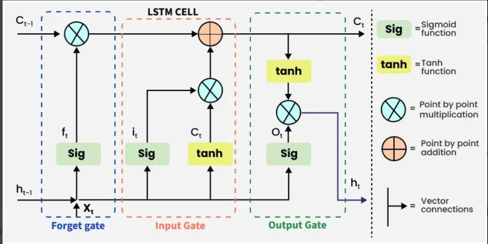

## LSTM (Long Short-Term Memory)

### The Problem
Early RNNs struggled with **vanishing and exploding gradients**, making it difficult to learn long-term dependencies. This issue was identified by Bengio, Hochreiter, and others in the early 1990s.

### The Solution
The **Long Short-Term Memory (LSTM)** model, introduced by Hochreiter and Schmidhuber (1997), was designed to overcome the vanishing gradient problem.

### Key Innovation: Memory Cells
Instead of standard recurrent nodes, LSTMs use **memory cells**. Each cell contains:
- An internal state with a **self-connected recurrent edge of fixed weight 1**
- This allows gradients to flow across many time steps without vanishing or exploding

### The Name Explained
| Memory Type | Description |
|-------------|-------------|
| **Long-term** | Slowly changing weights that encode general knowledge |
| **Short-term** | Ephemeral activations passing between nodes |
| **LSTM (intermediate)** | Memory cells that bridge the gap between long and short-term memory |


## Gated Memmory Cells
LSTMs use **gates** to control the flow of information into and out of the memory cell. Each gate is a neural network layer with a sigmoid activation function, producing outputs between 0 and 1. The gates are:
1. **Forget Gate**: Decides what information to discard from the cell state.
2. **Input Gate**: Determines which new information to add to the cell state.
3. **Output Gate**: Controls what information to output from the cell state.

### Gated Hidden State

**Key difference** between vanilla RNNs and LSTMs:

LSTMs have **learned mechanisms** that decide when to:
- **Update** the hidden state
- **Reset** the hidden state

**Examples of what LSTMs learn:**
- Keep important info (e.g., first token is critical → don't overwrite it)
- Ignore irrelevant data (skip temporary noise)
- Clear memory when needed (reset the state)


## Gate in LSTM:



### Forget Gate

**Purpose:** Decides what to keep or discard from the cell state.

#### How it works:
- Takes **current input** ($x_t$) and **previous hidden state** ($h_{t-1}$)
- Passes them through a **sigmoid** function → outputs values between **0 and 1**

| Value | Meaning |
|-------|---------|
| **Close to 0** | ❌ Remove/forget this information |
| **Close to 1** | ✅ Keep/retain this information |

#### Benefits:
- Discards unnecessary past information
- Controls memory retention

#### Formula:
$$f_t = \sigma(W_f \cdot [h_{t-1}, x_t] + b_f)$$

#### Where:
- $W_f$ = weight matrix for forget gate
- $[h_{t-1}, x_t]$ = concatenated previous hidden state and current input
- $b_f$ = bias term
- $\sigma$ = sigmoid activation function
---

### Input Gate

**Purpose:** Adds useful new information to the cell state.

#### How it works (3 steps):

1. **Regulate** — Use **sigmoid** on inputs ($h_{t-1}$ and $x_t$) to decide which values to remember (outputs 0 to 1)
2. **Create candidate vector** — Use **tanh** on same inputs to generate possible values (outputs -1 to +1)
3. **Multiply** — Combine regulated values with candidate vector to keep only useful information

#### Formulas:

**Input Gate (sigmoid):**
$$i_t = \sigma(W_i \cdot [h_{t-1}, x_t] + b_i)$$

**Candidate Values (tanh):**
$$\tilde{C}_t = \tanh(W_c \cdot [h_{t-1}, x_t] + b_c)$$

**Update Cell State:**
$$C_t = f_t \odot C_{t-1} + i_t \odot \tilde{C}_t$$

#### Where:
- $i_t$ = input gate (what to add)
- $\tilde{C}_t$ = candidate values (possible new memory)
- $C_t$ = new cell state (updated memory)
- $f_t$ = forget gate (from previous step)
- $\odot$ = element-wise multiplication
- $\tanh$ = activation function (-1 to +1)

---
### Output Gate

**Purpose:** Determines what information from the current cell state gets passed as the hidden state (output) at this time step.

#### How it works (2 steps):

1. **Regulate** — Use **sigmoid** on inputs ($h_{t-1}$ and $x_t$) to decide what to output (values 0 to 1)
2. **Scale & Filter** — Pass cell state through **tanh** (scales to -1 to +1), then multiply with sigmoid output

#### Formulas:

**Output Gate (sigmoid):**
$$o_t = \sigma(W_o \cdot [h_{t-1}, x_t] + b_o)$$

**Hidden State (final output):**
$$h_t = o_t \odot \tanh(C_t)$$

#### Where:
- $o_t$ = output gate activation (what to let through)
- $C_t$ = current cell state
- $h_t$ = hidden state (output at this step)
- $\odot$ = element-wise multiplication
- $\tanh$ = activation function (-1 to +1)

#### What happens next:
> The hidden state $h_t$ is passed to the **next time step** and can also be used to generate the network's output.


## Applications of LSTM

### Common Use Cases

| Domain | Application |
|--------|-------------|
| **Natural Language Processing** | Language modeling, machine translation, text summarization |
| **Speech & Audio** | Speech recognition (audio → text) |
| **Time Series** | Stock price prediction, weather forecasting, energy usage prediction |
| **Security** | Anomaly detection (fraud detection, intrusion detection) |
| **Recommendation** | Personalized suggestions (products, content) |
| **Computer Vision** | Video analysis (activity recognition, motion understanding) |


## Limitations of LSTM

Despite their power, LSTMs have several drawbacks:

| Limitation | Description |
|------------|-------------|
| **Computational Cost** | Heavy due to complex gating mechanism (more parameters than standard RNNs) |
| **Training Time** | Slow training, especially for long sequences |
| **Overfitting** | Prone to overfitting on small datasets |
| **Sequence Length** | Still struggles with very long sequences (>1000 steps) despite improvements |
| **Memory Usage** | High memory consumption during training (stores gradients for all time steps) |
| **Non-Parallelizable** | Processes sequences sequentially (cannot parallelize across time) |
| **Hyperparameter Tuning** | Many gates → many hyperparameters to tune |
| **Interpretability** | Hard to interpret what gates actually learn |

### Alternatives to Address Limitations:
- **GRU (Gated Recurrent Unit)** — Simpler, faster, fewer gates
- **Transformers** — Parallel processing, handles longer sequences
- **Attention Mechanisms** — Better long-range dependency handling
- **1D CNNs** — Faster training, parallelizable

## Implemtation 


```python
import torch
import torch.nn as nn
import torch.nn.functional as F
import numpy as np
from typing import Optional, Tuple, List, Any
from torch.utils.data import DataLoader, TensorDataset

# ============================================
# Basic LSTM Layer
# ============================================

class LSTMLayer(nn.Module):
    """
    Basic LSTM Layer with manual implementation
    
    Args:
        input_size: Number of input features
        hidden_size: Number of hidden units
        num_layers: Number of stacked LSTM layers
        dropout: Dropout rate (between layers)
        bidirectional: Use bidirectional LSTM
    """
    
    def __init__(
        self,
        input_size: int,
        hidden_size: int,
        num_layers: int = 1,
        dropout: float = 0.0,
        bidirectional: bool = False,
        batch_first: bool = True
    ):
        super().__init__()
        self.input_size = input_size
        self.hidden_size = hidden_size
        self.num_layers = num_layers
        self.dropout = dropout
        self.bidirectional = bidirectional
        self.batch_first = batch_first
        
        # Number of directions
        self.num_directions = 2 if bidirectional else 1
        
        # Create LSTM layers
        self.lstm = nn.LSTM(
            input_size=input_size,
            hidden_size=hidden_size,
            num_layers=num_layers,
            dropout=dropout if num_layers > 1 else 0,
            bidirectional=bidirectional,
            batch_first=batch_first
        )
        
        # Dropout for output (if needed)
        self.dropout_layer = nn.Dropout(dropout) if dropout > 0 else nn.Identity()
    
    def forward(
        self,
        x: torch.Tensor,
        hx: Optional[Tuple[torch.Tensor, torch.Tensor]] = None
    ) -> Tuple[torch.Tensor, Tuple[torch.Tensor, torch.Tensor]]:
        """
        Args:
            x: Input tensor of shape (batch, seq_len, input_size) if batch_first=True
            hx: Tuple of (hidden, cell) states
        
        Returns:
            output: (batch, seq_len, hidden_size * num_directions)
            (h_n, c_n): Final hidden and cell states
        """
        output, (h_n, c_n) = self.lstm(x, hx)
        output = self.dropout_layer(output)
        return output, (h_n, c_n)


# ============================================
# Custom LSTM Cell (Manual Implementation)
# ============================================

class LSTMCell(nn.Module):
    """
    Single LSTM Cell (manual implementation)
    
    Args:
        input_size: Number of input features
        hidden_size: Number of hidden units
        bias: Use bias
    """
    
    def __init__(self, input_size: int, hidden_size: int, bias: bool = True):
        super().__init__()
        self.input_size = input_size
        self.hidden_size = hidden_size
        
        # Input gate
        self.W_ii = nn.Parameter(torch.Tensor(hidden_size, input_size))
        self.W_hi = nn.Parameter(torch.Tensor(hidden_size, hidden_size))
        self.b_i = nn.Parameter(torch.Tensor(hidden_size)) if bias else None
        
        # Forget gate
        self.W_if = nn.Parameter(torch.Tensor(hidden_size, input_size))
        self.W_hf = nn.Parameter(torch.Tensor(hidden_size, hidden_size))
        self.b_f = nn.Parameter(torch.Tensor(hidden_size)) if bias else None
        
        # Cell gate
        self.W_ig = nn.Parameter(torch.Tensor(hidden_size, input_size))
        self.W_hg = nn.Parameter(torch.Tensor(hidden_size, hidden_size))
        self.b_g = nn.Parameter(torch.Tensor(hidden_size)) if bias else None
        
        # Output gate
        self.W_io = nn.Parameter(torch.Tensor(hidden_size, input_size))
        self.W_ho = nn.Parameter(torch.Tensor(hidden_size, hidden_size))
        self.b_o = nn.Parameter(torch.Tensor(hidden_size)) if bias else None
        
        self.reset_parameters()
    
    def reset_parameters(self):
        """Initialize weights using Xavier uniform"""
        std = 1.0 / np.sqrt(self.hidden_size)
        for weight in self.parameters():
            nn.init.uniform_(weight, -std, std)
    
    def forward(
        self,
        x: torch.Tensor,
        hx: Optional[Tuple[torch.Tensor, torch.Tensor]] = None
    ) -> Tuple[torch.Tensor, torch.Tensor]:
        """
        Args:
            x: Input tensor (batch, input_size)
            hx: Tuple of (h, c) states (batch, hidden_size)
        
        Returns:
            (h', c'): New hidden and cell states
        """
        if hx is None:
            h = torch.zeros(x.size(0), self.hidden_size, device=x.device)
            c = torch.zeros(x.size(0), self.hidden_size, device=x.device)
        else:
            h, c = hx
        
        # Gates
        i = torch.sigmoid(F.linear(x, self.W_ii, self.b_i) + F.linear(h, self.W_hi, None))
        f = torch.sigmoid(F.linear(x, self.W_if, self.b_f) + F.linear(h, self.W_hf, None))
        g = torch.tanh(F.linear(x, self.W_ig, self.b_g) + F.linear(h, self.W_hg, None))
        o = torch.sigmoid(F.linear(x, self.W_io, self.b_o) + F.linear(h, self.W_ho, None))
        
        # Update
        c_new = f * c + i * g
        h_new = o * torch.tanh(c_new)
        
        return h_new, c_new


class CustomLSTM(nn.Module):
    """
    Multi-layer LSTM using custom LSTM cells
    
    Args:
        input_size: Number of input features
        hidden_size: Number of hidden units
        num_layers: Number of stacked layers
        dropout: Dropout rate
        bidirectional: Use bidirectional LSTM
    """
    
    def __init__(
        self,
        input_size: int,
        hidden_size: int,
        num_layers: int = 1,
        dropout: float = 0.0,
        bidirectional: bool = False,
        batch_first: bool = True
    ):
        super().__init__()
        self.input_size = input_size
        self.hidden_size = hidden_size
        self.num_layers = num_layers
        self.dropout = dropout
        self.bidirectional = bidirectional
        self.batch_first = batch_first
        self.num_directions = 2 if bidirectional else 1
        
        # Create cells for each layer and direction
        self.cells = nn.ModuleList()
        for layer in range(num_layers):
            layer_cells = nn.ModuleList()
            for direction in range(self.num_directions):
                in_size = input_size if layer == 0 else hidden_size * self.num_directions
                layer_cells.append(LSTMCell(in_size, hidden_size))
            self.cells.append(layer_cells)
        
        self.dropout_layer = nn.Dropout(dropout) if dropout > 0 else nn.Identity()
    
    def forward(
        self,
        x: torch.Tensor,
        hx: Optional[Tuple[torch.Tensor, torch.Tensor]] = None
    ) -> Tuple[torch.Tensor, Tuple[torch.Tensor, torch.Tensor]]:
        """
        Args:
            x: Input tensor (batch, seq_len, input_size) if batch_first=True
            hx: Tuple of (h, c) states
        """
        if self.batch_first:
            x = x.transpose(0, 1)  # (seq_len, batch, input_size)
        
        seq_len, batch_size, _ = x.size()
        
        # Initialize hidden states
        if hx is None:
            h = torch.zeros(
                self.num_layers * self.num_directions,
                batch_size,
                self.hidden_size,
                device=x.device
            )
            c = torch.zeros(
                self.num_layers * self.num_directions,
                batch_size,
                self.hidden_size,
                device=x.device
            )
        else:
            h, c = hx
        
        # Process sequence
        outputs = []
        for t in range(seq_len):
            x_t = x[t]
            
            # Process each layer
            for layer in range(self.num_layers):
                layer_outputs = []
                for direction in range(self.num_directions):
                    idx = layer * self.num_directions + direction
                    h_t, c_t = self.cells[layer][direction](x_t, (h[idx], c[idx]))
                    h[idx] = h_t
                    c[idx] = c_t
                    layer_outputs.append(h_t)
                
                # Combine directions
                if self.bidirectional:
                    x_t = torch.cat(layer_outputs, dim=1)
                else:
                    x_t = layer_outputs[0]
                
                # Apply dropout between layers
                if layer < self.num_layers - 1:
                    x_t = self.dropout_layer(x_t)
            
            outputs.append(x_t)
        
        # Stack outputs
        output = torch.stack(outputs, dim=0)  # (seq_len, batch, hidden_size * num_directions)
        
        if self.batch_first:
            output = output.transpose(0, 1)  # (batch, seq_len, hidden_size * num_directions)
        
        return output, (h, c)


# ============================================
# LSTM Models for Different Tasks
# ============================================

class LSTMForClassification(nn.Module):
    """
    LSTM for sequence classification
    
    Args:
        input_size: Number of input features
        hidden_size: Number of hidden units
        num_layers: Number of LSTM layers
        num_classes: Number of classes
        dropout: Dropout rate
        bidirectional: Use bidirectional LSTM
    """
    
    def __init__(
        self,
        input_size: int,
        hidden_size: int,
        num_layers: int,
        num_classes: int,
        dropout: float = 0.0,
        bidirectional: bool = False,
        batch_first: bool = True
    ):
        super().__init__()
        self.hidden_size = hidden_size
        self.num_directions = 2 if bidirectional else 1
        
        self.lstm = nn.LSTM(
            input_size=input_size,
            hidden_size=hidden_size,
            num_layers=num_layers,
            dropout=dropout if num_layers > 1 else 0,
            bidirectional=bidirectional,
            batch_first=batch_first
        )
        
        self.dropout = nn.Dropout(dropout)
        self.fc = nn.Linear(hidden_size * self.num_directions, num_classes)
    
    def forward(self, x: torch.Tensor) -> torch.Tensor:
        """
        Args:
            x: Input tensor (batch, seq_len, input_size)
        
        Returns:
            Logits (batch, num_classes)
        """
        lstm_out, _ = self.lstm(x)
        # Use the last output
        last_out = lstm_out[:, -1, :]  # (batch, hidden_size * num_directions)
        last_out = self.dropout(last_out)
        return self.fc(last_out)


class LSTMForRegression(nn.Module):
    """
    LSTM for sequence regression
    
    Args:
        input_size: Number of input features
        hidden_size: Number of hidden units
        num_layers: Number of LSTM layers
        output_size: Number of output features
        dropout: Dropout rate
    """
    
    def __init__(
        self,
        input_size: int,
        hidden_size: int,
        num_layers: int,
        output_size: int = 1,
        dropout: float = 0.0,
        batch_first: bool = True
    ):
        super().__init__()
        self.lstm = nn.LSTM(
            input_size=input_size,
            hidden_size=hidden_size,
            num_layers=num_layers,
            dropout=dropout if num_layers > 1 else 0,
            batch_first=batch_first
        )
        self.dropout = nn.Dropout(dropout)
        self.fc = nn.Linear(hidden_size, output_size)
    
    def forward(self, x: torch.Tensor) -> torch.Tensor:
        """
        Args:
            x: Input tensor (batch, seq_len, input_size)
        
        Returns:
            Predictions (batch, output_size)
        """
        lstm_out, _ = self.lstm(x)
        last_out = lstm_out[:, -1, :]
        last_out = self.dropout(last_out)
        return self.fc(last_out)


class LSTMForSequenceToSequence(nn.Module):
    """
    LSTM for sequence-to-sequence tasks (e.g., time series forecasting)
    
    Args:
        input_size: Number of input features
        hidden_size: Number of hidden units
        num_layers: Number of LSTM layers
        output_size: Number of output features per timestep
        output_seq_len: Length of output sequence
        dropout: Dropout rate
    """
    
    def __init__(
        self,
        input_size: int,
        hidden_size: int,
        num_layers: int,
        output_size: int,
        output_seq_len: int,
        dropout: float = 0.0,
        batch_first: bool = True
    ):
        super().__init__()
        self.hidden_size = hidden_size
        self.num_layers = num_layers
        self.output_seq_len = output_seq_len
        
        self.encoder = nn.LSTM(
            input_size=input_size,
            hidden_size=hidden_size,
            num_layers=num_layers,
            dropout=dropout if num_layers > 1 else 0,
            batch_first=batch_first
        )
        
        self.decoder = nn.LSTM(
            input_size=output_size,
            hidden_size=hidden_size,
            num_layers=num_layers,
            dropout=dropout if num_layers > 1 else 0,
            batch_first=batch_first
        )
        
        self.fc = nn.Linear(hidden_size, output_size)
        self.dropout = nn.Dropout(dropout)
    
    def forward(
        self,
        x: torch.Tensor,
        teacher_forcing: Optional[torch.Tensor] = None,
        teacher_ratio: float = 0.5
    ) -> torch.Tensor:
        """
        Args:
            x: Input tensor (batch, input_seq_len, input_size)
            teacher_forcing: Target sequence (batch, output_seq_len, output_size)
            teacher_ratio: Probability of using teacher forcing
        
        Returns:
            Output sequence (batch, output_seq_len, output_size)
        """
        batch_size = x.size(0)
        
        # Encode
        _, (h, c) = self.encoder(x)
        
        # Decoder input (start with zeros)
        decoder_input = torch.zeros(
            batch_size, 1, self.fc.out_features,
            device=x.device
        )
        
        outputs = []
        for t in range(self.output_seq_len):
            # Decode
            decoder_out, (h, c) = self.decoder(decoder_input, (h, c))
            pred = self.fc(decoder_out)
            outputs.append(pred)
            
            # Teacher forcing
            if teacher_forcing is not None and torch.rand(1).item() < teacher_ratio:
                decoder_input = teacher_forcing[:, t:t+1, :]
            else:
                decoder_input = pred
        
        return torch.cat(outputs, dim=1)


class LSTMForLanguageModeling(nn.Module):
    """
    LSTM for language modeling / text generation
    
    Args:
        vocab_size: Size of vocabulary
        embedding_dim: Dimension of embeddings
        hidden_size: Number of hidden units
        num_layers: Number of LSTM layers
        dropout: Dropout rate
    """
    
    def __init__(
        self,
        vocab_size: int,
        embedding_dim: int,
        hidden_size: int,
        num_layers: int,
        dropout: float = 0.0,
        batch_first: bool = True
    ):
        super().__init__()
        self.vocab_size = vocab_size
        self.hidden_size = hidden_size
        self.num_layers = num_layers
        
        self.embedding = nn.Embedding(vocab_size, embedding_dim, padding_idx=0)
        self.lstm = nn.LSTM(
            input_size=embedding_dim,
            hidden_size=hidden_size,
            num_layers=num_layers,
            dropout=dropout if num_layers > 1 else 0,
            batch_first=batch_first
        )
        self.dropout = nn.Dropout(dropout)
        self.fc = nn.Linear(hidden_size, vocab_size)
    
    def forward(self, x: torch.Tensor) -> torch.Tensor:
        """
        Args:
            x: Input tokens (batch, seq_len)
        
        Returns:
            Logits (batch, seq_len, vocab_size)
        """
        x = self.embedding(x)
        x, _ = self.lstm(x)
        x = self.dropout(x)
        return self.fc(x)


# ============================================
# Attention Mechanisms for LSTM
# ============================================

class Attention(nn.Module):
    """
    Attention mechanism for LSTM
    
    Args:
        hidden_size: Hidden size of LSTM
        attention_size: Size of attention layer
    """
    
    def __init__(self, hidden_size: int, attention_size: int = None):
        super().__init__()
        if attention_size is None:
            attention_size = hidden_size
        
        self.attention = nn.Sequential(
            nn.Linear(hidden_size, attention_size),
            nn.Tanh(),
            nn.Linear(attention_size, 1)
        )
    
    def forward(self, lstm_outputs: torch.Tensor) -> torch.Tensor:
        """
        Args:
            lstm_outputs: (batch, seq_len, hidden_size)
        
        Returns:
            Context vector (batch, hidden_size)
        """
        # Compute attention weights
        attention_weights = self.attention(lstm_outputs)  # (batch, seq_len, 1)
        attention_weights = F.softmax(attention_weights, dim=1)
        
        # Apply attention
        context = torch.sum(attention_weights * lstm_outputs, dim=1)
        return context


class LSTMWithAttention(nn.Module):
    """
    LSTM with attention for classification
    
    Args:
        input_size: Number of input features
        hidden_size: Number of hidden units
        num_layers: Number of LSTM layers
        num_classes: Number of classes
        dropout: Dropout rate
        bidirectional: Use bidirectional LSTM
    """
    
    def __init__(
        self,
        input_size: int,
        hidden_size: int,
        num_layers: int,
        num_classes: int,
        dropout: float = 0.0,
        bidirectional: bool = True,
        batch_first: bool = True
    ):
        super().__init__()
        self.hidden_size = hidden_size
        self.num_directions = 2 if bidirectional else 1
        
        self.lstm = nn.LSTM(
            input_size=input_size,
            hidden_size=hidden_size,
            num_layers=num_layers,
            dropout=dropout if num_layers > 1 else 0,
            bidirectional=bidirectional,
            batch_first=batch_first
        )
        
        self.attention = Attention(hidden_size * self.num_directions)
        self.dropout = nn.Dropout(dropout)
        self.fc = nn.Linear(hidden_size * self.num_directions, num_classes)
    
    def forward(self, x: torch.Tensor) -> torch.Tensor:
        """
        Args:
            x: Input tensor (batch, seq_len, input_size)
        
        Returns:
            Logits (batch, num_classes)
        """
        lstm_out, _ = self.lstm(x)
        context = self.attention(lstm_out)
        context = self.dropout(context)
        return self.fc(context)


# ============================================
# Stacked LSTM with Residual Connections
# ============================================

class ResidualLSTM(nn.Module):
    """
    LSTM with residual connections between layers
    
    Args:
        input_size: Number of input features
        hidden_size: Number of hidden units
        num_layers: Number of LSTM layers
        dropout: Dropout rate
        batch_first: Batch first
    """
    
    def __init__(
        self,
        input_size: int,
        hidden_size: int,
        num_layers: int,
        dropout: float = 0.0,
        batch_first: bool = True
    ):
        super().__init__()
        self.hidden_size = hidden_size
        self.num_layers = num_layers
        
        self.lstm_layers = nn.ModuleList()
        self.dropout_layers = nn.ModuleList()
        
        for i in range(num_layers):
            in_size = input_size if i == 0 else hidden_size
            lstm = nn.LSTM(
                input_size=in_size,
                hidden_size=hidden_size,
                num_layers=1,
                batch_first=batch_first
            )
            self.lstm_layers.append(lstm)
            self.dropout_layers.append(nn.Dropout(dropout) if dropout > 0 else nn.Identity())
    
    def forward(self, x: torch.Tensor) -> Tuple[torch.Tensor, List[Tuple]]:
        """
        Args:
            x: Input tensor (batch, seq_len, input_size)
        
        Returns:
            Output and list of hidden states
        """
        hidden_states = []
        for i, (lstm, dropout) in enumerate(zip(self.lstm_layers, self.dropout_layers)):
            out, (h, c) = lstm(x)
            out = dropout(out)
            
            # Residual connection
            if i > 0 and x.shape[-1] == out.shape[-1]:
                out = out + x
            
            x = out
            hidden_states.append((h, c))
        
        return x, hidden_states


# ============================================
# Utilities
# ============================================

def init_hidden(
    batch_size: int,
    hidden_size: int,
    num_layers: int,
    bidirectional: bool = False,
    device: torch.device = torch.device('cpu')
) -> Tuple[torch.Tensor, torch.Tensor]:
    """Initialize hidden states"""
    num_directions = 2 if bidirectional else 1
    h = torch.zeros(num_layers * num_directions, batch_size, hidden_size, device=device)
    c = torch.zeros(num_layers * num_directions, batch_size, hidden_size, device=device)
    return h, c


def count_parameters(model: nn.Module) -> int:
    """Count trainable parameters"""
    return sum(p.numel() for p in model.parameters() if p.requires_grad)


def get_model_size(model: nn.Module) -> float:
    """Get model size in MB"""
    param_size = 0
    for param in model.parameters():
        param_size += param.nelement() * param.element_size()
    buffer_size = 0
    for buffer in model.buffers():
        buffer_size += buffer.nelement() * buffer.element_size()
    return (param_size + buffer_size) / 1024**2


# ============================================
# Training Example
# ============================================

def train_lstm_example():
    """Example training loop for LSTM"""
    
    # Generate sample data
    def generate_data(num_samples: int = 1000, seq_len: int = 10, input_size: int = 5):
        X = torch.randn(num_samples, seq_len, input_size)
        # Simple classification based on sequence sum
        y = (X.sum(dim=(1, 2)) > 0).long()
        return X, y
    
    # Create dataset
    X, y = generate_data()
    dataset = TensorDataset(X, y)
    dataloader = DataLoader(dataset, batch_size=32, shuffle=True)
    
    # Create model
    model = LSTMForClassification(
        input_size=5,
        hidden_size=64,
        num_layers=2,
        num_classes=2,
        dropout=0.2,
        bidirectional=True
    )
    
    print(f"Model: LSTMForClassification")
    print(f"Parameters: {count_parameters(model):,}")
    
    # Training setup
    criterion = nn.CrossEntropyLoss()
    optimizer = torch.optim.Adam(model.parameters(), lr=0.001)
    
    # Training loop (simplified)
    model.train()
    for epoch in range(5):
        total_loss = 0
        for batch_X, batch_y in dataloader:
            optimizer.zero_grad()
            outputs = model(batch_X)
            loss = criterion(outputs, batch_y)
            loss.backward()
            optimizer.step()
            total_loss += loss.item()
        
        print(f"Epoch {epoch+1}, Loss: {total_loss/len(dataloader):.4f}")


# ============================================
# Usage Example
# ============================================

if __name__ == "__main__":
    print("=" * 60)
    print("LSTM Examples")
    print("=" * 60)
    
    # Basic LSTM
    print("\n1. Basic LSTM Layer")
    lstm = LSTMLayer(input_size=10, hidden_size=20, num_layers=2, bidirectional=True)
    x = torch.randn(2, 5, 10)  # (batch, seq_len, input_size)
    output, (h, c) = lstm(x)
    print(f"Input: {x.shape}")
    print(f"Output: {output.shape}")
    print(f"Hidden: {h.shape}, Cell: {c.shape}")
    
    # LSTM for Classification
    print("\n2. LSTM for Classification")
    model = LSTMForClassification(
        input_size=10,
        hidden_size=64,
        num_layers=2,
        num_classes=5,
        dropout=0.2,
        bidirectional=True
    )
    x = torch.randn(2, 10, 10)
    output = model(x)
    print(f"Input: {x.shape}")
    print(f"Output (logits): {output.shape}")
    print(f"Parameters: {count_parameters(model):,}")
    
    # LSTM with Attention
    print("\n3. LSTM with Attention")
    model_attn = LSTMWithAttention(
        input_size=10,
        hidden_size=64,
        num_layers=2,
        num_classes=5,
        dropout=0.2,
        bidirectional=True
    )
    x = torch.randn(2, 10, 10)
    output = model_attn(x)
    print(f"Input: {x.shape}")
    print(f"Output (with attention): {output.shape}")
    print(f"Parameters: {count_parameters(model_attn):,}")
    
    # Sequence-to-Sequence
    print("\n4. LSTM for Sequence-to-Sequence")
    model_s2s = LSTMForSequenceToSequence(
        input_size=5,
        hidden_size=32,
        num_layers=2,
        output_size=3,
        output_seq_len=8,
        dropout=0.1
    )
    x = torch.randn(2, 10, 5)
    output = model_s2s(x)
    print(f"Input: {x.shape}")
    print(f"Output (predicted sequence): {output.shape}")
    print(f"Parameters: {count_parameters(model_s2s):,}")
    
    # Language Modeling
    print("\n5. LSTM for Language Modeling")
    model_lm = LSTMForLanguageModeling(
        vocab_size=1000,
        embedding_dim=128,
        hidden_size=256,
        num_layers=2,
        dropout=0.2
    )
    x = torch.randint(0, 1000, (2, 20))
    output = model_lm(x)
    print(f"Input tokens: {x.shape}")
    print(f"Output (logits over vocabulary): {output.shape}")
    print(f"Parameters: {count_parameters(model_lm):,}")
    
    # Residual LSTM
    print("\n6. Residual LSTM")
    model_res = ResidualLSTM(
        input_size=10,
        hidden_size=20,
        num_layers=3,
        dropout=0.1
    )
    x = torch.randn(2, 5, 10)
    output, hidden = model_res(x)
    print(f"Input: {x.shape}")
    print(f"Output: {output.shape}")
    print(f"Parameters: {count_parameters(model_res):,}")
    
    print("\n" + "=" * 60)
    print("All models loaded successfully!")
```