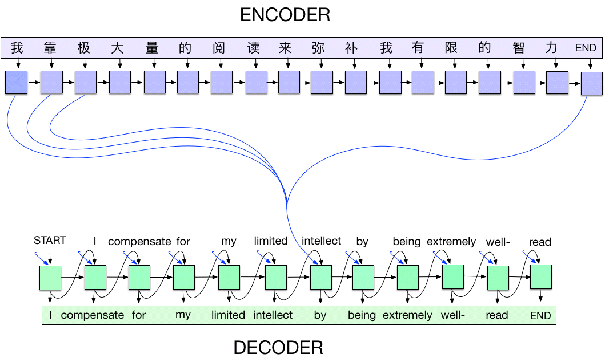

## 1. What is Seq2Seq?

**Sequence-to-Sequence (Seq2Seq)** models are neural networks designed to transform **one sequence into another**, even when input and output lengths differ. They are built using an **encoder-decoder architecture**.

### Key Features:
- Processes input sequence → generates output sequence
- Handles **variable-length** input and output sequences
- Used in NLP, machine translation, speech recognition, time-series prediction

## 2. Architecture Overview

The Seq2Seq model consists of **two main components**:

### 2.1 Encoder
- Processes input sequence **token by token**
- Encodes entire sequence into a **context vector** (fixed-length representation)
- Summarizes important information from the input

### 2.2 Decoder
- Takes the **context vector** as input
- Generates output sequence **one token at a time**
- Predicts each token based on context + previously generated tokens
