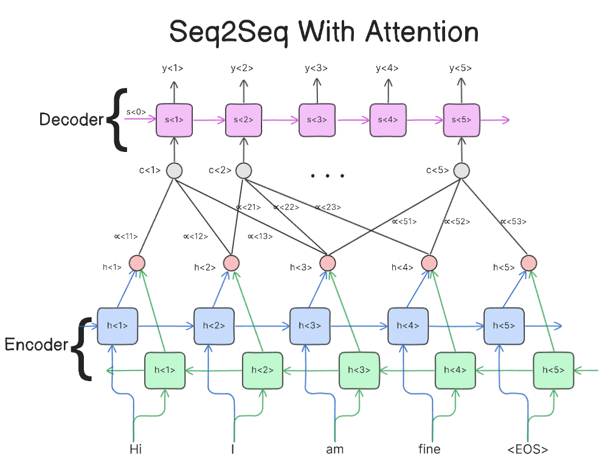

# 1. What is Seq2Seq?

**Sequence-to-Sequence (Seq2Seq)** models are neural networks designed to transform **one sequence into another**, even when the input and output sequences have different lengths.

They are built using an **encoder-decoder architecture**.

For example, in machine translation:

```text
Input:
"I love machine learning"

        ↓ Encoder

Context Representation

        ↓ Decoder

"Ich liebe maschinelles Lernen"
```

### Key Features

* Processes an input sequence → generates an output sequence
* Handles **variable-length** input and output sequences
* Generates the output **sequentially**
* Can model relationships between elements in a sequence
* Originally became very important for **machine translation**
* Used in NLP, speech recognition, summarization, and other sequence-generation tasks


## Encoder-Decoder Architecture

A classic Seq2Seq model consists of two main components:

```text
Input Sequence
      │
      ▼
┌─────────────┐
│   Encoder   │
└─────────────┘
      │
      ▼
Context Vector
      │
      ▼
┌─────────────┐
│   Decoder   │
└─────────────┘
      │
      ▼
Output Sequence
```

The two components have different responsibilities.


### Encoder

The **encoder** reads the input sequence one element at a time and converts it into an internal representation.

For example:

```text
"I love AI"

   ↓

x₁      x₂      x₃
"I"    "love"   "AI"
 │       │       │
 ▼       ▼       ▼
h₁      h₂      h₃
```

For a recurrent Seq2Seq model, the hidden state is updated at every timestep:

$
h_t = f(x_t, h_{t-1})
$

where:

* $(x_t)$ = current input token
* $(h_{t-1})$= previous hidden state
* $(h_t)$ = current hidden state
* $(f)$ = recurrent function, such as an RNN, LSTM, or GRU

In the simplest architecture, the final hidden state represents the entire input sequence.


### Context Vector

The encoder's final representation is passed to the decoder.

This representation is commonly called the **context vector**.

```text
Input:

"I love AI"

   ↓

Encoder

   ↓

h₁ → h₂ → h₃

          ↓

    Context Vector
```

The context vector attempts to contain the important information required to generate the output.

In the original Seq2Seq architecture:

$$
c = h_T
$$

where:

* $(T)$ = final input timestep
* $(h_T)$ = final encoder hidden state
* $(c)$ = context vector

### Important Limitation

The entire input sequence must be compressed into a **fixed-size representation**.

For long sequences, this can create an information bottleneck.

This limitation was one of the major motivations for introducing **Attention Mechanisms**.


### Decoder

The decoder takes the encoded representation and generates the output sequence **one token at a time**.

For example:

```text
Context Vector
      │
      ▼
   Decoder
      │
      ├── "I"
      ├── "love"
      ├── "AI"
      └── <EOS>
```

The decoder maintains its own hidden state and uses previously generated tokens to predict the next token.

A simplified formulation is:

$$
s_t = f(y_{t-1}, s_{t-1}, c)
$$

where:

* $(y_{t-1})$ = previous output token
* $(s_{t-1})$ = previous decoder hidden state
* $(s_t)$ = current decoder hidden state
* $(c)$ = encoder context vector

The decoder then predicts the next token:

$$
P(y_t|y_{<t},x)
$$


## Special Tokens

Seq2Seq models commonly use special tokens.

#### `<BOS>` — Beginning of Sequence

Indicates that generation is starting.

#### `<EOS>` — End of Sequence

Indicates that generation should stop.

Example:

```text
<BOS> I love AI <EOS>
```

During decoding:

```text
<BOS>
  ↓
"I"
  ↓
"love"
  ↓
"AI"
  ↓
<EOS>
```


## Complete Seq2Seq Flow

Consider translation:

```text
Input:
"I love AI"
```

### Step 1 :Tokenization

```text
"I" → x₁
"love" → x₂
"AI" → x₃
```

### Step 2 : Encoder

```text
x₁ → h₁
x₂ → h₂
x₃ → h₃
```

The final representation becomes the context:

```text
h₃ → Context Vector
```

### Step 3: Initialize Decoder

The decoder receives the encoded representation.

```text
Context Vector
      ↓
Decoder
```

### Step 4 : Generate Tokens

```text
<BOS>
  ↓
"I"
  ↓
"love"
  ↓
"AI"
  ↓
<EOS>
```

The complete process is:

```text
Input Sequence
"I love AI"
      │
      ▼
   Encoder
      │
      ▼
Context Vector
      │
      ▼
   Decoder
      │
      ▼
Output Sequence
"I love AI"
```

## Seq2Seq with RNN

The original Seq2Seq architecture was commonly implemented using **Recurrent Neural Networks (RNNs)**.

The encoder processes the sequence recurrently:

$$
h_t = f(x_t,h_{t-1})
$$

The decoder also operates recurrently:

$$
s_t = f(y_{t-1},s_{t-1},c)
$$

A simplified architecture looks like:

```text
Encoder

x₁       x₂       x₃       x₄
│        │        │        │
▼        ▼        ▼        ▼
h₁  →    h₂  →    h₃  →    h₄
                         │
                         ▼
                    Context Vector
                         │
                         ▼
Decoder

<BOS> → s₁ → s₂ → s₃ → <EOS>
          │    │    │
          ▼    ▼    ▼
         y₁   y₂   y₃
```


##  LSTM/GRU Seq2Seq

Plain RNNs can struggle with long-term dependencies because of problems such as:

* Vanishing gradients
* Exploding gradients
* Difficulty remembering information over long sequences

Therefore, Seq2Seq models are often built using:

* **LSTM**
* **GRU**

A common architecture is:

```text
Input
  ↓
LSTM Encoder
  ↓
Hidden + Cell State
  ↓
LSTM Decoder
  ↓
Output
```

For an LSTM, both hidden state and cell state can be transferred:

$$
(h_T,c_T)
$$

from the encoder to initialize the decoder.


##  Teacher Forcing

One of the most important concepts in training Seq2Seq models is **Teacher Forcing**.

During training, instead of always feeding the decoder's predicted token back into itself, we often provide the **correct previous token**.

### Without Teacher Forcing

```text
<BOS>
  ↓
Prediction: "I"
  ↓
"I"
  ↓
Prediction: "like"
  ↓
"like"
  ↓
Prediction: "AI"
```

If the model makes an early mistake, that mistake can propagate through later steps.

### With Teacher Forcing

Suppose the correct output is:

```text
<BOS> I love AI <EOS>
```

The decoder receives the actual previous token:

```text
Input to decoder     Target

<BOS>                 I
I                     love
love                  AI
AI                    <EOS>
```

So:

$$
input_t = y_{t-1}^{true}
$$

rather than:

$$
input_t = \hat{y}_{t-1}
$$

where $(\hat{y})$ is the model's prediction.

### Advantage

Teacher forcing generally makes training:

* Faster
* More stable
* Easier to optimize

### Problem

During inference, the correct previous token is unavailable.

The model must use its **own predictions**.

This creates a difference between training and inference known as **exposure bias**.


## Training Objective

Seq2Seq models are usually trained using **maximum likelihood**.

The decoder predicts a probability distribution over the vocabulary at every timestep.

For example:

```text
"I"
 │
 ▼
Vocabulary probabilities

AI      0.05
love    0.70
cat     0.02
...
```

The model is trained to assign high probability to the correct next token.

The sequence probability can be factorized as:

$$
P(y|x)
=
\prod_{t=1}^{T}
P(y_t|y_{<t},x)
$$

The training loss is typically **cross-entropy loss**:

$$
\mathcal{L}
=
-\sum_{t=1}^{T}
\log P(y_t^{true}|y_{<t}^{true},x)
$$


## Inference

During inference, the model does not know the correct output sequence.

It generates tokens autoregressively.

```text
<BOS>
  ↓
Token 1
  ↓
Token 2
  ↓
Token 3
  ↓
...
  ↓
<EOS>
```

At each step:

$$
\hat{y}_t =
\arg\max_y P(y|y_{<t},x)
$$

This is the basic **greedy decoding** strategy.


##  Greedy Decoding

Greedy decoding selects the token with the highest probability at every timestep.

Example:

```text
Step 1:

AI      0.60
ML      0.20
Data    0.10

→ Choose AI
```

Then:

```text
Step 2:

is      0.70
was     0.15
can     0.05

→ Choose is
```

This is simple and fast.

However, the locally best token does not always lead to the globally best sequence.


## Beam Search

**Beam Search** keeps multiple candidate sequences instead of only one.

Example with beam size = 3:

```text
                 ┌── "I love AI"
<BOS> ───────────┼── "I like AI"
                 └── "I enjoy AI"
```

At each timestep, the model keeps the top \(k\) candidates.

```text
Beam Size = 3

Candidate 1 ─────┐
Candidate 2 ─────┼──→ Next generation
Candidate 3 ─────┘
```

Beam search can produce better sequences than greedy decoding, especially in traditional Seq2Seq applications such as translation.


## The Major Problem: Fixed-Length Context

The original Seq2Seq architecture compresses the entire input into one fixed-size vector.

For a short sentence:

```text
"I love AI"
     ↓
Context Vector
```

This may work reasonably well.

But consider a very long sequence:

```text
"The researcher who worked at several
universities across different countries
developed a new..."
```

The encoder must compress all of this information into:

```text
ONE
Context
Vector
```

This creates an **information bottleneck**.

As sequences become longer:

* Important information can be lost
* Long-range dependencies become harder
* Translation quality can decrease
* The decoder may struggle to recover specific input information

This motivated the development of **Attention**.


## Seq2Seq with Attention

Attention removes the requirement that the decoder rely only on one fixed context vector.

Instead, the decoder can access **all encoder hidden states**.

```text
Encoder

x₁ → h₁
x₂ → h₂
x₃ → h₃
x₄ → h₄
       │
       ├────────┐
       ├────────┤
       ├────────┤
       └────────┤
                ▼
             Attention
                │
                ▼
             Decoder
```

Instead of:

```text
h₁ h₂ h₃ h₄
      ↓
ONE fixed vector
      ↓
Decoder
```

we have:

```text
h₁ h₂ h₃ h₄
 \  |  |  /
  Attention
      ↓
Context for current step
      ↓
Decoder
```

The decoder dynamically focuses on different parts of the input for each output token.


## Why Attention Matters

Suppose we translate:

```text
"The cat is sitting on the mat"
```

When generating:

```text
"Katze"
```

the decoder should focus strongly on:

```text
"cat"
```

When generating another output token, it may focus on a different input word.

Therefore:

```text
Output Token 1 → Attention → Input Token 2
Output Token 2 → Attention → Input Token 4
Output Token 3 → Attention → Input Token 6
```

This provides a **dynamic context** instead of a single fixed representation.


## Seq2Seq Evolution

The historical progression is important:

```text
RNN
 │
 ▼
Encoder-Decoder Seq2Seq
 │
 ▼
LSTM/GRU Seq2Seq
 │
 ▼
Seq2Seq + Attention
 │
 ▼
Transformer
 │
 ▼
Modern LLMs
```

The Transformer replaced recurrent sequence processing with **attention-based processing** and became the foundation for many modern NLP systems.


## Seq2Seq Applications

Seq2Seq architectures can be used for many sequence transformation problems.

### Machine Translation

```text
English → German
English → French
English → Hindi
```

### Text Summarization

```text
Long Document
      ↓
   Encoder
      ↓
   Decoder
      ↓
Short Summary
```

### Chatbots

```text
User Message
      ↓
   Encoder
      ↓
   Decoder
      ↓
Response
```

### Speech Recognition

```text
Audio Features
      ↓
   Encoder
      ↓
   Decoder
      ↓
Text
```

### Text Generation

```text
Input Sequence
      ↓
Seq2Seq
      ↓
Generated Sequence
```

### Time-Series Prediction

```text
Past Values
      ↓
Encoder
      ↓
Decoder
      ↓
Future Values
```

---

## Advantages

### Variable-Length Sequences

Input and output sequences can have different lengths.

```text
Input:  5 tokens
Output: 8 tokens
```

This makes Seq2Seq suitable for translation and summarization.

### General Sequence Transformation

The same architecture can model many sequence-to-sequence problems.

### End-to-End Learning

The model can learn the transformation directly from data.

```text
Input → Neural Network → Output
```

No manually designed translation rules are required.


## Limitations

###  Fixed-Length Bottleneck

Classic Seq2Seq compresses the entire input into a single representation.

###  Long-Term Dependencies

RNN-based models can struggle with very long sequences.

###  Sequential Computation

RNNs process tokens sequentially:

```text
x₁ → x₂ → x₃ → x₄
```

This makes training less parallelizable.

###  Exposure Bias

Teacher forcing during training creates a difference between training and inference.

###  Slow Generation

The decoder generally generates one token at a time.

```text
Token 1
  ↓
Token 2
  ↓
Token 3
  ↓
Token 4
```


## Seq2Seq vs Transformer

| Feature                       | Classic Seq2Seq | Transformer                      |
| ----------------------------- | --------------- | -------------------------------- |
| Encoder                       | RNN/LSTM/GRU    | Self-Attention                   |
| Decoder                       | RNN/LSTM/GRU    | Self-Attention + Cross-Attention |
| Sequential encoder processing | Yes             | No                               |
| Parallel training             | Limited         | Strong                           |
| Long-range dependencies       | Difficult       | Much better                      |
| Attention                     | Optional/add-on | Core mechanism                   |
| Modern LLM foundation         | No              | Yes                              |

