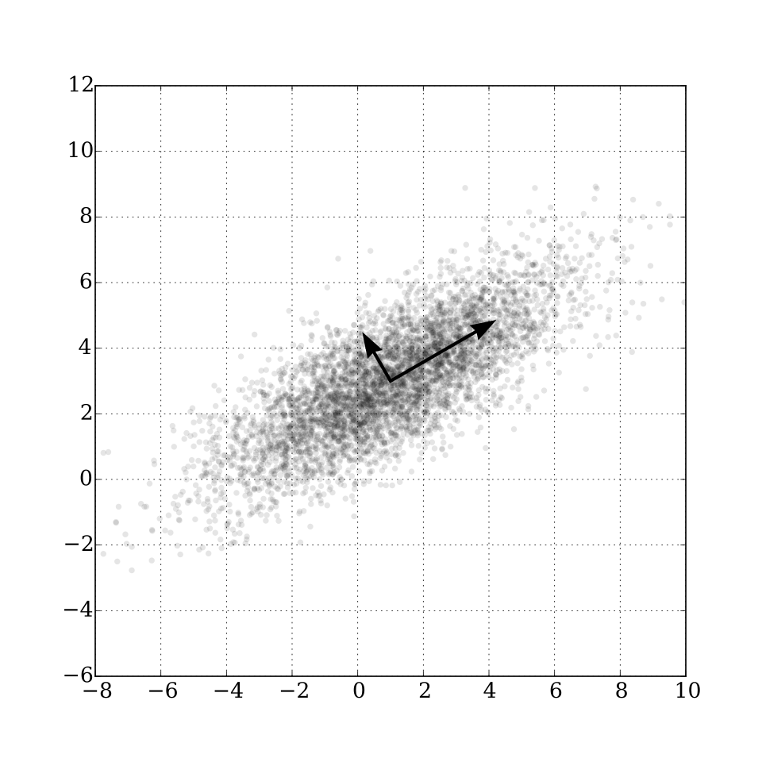

## SVD — Singular Value Decomposition

SVD decomposes a matrix into three matrices:

SVD decomposes a matrix into three constituent matrices:

$$\boxed{ A = U\Sigma V^T }$$


where:
* **$U$**: Matrix containing the **left singular vectors** as its columns (these are the orthonormal eigenvectors of $AA^T$).
* **$\Sigma$** (Sigma): A diagonal matrix containing the **singular values** sorted in descending order (these represent the scaling strengths along each axis).
* **$V^T$**: The transpose of matrix $V$, which contains the **right singular vectors** as its columns (these are the orthonormal eigenvectors of $A^TA$).

### Why SVD is useful

* Dimensionality reduction
* Data compression
* Noise reduction
* Recommender systems
* Low-rank approximations
* Used to compute PCA

### Key intuition

SVD finds the **important directions and strengths** present in a matrix.

If some singular values are very small, we can remove them and keep only the important information.

## Low-rank approximation

Instead of:
$$
A = U\Sigma V^T
$$

keep only the largest \(k\) singular values:

$$
A \approx U_k\Sigma_kV_k^T
$$

This gives a smaller approximation while preserving most of the information.


## PCA — Principal Component Analysis

PCA is a **dimensionality reduction** technique.

Its goal is to find directions that capture the **maximum variance** in the data.

### Basic idea

Suppose your dataset has 100 features.

PCA can transform those 100 features into, for example, 10 principal components while retaining most of the important information.

### PCA steps

1. **Center the data**

   $$
   X_{centered}=X-\mu
   $$

2. Find the directions of maximum variance.

3. Rank the directions by their importance.

4. Keep the top \(k\) components.

5. Project the data onto those components.

### PCA + SVD

PCA is commonly calculated using SVD:

$$
X = U\Sigma V^T
$$

The columns of \(V\) give the **principal directions**.

### Key intuition

PCA asks:

> "What are the most important directions in my data?"

SVD provides a mathematical way to find those directions.

### Explained variance

Each principal component explains some amount of the data's variance.

For example:

* PC1 → 60%
* PC2 → 25%
* PC3 → 10%
* PC4 → 5%

Keeping PC1 + PC2 preserves **85% of the variance**.

## Tensors

A tensor is a **generalization of scalars, vectors, and matrices to multiple dimensions**.

| Object | Dimensions |
| ------ | ---------: |
| Scalar |         0D |
| Vector |         1D |
| Matrix |         2D |
| Tensor |        3D+ |

### Examples

Scalar:

$$
5
$$

Vector:

$$
[1,2,3]
$$

Matrix:

$$
\begin{bmatrix}
1&2\\
3&4
\end{bmatrix}
$$

3D tensor:

$$
\text{Height} \times \text{Width} \times \text{Channels}
$$

### Tensors in AI

Tensors are the **main data structure used in deep learning**.

For an RGB image:

$$
H \times W \times 3
$$

For a batch of images:

$$
B \times H \times W \times 3
$$

For a language model, tensors represent things such as:

* Token IDs
* Embeddings
* Attention matrices
* Model weights
* Activations
* Gradients

### PyTorch example

```python
import torch

x = torch.tensor([[1, 2], [3, 4]])

print(x.shape)
# torch.Size([2, 2])
```


## SVD vs PCA vs Tensors

**SVD:** Matrix decomposition

$$
A = U\Sigma V^T
$$

**PCA:** Finds important directions and reduces dimensionality

**Tensors:** Represent multidimensional data used throughout deep learning

### Remember

> **SVD → decomposes matrices**
> **PCA → reduces dimensions / finds important directions**
> **Tensors → represent multidimensional data in AI**
