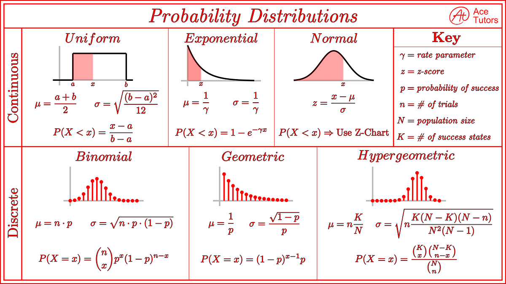

## 1. Probability

Probability measures how likely an event is to occur.

$$\boxed{ 0 \le P(A) \le 1 }$$

where:
* $P(A)$ is the **probability** of event $A$ occurring.
* $0$ represents an **impossible event** (cannot happen).
* $1$ represents a **certain event** (guaranteed to happen).

### Basic Rules

**Complement Rule:**
$$\boxed{ P(A^c) = 1 - P(A) }$$

where:
* $P(A^c)$ is the probability of the **complement** of event $A$ (the probability that event $A$ does **not** happen).
* $P(A)$ is the probability that event $A$ does happen.

**Union Rule (General Addition Rule):**
$$\boxed{ P(A \cup B) = P(A) + P(B) - P(A \cap B) }$$

where:
* $\cup$ represents the **union** operator (meaning event $A$ **or** event $B$ or both occur).
* $\cap$ represents the **intersection** operator (meaning both event $A$ **and** event $B$ occur simultaneously).
* $P(A \cup B)$ is the combined probability of either event happening.
* $P(A \cap B)$ is subtracted to avoid double-counting the overlapping outcomes where both events occur.

**Independent Events Rule (Multiplication Rule):**
$$\boxed{ P(A \cap B) = P(A) \cdot P(B) }$$

where:
* $P(A \cap B)$ is the joint probability that independent events $A$ and $B$ both happen.
* $\cdot$ represents the standard multiplication operator.
* This rule applies **only** if events $A$ and $B$ are completely independent (the occurrence of one does not alter the likelihood of the other).

### AI Connection

Probability represents uncertainty in data, predictions, labels, and model outputs.

## Random Variables

A random variable is a variable whose possible values are numerical outcomes of a random phenomenon.

### Discrete Random Variable

A discrete random variable takes on a countable set of distinct values.

$$\boxed{ X = \text{number of defective products} }$$

where:
* $X$ is the **discrete random variable** representing the count of interest.
* $\text{number of defective products}$ represents distinct, isolated integer outcomes (e.g., $0, 1, 2, \ldots$) that can be explicitly counted.

### Continuous Random Variable

A continuous random variable can take any numerical value within an unbroken, infinite range or interval.

$$\boxed{ X = \text{height} }$$

where:
* $X$ is the **continuous random variable** representing the measurement of interest.
* $\text{height}$ represents an outcome that can be any real number within a physical range (e.g., $172.54 \text{ cm}$) and is measured rather than counted.

## Probability Distributions

A probability distribution describes how probability is distributed across the possible values of a random variable.

### Probability Mass Function (PMF)

For discrete random variables, the PMF gives the exact probability that the variable equals a specific value:

$$\boxed{ P(X = x) }$$

where:
* $X$ is the discrete random variable.
* $x$ is a specific, discrete numerical value that the random variable can take.
* $P(X = x)$ outputs a distinct probability value between $0$ and $1$.

### Probability Density Function (PDF)

For continuous random variables, the PDF describes the relative likelihood for the variable to take on a given value:

$$\boxed{ f(x) }$$

where:
* $f$ is the continuous probability density function.
* $x$ is a specific real number along the range of possible outcomes.
* Note: Unlike a PMF, $f(x)$ represents *density* rather than an exact probability, and its value can be greater than $1$.

To find the actual probability over a specific interval, you integrate the PDF:

$$\boxed{ P(a \le X \le b) = \int_a^b f(x) \, dx }$$

where:
* $X$ is the continuous random variable.
* $a$ is the lower numerical bound of the targeted interval.
* $b$ is the upper numerical bound of the targeted interval.
* $\int_a^b \cdots dx$ represents the definite integral operator computing the geometric area under the curve $f(x)$ from $a$ to $b$.
* $P(a \le X \le b)$ outputs the final probability of the variable landing within that range.

### Important Distributions

* **Bernoulli**: Models a single binary outcome (e.g., success/failure, $0$ or $1$).
* **Binomial**: Models the total number of successes across a fixed number of independent Bernoulli trials.
* **Categorical**: Generalizes the Bernoulli distribution to outcomes with more than two distinct categories.
* **Gaussian/Normal**: The classic bell-shaped continuous distribution found throughout data science.
* **Uniform**: Distributes completely equal probability density over a specified numeric interval.
* **Poisson**: Models the count of independent events occurring within a fixed interval of time or space.

### Normal Distribution (Gaussian)

A random variable follows a normal distribution if it maps to the following parameterization:

$$\boxed{ X \sim \mathcal{N}(\mu, \sigma^2) }$$

where:
* $X$ is the continuous random variable following the distribution.
* $\sim$ (tilde) means "is distributed as".
* $\mathcal{N}$ stands for the **Normal (Gaussian) Distribution** model family.
* $\mu$ (Mu) is the **mean**, which dictates the center location point (the peak) of the bell curve.
* $\sigma^2$ (Sigma squared) is the **variance**, which measures the statistical dispersion or spread of the curve.
* $\sigma$ (Sigma) is the **standard deviation**, representing the average physical distance of data points from the mean.

## Expectation & Variance

### Expectation

The expected value is the probability-weighted average of all possible values a random variable can take.

**For Discrete Variables:**
$$\boxed{ \mathbb{E}[X] = \sum_x x P(X = x) }$$

where:
* $\mathbb{E}[X]$ is the **expected value** (mean) of the discrete random variable $X$.
* $\sum_x$ represents the summation operator over all possible distinct values $x$ that $X$ can take.
* $x$ is a specific value of the random variable.
* $P(X = x)$ is the probability mass function (PMF) evaluating the exact probability of obtaining value $x$.

**For Continuous Variables:**
$$\boxed{ \mathbb{E}[X] = \int_{-\infty}^{\infty} x f(x) \, dx }$$

where:
* $\mathbb{E}[X]$ is the **expected value** (mean) of the continuous random variable $X$.
* $\int_{-\infty}^{\infty} \cdots dx$ represents the definite integral operator across the entire domain of real numbers from negative to positive infinity.
* $x$ represents the continuous numerical value of the random variable.
* $f(x)$ is the probability density function (PDF) evaluating the relative density at point $x$.

### Variance

Variance measures how spread out the values of a random variable are around its mean.

**Definitional Formula:**
$$\boxed{ \operatorname{Var}(X) = \mathbb{E}[(X - \mu)^2] }$$

where:
* $\operatorname{Var}(X)$ is the **variance** of the random variable $X$.
* $\mathbb{E}[\cdots]$ is the expected value operator.
* $X$ is the random variable being evaluated.
* $\mu$ (Mu) is the mean of the distribution, equivalent to $\mathbb{E}[X]$.
* $(X - \mu)^2$ represents the squared distance of an outcome from its mean (squared to ensure negative deviances become positive).

**Computational Formula (Equivalent):**
$$\boxed{ \operatorname{Var}(X) = \mathbb{E}[X^2] - (\mathbb{E}[X])^2 }$$

where:
* $\operatorname{Var}(X)$ is the variance of the random variable $X$.
* $\mathbb{E}[X^2]$ is the expected value of the squared random variable.
* $(\mathbb{E}[X])^2$ is the square of the standard expected value (the mean squared).
* Note: This identity is often summarized as "the mean of the squares minus the square of the mean".

**Standard Deviation:**
$$\boxed{ \sigma = \sqrt{\operatorname{Var}(X)} }$$

where:
* $\sigma$ (Sigma) is the **standard deviation** of the random variable.
* $\operatorname{Var}(X)$ is the calculated variance value.
* $\sqrt{\cdots}$ represents the principal square root operator, which returns the dispersion metric back into the original, non-squared physical units of the variable $X$.

### AI Connection

Expectation and variance are used in probability models, normalization layers (like Batch Norm), uncertainty estimation, and formulating machine learning objective loss functions.

## Covariance & Correlation

### Covariance

Covariance measures the directional relationship between two random variables to see how they change together.

$$\boxed{ \operatorname{Cov}(X, Y) = \mathbb{E}[(X - \mathbb{E}[X])(Y - \mathbb{E}[Y])] }$$

where:
* $\operatorname{Cov}(X, Y)$ is the **covariance** between random variables $X$ and $Y$.
* $\mathbb{E}[\cdots]$ represents the mathematical expected value operator.
* $X$ and $Y$ are the two separate random variables being compared.
* $\mathbb{E}[X]$ and $\mathbb{E}[Y]$ are the respective means (expected values) of each individual variable.
* $(X - \mathbb{E}[X])(Y - \mathbb{E}[Y])$ is the product of their deviations from their respective means.

### Interpretation

* **Positive Covariance:** The variables tend to increase or decrease together.
* **Negative Covariance:** One variable tends to increase as the other decreases.
* **Near-Zero Covariance:** There is little to no linear relationship between the two variables.

### Correlation

Correlation is a normalized version of covariance that measures both the strength and direction of the linear relationship between two variables.

$$\boxed{ \rho_{X,Y} = \frac{\operatorname{Cov}(X,Y)}{\sigma_X \sigma_Y} }$$

where:
* $\rho_{X,Y}$ (Rho) is the **Pearson correlation coefficient** between variables $X$ and $Y$.
* $\operatorname{Cov}(X,Y)$ is the calculated covariance between the two variables.
* $\sigma_X$ and $\sigma_Y$ (Sigma) are the standard deviations of variable $X$ and variable $Y$, respectively.

### Range and Interpretation

The output value is bounded within a fixed geometric range:

$$\boxed{ -1 \le \rho_{X,Y} \le 1 }$$

where:
* $+1$ represents a **perfect positive linear relationship** (as one variable goes up, the other goes up proportionally).
* $0$ represents **no linear correlation** (the variables do not share a linear trend).
* $-1$ represents a **perfect negative linear relationship** (as one variable goes up, the other goes down proportionally).

**Remember: Correlation does not imply causation.**
