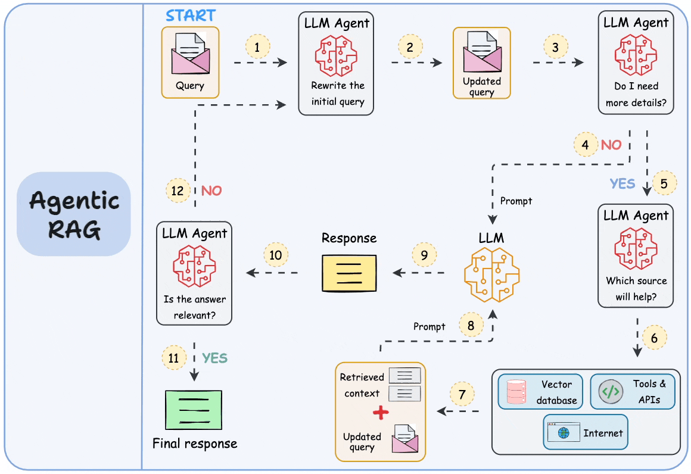

# Agentic RAG

## What is Agentic RAG?

**Agentic RAG** is a RAG architecture where an **AI agent decides how and when to retrieve information** instead of following a fixed retrieval pipeline.

Traditional RAG usually follows:

```text
User Query
    ↓
Retrieve
    ↓
Context
    ↓
LLM
    ↓
Answer
```

Agentic RAG introduces an agent that can make decisions:

```text
User Query
    ↓
Agent
    ↓
Decide what to do
    ↓
Retrieve / Search / Reason / Use Tools
    ↓
Observe Results
    ↓
Decide next action
    ↓
Generate Answer
```

The key idea:

> **Traditional RAG follows a predefined retrieval workflow. Agentic RAG allows an agent to dynamically decide the retrieval and reasoning process.**


## Why Agentic RAG?

Simple RAG works well for straightforward questions.

Example:

> "What is the refund policy?"

```text
Query
 ↓
Retrieve relevant document
 ↓
Generate answer
```

But consider:

> "Compare the refund policies of our three products and determine which one provides the longest refund period."

This may require:

```text
Find Product A policy
        ↓
Find Product B policy
        ↓
Find Product C policy
        ↓
Compare information
        ↓
Reason about differences
        ↓
Generate answer
```

A fixed RAG pipeline may not know how to perform these steps dynamically.

An agent can.

## Traditional RAG vs Agentic RAG

### Traditional RAG

```text
Query
  ↓
Retriever
  ↓
Top-K Documents
  ↓
Context
  ↓
LLM
  ↓
Answer
```

The workflow is mostly predetermined.


### Agentic RAG

```text
Query
  ↓
Agent
  ↓
Plan
  ↓
Choose Tool
  ↓
Retrieve
  ↓
Observe
  ↓
Reason
  ↓
Retrieve Again?
  ↓
Yes ──────────→ Retrieve
  │
  No
  ↓
Generate Answer
```

The agent controls the workflow.


##  What is an Agent?

An **AI agent** is a system that can:

* Understand a goal
* Decide what action to take
* Use tools
* Observe results
* Reason about the results
* Take additional actions
* Stop when the goal is achieved

A simplified agent loop:

```text
Goal
 ↓
Reason
 ↓
Action
 ↓
Observation
 ↓
Reason
 ↓
Action
 ↓
Observation
 ↓
...
 ↓
Final Answer
```


## Agentic RAG Mental Model

Remember:

```text
RAG:
"Retrieve information for the LLM."

Agentic RAG:
"Let the agent decide what information it needs,
how to retrieve it, and whether it needs more information."
```


##  Components of Agentic RAG

A typical Agentic RAG system contains:

```text
┌───────────────────────┐
│ User Query            │
└───────────┬───────────┘
            ↓
┌───────────────────────┐
│ Agent / Reasoner      │
└───────────┬───────────┘
            ↓
┌───────────────────────┐
│ Tools                 │
│                       │
│ • Vector Search       │
│ • Web Search          │
│ • Database            │
│ • APIs                │
│ • Calculator          │
└───────────┬───────────┘
            ↓
       Observations
            ↓
          Agent
            ↓
      Final Answer
```

## Tools

Agents become powerful because they can use tools.

Examples:

```text
Vector Database
Web Search
SQL Database
API
Calculator
Code Interpreter
File Search
Knowledge Graph
```

For example:

```text
Agent
  │
  ├── Vector Search
  │
  ├── SQL Query
  │
  ├── Web Search
  │
  └── Calculator
```

The agent chooses which tool is appropriate.


## Retrieval as a Tool

In Agentic RAG, retrieval can be treated as a tool.

Example:

```text
Tool:
search_documents(query)
```

The agent can decide:

```text
User Question
     ↓
Agent
     ↓
"I need information from the knowledge base."
     ↓
search_documents()
     ↓
Retrieved Information
     ↓
Agent
```

The important change is:

> Retrieval is no longer necessarily an automatic first step. The agent can decide when retrieval is needed.


## Single-Step Agentic RAG

The simplest version:

```text
User Query
    ↓
Agent
    ↓
Decide to retrieve
    ↓
Retriever
    ↓
Context
    ↓
Agent
    ↓
Answer
```

This is already more flexible than a completely fixed RAG pipeline.

## Multi-Step Retrieval

Agentic RAG becomes more powerful when the agent can retrieve multiple times.

Example question:

> "Which technology is used by the project managed by Alice?"

The agent may reason:

```text
Step 1:
Find Alice.

        ↓

Step 2:
Find projects managed by Alice.

        ↓

Step 3:
Find technologies used by the project.

        ↓

Step 4:
Generate answer.
```

Pipeline:

```text
Query
 ↓
Agent
 ↓
Retrieve Alice
 ↓
Observe
 ↓
Retrieve Alice's projects
 ↓
Observe
 ↓
Retrieve project technologies
 ↓
Observe
 ↓
Answer
```


## Iterative Retrieval

Traditional RAG:

```text
Retrieve once
    ↓
Generate
```

Agentic RAG:

```text
Retrieve
   ↓
Evaluate result
   ↓
Need more information?
   ↓
Yes
   ↓
Retrieve again
   ↓
Evaluate
   ↓
Enough information?
   ↓
Yes
   ↓
Generate
```

This is called **iterative retrieval**.


## Query Planning

An agent can break a complex question into smaller tasks.

Example:

> "Compare the revenue and employee growth of Company A and Company B."

The agent may create:

```text
Task 1:
Find Company A revenue.

Task 2:
Find Company A employee count.

Task 3:
Find Company B revenue.

Task 4:
Find Company B employee count.

Task 5:
Compare results.
```

This is **query/task planning**.

##  Query Decomposition

A complex question can be decomposed into sub-questions.

Example:

```text
Original Query:

"Which company had higher revenue growth,
Company A or Company B?"
```

Possible decomposition:

```text
Sub-query 1:
What was Company A's revenue in 2024?

Sub-query 2:
What was Company A's revenue in 2025?

Sub-query 3:
What was Company B's revenue in 2024?

Sub-query 4:
What was Company B's revenue in 2025?
```

Then the agent combines the results.

## Tool Selection

An agent may have several tools:

```text
Vector Search
SQL
Web Search
Calculator
Graph Search
```

Given:

> "What was our revenue in Q4?"

The agent might choose:

```text
SQL Database
```

Given:

> "What does our internal documentation say about deployment?"

It might choose:

```text
Vector Search
```

Given:

> "What is the current market price?"

It might choose:

```text
Web Search / External API
```

The agent chooses based on the task.

## Routing

**Routing** means deciding which retrieval/tool path should handle the query.

Example:

```text
                    Query
                      ↓
                    Agent
                      ↓
          ┌───────────┼───────────┐
          ↓           ↓           ↓
     Vector DB      SQL DB     Web Search
```

The agent routes the question to the appropriate source.

## Reflection

An agent can inspect its own intermediate results.

Example:

```text
Agent:
"I searched the knowledge base."

Result:
Only one relevant document found.

Agent:
"This is not enough information."

Action:
Search again with a different query.
```

This is a form of **reflection**.

The agent evaluates whether its current information is sufficient.


##  Self-Correction

Suppose the agent retrieves:

```text
Document A:
Product price = $100
```

Then another source says:

```text
Document B:
Product price = $120
```

The agent may recognize a conflict and perform another action:

```text
Conflicting information
        ↓
Search for newer source
        ↓
Check metadata/date
        ↓
Determine trusted source
        ↓
Generate answer
```

This is an example of agentic self-correction.

## Agentic RAG Loop

A useful mental model is:

```text
┌───────────────────┐
│      Query        │
└────────┬──────────┘
         ↓
┌───────────────────┐
│      Agent        │
└────────┬──────────┘
         ↓
     Decide Action
         ↓
┌───────────────────┐
│       Tool        │
└────────┬──────────┘
         ↓
    Observation
         ↓
┌───────────────────┐
│      Agent        │
└────────┬──────────┘
         ↓
   Enough Evidence?
      ↙       ↘
    No         Yes
    ↓           ↓
  Tool       Answer
    ↓
 Observation
    ↓
  Agent
```

##  Agentic RAG + Vector RAG

Agentic RAG often uses vector retrieval as one of its tools.

```text
                    Agent
                      ↓
             ┌────────┼────────┐
             ↓        ↓        ↓
         Vector DB   SQL      Web
             ↓        ↓        ↓
             └────────┼────────┘
                      ↓
                  Evidence
                      ↓
                    Agent
                      ↓
                    Answer
```

Therefore:

> Agentic RAG is an orchestration layer around retrieval and other tools.


## Agentic RAG + Graph RAG

Graph retrieval can also be a tool.

```text
                     Agent
                       ↓
        ┌──────────────┼──────────────┐
        ↓              ↓              ↓
   Vector Search   Graph Search    SQL
        ↓              ↓              ↓
        └──────────────┼──────────────┘
                       ↓
                    Context
                       ↓
                      LLM
```

The agent can decide whether a question requires:

* Semantic retrieval
* Graph traversal
* Structured database querying


### Example: Research Agent

Question:

> "Compare the latest research on Model A and Model B and explain which performs better."

An agent could perform:

```text
1. Search documents for Model A.
2. Search documents for Model B.
3. Retrieve performance metrics.
4. Find benchmark definitions.
5. Compare metrics.
6. Check conflicting results.
7. Generate conclusion.
8. Cite sources.
```

This is difficult to implement as a single fixed retrieval step.


## Agentic RAG vs Traditional RAG

| Feature             | Traditional RAG             | Agentic RAG          |
| ------------------- | --------------------------- | -------------------- |
| Workflow            | Mostly fixed                | Dynamic              |
| Retrieval           | Usually predefined          | Agent decides        |
| Number of searches  | Often one                   | Can be multiple      |
| Tool usage          | Limited                     | Multiple tools       |
| Query decomposition | Usually external/predefined | Agent can perform it |
| Planning            | Limited                     | Stronger             |
| Self-correction     | Limited                     | Possible             |
| Complexity          | Lower                       | Higher               |
| Latency             | Usually lower               | Can be higher        |

---

## Advantages

### Dynamic Retrieval

The agent can retrieve information based on what it discovers.

### Multi-Step Reasoning

Complex questions can be broken into multiple steps.

### Tool Usage

The agent can combine:

```text
Vector DB
+
Graph DB
+
SQL
+
Web
+
APIs
```

### Adaptive Search

The agent can search again when the first result is insufficient.

### Complex Tasks

Agentic RAG is useful for tasks that cannot be solved with one retrieval operation.

## Limitations

Agentic RAG introduces additional complexity.

### Higher Latency

Multiple tool calls can make responses slower.

```text
1 retrieval → fast

5 retrievals + reasoning → slower
```

### Higher Cost

More LLM calls and tool calls can increase cost.

### Agent Errors

The agent can choose the wrong tool or wrong action.

### Infinite Loops

Poorly designed agents may repeatedly search without making progress.

### Unpredictability

A dynamic agent may not always follow the same execution path.

### Debugging Difficulty

More steps mean more places where something can fail.

##  Controlling the Agent

A production agent should have boundaries.

Examples:

```text
Maximum iterations
Maximum tool calls
Timeout
Allowed tools
Token budget
Confidence thresholds
Stop conditions
```

Example:

```text
MAX_STEPS = 5
```

The agent must stop after five reasoning/tool cycles.

## Stop Conditions

The agent needs to know when it is finished.

Possible conditions:

```text
Enough evidence found
Answer can be supported
Maximum iterations reached
Tool returned sufficient result
Task completed
```

Example:

```text
Agent
 ↓
Enough evidence?
 ↓
Yes
 ↓
Generate final answer
```
## Agent State

During execution, the agent may maintain state.

Example:

```text
State:

Original Query
Subtasks
Retrieved Documents
Tool Results
Intermediate Reasoning
Completed Tasks
Remaining Tasks
```

Conceptually:

```text
Query
 ↓
Agent State
 ├── Retrieved Evidence
 ├── Previous Actions
 ├── Observations
 └── Remaining Tasks
```

## Memory vs RAG

These concepts are related but different.

### RAG

Retrieves information from an external knowledge source.

```text
Question
 ↓
Knowledge Base
 ↓
Relevant Information
```

### Agent Memory

Stores information about previous interactions or agent state.

```text
Previous Interaction
 ↓
Memory
 ↓
Future Interaction
```

An agent can use both:

```text
              Agent
             /     \
            ↓       ↓
          RAG     Memory
```

##  Agentic RAG and Citations

Citations remain important.

If the agent performs:

```text
Search A
Search B
Search C
```

the final answer should preserve source information.

```text
Answer claim 1 → Source A
Answer claim 2 → Source B
Answer claim 3 → Source C
```

Therefore:

```text
Agent
 ↓
Multiple Retrievals
 ↓
Evidence
 ↓
Source Metadata
 ↓
Generation
 ↓
Citations
```
## Agentic RAG Failure Modes

### Wrong Tool

The agent selects an inappropriate tool.

### Bad Query

The agent creates a poor search query.

### Retrieval Failure

The correct information is not retrieved.

### Reasoning Failure

The agent misunderstands the retrieved evidence.

### Looping

The agent keeps performing actions without progress.

### Hallucination

The final answer contains unsupported information.

### Source Conflicts

Different sources provide conflicting information.

## Evaluation of Agentic RAG

Agentic systems should be evaluated at multiple levels.

### Retrieval

Did the agent retrieve useful information?

### Tool Selection

Did it choose the correct tool?

### Planning

Did it create a sensible sequence of actions?

### Reasoning

Did it correctly interpret the evidence?

### Answer

Is the final answer correct and grounded?

### Efficiency

Did it use an excessive number of tool calls?

A useful conceptual view:

```text
Tool Selection
      ↓
Retrieval Quality
      ↓
Reasoning Quality
      ↓
Answer Quality
      ↓
Overall Agent Performance
```
## When to Use Agentic RAG

Agentic RAG is useful when:

* Questions require multiple retrieval steps.
* Multiple knowledge sources exist.
* Different tools are required.
* Queries are unpredictable.
* The system needs adaptive retrieval.
* The task requires planning.
* The agent needs to verify or refine information.

##  When Traditional RAG Is Better

Don't use an agent simply because you can.

For:

> "What is our vacation policy?"

A simple system is probably better:

```text
Query
 ↓
Vector Search
 ↓
Context
 ↓
LLM
 ↓
Answer
```

Agentic RAG would introduce unnecessary complexity.

---

# 34. Agentic RAG Architecture

A broader architecture:

```text
                         User
                          ↓
                        Query
                          ↓
                  ┌──────────────┐
                  │     Agent    │
                  └──────┬───────┘
                         ↓
                      Planning
                         ↓
              ┌──────────┼──────────┐
              ↓          ↓          ↓
         Vector DB    Graph DB     SQL
              ↓          ↓          ↓
              └──────────┼──────────┘
                         ↓
                       Tools
                         ↓
                     Observation
                         ↓
                       Agent
                         ↓
                 More Actions?
                   ↙       ↘
                 Yes        No
                  ↓          ↓
                Tools      Context
                  ↓          ↓
                Agent       LLM
                             ↓
                           Answer
                             ↓
                         Citations
```

## Agentic RAG Design Principle

A key principle:

> **Give the agent enough tools to solve the task, but not so many that tool selection becomes unnecessarily difficult.**

Good agent design balances:

```text
Capability
    ↕
Complexity
```

## Advanced Topics — Quick Reference

These are useful topics which we will  explore  later.

### ReAct

A common agent pattern based on:

```text
Reason → Act → Observe → Reason
```

The agent alternates between reasoning and tool actions.


### Planning Agents

Agents explicitly create a plan before execution.

```text
Goal
 ↓
Plan
 ↓
Execute
 ↓
Verify
```

### Multi-Agent RAG

Multiple specialized agents cooperate.

Example:

```text
Research Agent
      ↓
Analysis Agent
      ↓
Writing Agent
      ↓
Final Answer
```


### Agent Memory

Agents may maintain:

```text
Short-Term State
Long-Term Memory
Conversation History
Task State
```


### Reflection Agents

An agent evaluates its own output and attempts to improve it.

```text
Generate
   ↓
Evaluate
   ↓
Improve
   ↓
Final
```


### Hierarchical Agents

A manager agent delegates tasks to specialized agents.

```text
             Manager Agent
             /     |      \
            ↓      ↓       ↓
        Research  SQL    Retrieval
         Agent   Agent     Agent
```

## Agentic RAG vs Agentic AI

These are not exactly the same.

### Agentic RAG

The agent's primary goal involves **retrieving and using external knowledge**.

```text
Agent
 ↓
Retrieval
 ↓
Evidence
 ↓
Answer
```

### Agentic AI

A broader concept where agents can perform many kinds of tasks.

```text
Agent
 ├── Search
 ├── Code
 ├── Database
 ├── APIs
 ├── Files
 ├── RAG
 └── Actions
```

Therefore:

> **Agentic RAG is one application of agentic AI.**

 

## Key Takeaways

1. **Agentic RAG adds an agent to the RAG workflow.**
2. The agent can decide **when and how to retrieve information**.
3. Retrieval becomes one of many possible tools.
4. Agents can perform **multi-step and iterative retrieval**.
5. Complex queries can be decomposed into smaller tasks.
6. Agents can route queries to different tools.
7. Agents can inspect results and perform additional searches.
8. Graph RAG, Vector RAG, SQL, APIs, and web search can all become tools.
9. Agentic RAG provides flexibility but increases latency, cost, and complexity.
10. Simple questions are often better handled by traditional RAG.
11. Production agents need limits, stop conditions, and monitoring.
12. Citations remain important even when multiple retrieval steps are involved.


## One-Line Summary

> **Agentic RAG uses an AI agent to dynamically plan, retrieve, reason, use tools, and iterate until it has enough evidence to generate a grounded answer.**
 