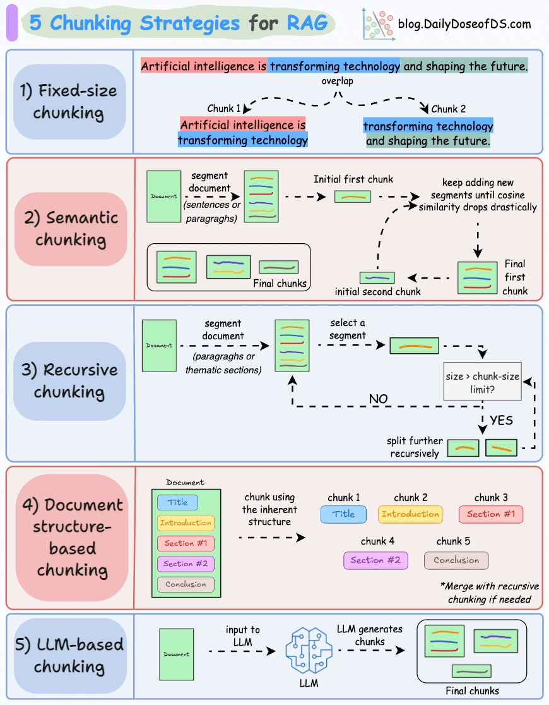

# Introduction to Chunking in RAG Pipelines

## What is Chunking?
* **Definition**: Segmenting text into smaller, manageable portions based on length, structure, or semantic meaning.
* **Purpose**: Allows vector search to focus on precise information instead of scanning entire documents.
* **Impact**: Improves retrieval accuracy and model performance in **Retrieval Augmented Generation (RAG)** workflows.


### Key Dimensions of Chunking

| Dimension | Description |
| :--- | :--- |
| **Methods** | Segmenting by fixed character length, structural tokens (paragraphs/sentences), or semantic changes. |
| **Benefits** | Higher retrieval relevance, reduced noise in LLM context windows, and faster vector search. |
| **Tradeoffs** | Small chunks risk losing vital context; large chunks may include irrelevant data. |

### A Simple Chunking Example


Here in the Image you can see different chunking strategies in action.

### Why Chunking is Critical (The Need)

* **Overcomes LLM Token Limitations**: Long documents often exceed context windows; chunking avoids inefficient processing, truncation, or sliding window complexities.
* **Improves Retrieval Accuracy**: Extracting smaller segments ensures retrieval pipelines match user queries with high structural precision.
* **Boosts System Performance**: Processing concise text segments reduces total computational overhead and accelerates embedding search speeds.
* **Preserves Local Context**: Keeping tightly coupled text together mitigates LLM hallucinations and prevents incorrect logical reasoning.
* **Optimizes Knowledge Access**: Enables lightning-fast querying across vast enterprise datasets without the massive memory overhead of loading entire files.


## Technical Breakdown: 5 Key Chunking Strategies

| Strategy | Core Mechanism | Primary Benefits | Key Tradeoffs / Drawbacks |
| :--- | :--- | :--- | :--- |
| **1. Fixed-Size** | Splits text into rigid, equal-sized segments using a set character or token count. | Simple to configure; highly predictable chunk boundaries. | Can split sentences mid-word or break vital context. |
| **2. Recursive Character** | Uses hierarchical fallback characters (e.g., `\n\n`, `\n`, ` `) to separate text. | Preserves natural sentence flow; avoids jarring splits. | Requires careful tuning of chunk sizes and overlaps. |
| **3. Document-Based** | Parses structural markup (HTML, Markdown, PDFs) to separate logical sections. | Respects layout hierarchies; ideal for web pages or manuals. | Highly dependent on clean, well-formatted source files. |
| **4. Sentence / Semantic**| Analyzes text transitions to group segments by underlying meaning or sentence borders. | Excellent context retention; ideal for complex prose. | Highly compute-intensive; depends on embedding models. |
| **5. Token-Based** | Measures and slices text strictly according to the target LLM's custom tokenizer. | Eliminates token overflow; perfectly matches model limits. | Harder to read for humans; text can look fragmented. |


## Managing Boundaries with Chunk Overlap

**Chunk overlap** includes a small portion of trailing text from the end of one chunk at the start of the subsequent chunk. This system design prevents context fragmentation when text is split mid-idea or mid-sentence.

* **Maintains Context Flow**: Preserves information continuity across artificial chunk boundaries.
* **Reduces Context Loss**: Eliminates missing semantic meaning when sentences span multiple segments.
* **Improves Answer Accuracy**: Provides retrieval models with uninterrupted logic paths, creating cleaner LLM responses.
* **Enhances Semantic Embeddings**: Retains critical transitional phrases and linked relational ideas within vector space.


## Selecting Optimal Chunk Sizes (LangChain Framework Benchmarks)

Choosing the correct chunk size requires a balance: chunks that are too large inject noise into the LLM context window, while chunks that are too small fail to convey complete meaning.

* **100–200 Tokens (Small)**
  * **Best Use Cases**: Conversational chat history, structured log streams, or micro-knowledge fragments.
* **300–500 Tokens (Medium / Standard)**
  * **Best Use Cases**: General enterprise documentation, prose, and articles where moderate context is needed.
* **600–900 Tokens (Large)**
  * **Best Use Cases**: Complex technical software guides, architecture manuals, and legal documents requiring deep reference anchoring.
  
## Implementation of Chunking Strategies (LangChain)

### Step 1: Install Required Libraries
```bash
!pip install langchain langchain-community langchain-experimental
```

### Step 2: Load the Source Document
```python
# Reading the raw input text file
text = open("sample_doc.txt", "r").read()
```

### 1. Fixed-Size Chunking Implementation
```python
from langchain.text_splitter import CharacterTextSplitter

splitter = CharacterTextSplitter(separator="",chunk_size=300, chunk_overlap=50)
chunks = splitter.split_text(text)

print("Fixed Size Chunks:", len(chunks))
print(chunks[0])
```
* **Sample Output Preview:**
  > *Machine learning is a branch of artificial intelligence focused on building systems that learn from data. These systems improve their performance over time without being explicitly programmed. There are many applications of machine learning, such as image classification, speech recognition, recommendation systems, and autonomous driving.*
  <br>
  <br>
### 2. Recursive Character Chunking Implementation
```python
from langchain.text_splitter import RecursiveCharacterTextSplitter

splitter = RecursiveCharacterTextSplitter(chunk_size=400, chunk_overlap=80)
chunks = splitter.split_text(text)

print("Recursive Chunks:", len(chunks))
print(chunks[0])
```
* **Sample Output Preview:**
  > *Machine learning is a branch of artificial intelligence focused on building systems that learn from data. These systems improve their performance over time without being explicitly programmed. There are many applications of machine learning, such as image classification, speech recognition, recommendation systems, and autonomous driving.*
  <br>
    <br>
### 3. Token-Based Chunking Implementation
```python
from langchain.text_splitter import TokenTextSplitter

splitter = TokenTextSplitter(chunk_size=256, chunk_overlap=32)
chunks = splitter.split_text(text)

print("Token-Based Chunks:", len(chunks))
print(chunks[0])
```
* **Sample Output Preview:**
  > *Supervised learning uses labeled data to train predictive models. It is commonly used for tasks like spam detection and sentiment analysis. Unsupervised learning, on the other hand, discovers hidden patterns in unlabeled data, such as customer clustering or anomaly detection...*
 <br>
  <br>
### 4. Sentence / Semantic Chunking Implementation
```python
from langchain_experimental.text_splitter import SemanticChunker
from langchain_community.embeddings import OpenAIEmbeddings

# Note: Depends on external embedding models to calculate semantic distance variance
embeddings = OpenAIEmbeddings()
splitter = SemanticChunker(embeddings)

chunks = splitter.split_text(text)
print("Semantic Chunks:", len(chunks))
#You need to setup api key for OpenAIEmbeddings
 
```
<br>

### 5. Document-Based Chunking Implementation
```python
from langchain_community.document_loaders import TextLoader
from langchain.text_splitter import RecursiveCharacterTextSplitter

# Loads structural document objects instead of raw string blocks
loader = TextLoader("sample_doc.txt")
documents = loader.load()

splitter = RecursiveCharacterTextSplitter(chunk_size=500, chunk_overlap=100)
chunks = splitter.split_documents(documents)

print("Document Chunks:", len(chunks))
```

## Applications

* **Question Answering**: Feeds specific, targeted text segments to the LLM for precise, context-aware answers.
* **Document Summarization**: Slices massive files into logical sections so LLMs can condense long reports without dropping facts.
* **Semantic Search**: Matches queries to context-rich chunks rather than dumping broad, irrelevant full documents.
* **Chatbots**: Provides chat agents with highly localized context to keep conversations accurate and free of hallucinations.
* **Knowledge Graphs**: Breaks entities and explicit relations down into manageable pairs to map out data connections clearly.
