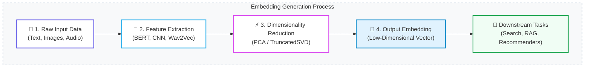

### What is an Embedding?
* **Definition**: A low-dimensional vector representation that encodes important features of unstructured data in a machine-understandable form.
* **Core Value**: Transforms complex structural data (text, images, audio) into geometric space where mathematical distance correlates directly to semantic similarity.

---

### The Embedding Model Pipeline

1. **Input Data**: Raw unstructured source streams requiring strategic preprocessing.
2. **Feature Extraction**: Deep layers transform input structures into dense numerical vectors.
3. **Dimensionality Reduction**: Algorithmic filters (like PCA) drop noisy variables while preserving data variance to mitigate overfitting.
4. **Output Embedding**: The final optimized, low-dimensional target vector prepared for enterprise compute operations.

---

### Classification of Specialized Embedding Models

| Data Type | Model Category | Core Implementations | Primary System Use Cases |
| :--- | :--- | :--- | :--- |
| **Text (Word)** | Word Embeddings | `Word2Vec`, `GloVe` | Maps isolated words via neighborhood context and co-occurrence. |
| **Text (Block)** | Sentence / Document | `Doc2Vec`, `InferSent`, `BERT` | Captures unified conceptual meaning of whole paragraphs or logs. |
| **Audio** | Speech & Sound | `VGGish`, `Wav2Vec` | Converts raw acoustic waveform data into text or music features. |
| **Vision** | Image Embeddings | `ResNet`, `VGG` (via CNNs) | Encodes geometric objects, colors, and textures for classification. |
| **Multimodal** | Cross-Domain | `CLIP` (OpenAI) | Aligns image and text vectors directly within a shared vector space. |

---

### Architectural Selection Framework: Choosing a Model

#### 1. Target Data Signature
* **Text Execution**: Choose transformer architectures (`BERT`, `RoBERTa`) for contextual nuance; use static models (`Word2Vec`) for lightweight token metrics.
* **Vision & Voice Execution**: Use specialized convolutional arrays (`ResNet`) for pixel structures and raw speech models (`Wav2Vec`) for wave streams.

#### 2. Downstream Task Mechanics
* **Contextual Nuance**: Tasks like Sentiment Analysis require context-aware sequence mapping (`BERT`).
* **Relational Mapping**: Tasks like Recommendation Systems excel via user-product collaborative filtering or lightweight similarity lookup arrays.

#### 3. Latency vs. Accuracy Tradeoffs
* **High-Capacity / Slow**: Models like `BERT` or `CLIP` deliver bleeding-edge semantic accuracy but demand high-cost GPU nodes and increase system query runtime.
* **Low-Capacity / Fast**: Static matrices process items instantly on basic CPU architectures with a slight loss in granular semantic parsing.

#### 4. Training Dataset Scale
* **Enterprise-Scale Data**: Large-scale transformer models achieve peak performance when given extensive target training pools.
* **Sparse / Limited Data**: Leverage a heavy **Pre-trained Foundation Model** and apply localized domain **Fine-Tuning** to save compute costs.

---
