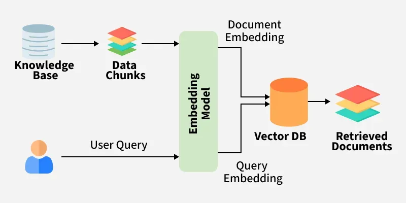

# Embeddings

## 1. What is an Embedding?

An **embedding** is a numerical vector representation of data that captures its semantic meaning.

```text
Text
 ↓
Embedding Model
 ↓
Vector
```

Example:

```text
"I love machine learning"
        ↓
[0.21, -0.73, 0.14, 0.91, ...]
```

### Core idea

> **Similar meaning → similar vectors**

```text
"I love dogs"
"I really like puppies"
        ↓
   close vectors
```

while:

```text
"I love dogs"
"Quantum mechanics is difficult"
        ↓
   distant vectors
```


# 2. Why Embeddings are Used in RAG

The main purpose of embeddings in RAG is:

> **Semantic retrieval**

Suppose you have:

```text
1,000,000 documents
```

You don't want to send all of them to the LLM.

Instead:

```text
Documents
    ↓
Chunking
    ↓
Embedding Model
    ↓
Vectors
    ↓
Vector Database
```

At query time:

```text
User Query
    ↓
Embedding Model
    ↓
Query Vector
    ↓
Similarity Search
    ↓
Relevant Chunks
    ↓
LLM
```

### Key takeaway

> Embeddings are the numerical representation that enables semantic search in a RAG system.

## Document Embeddings vs Query Embeddings

There are two sides of the RAG pipeline.

### During indexing

```text
Document Chunk
      ↓
Embedding Model
      ↓
Document Vector
      ↓
Vector Database
```

### During retrieval

```text
User Query
      ↓
Embedding Model
      ↓
Query Vector
      ↓
Vector Database Search
```

The vector database then finds document vectors that are most similar to the query vector.

## Semantic Search

Traditional keyword search focuses primarily on matching words.

Example:

```text
Query:
"How much vacation do I get?"
```

Document:

```text
"Employees are entitled to 20 days of annual leave."
```

Keyword search may struggle because:

```text
vacation ≠ annual leave
get ≠ entitled
```

Embedding-based search can recognize that these phrases have related meanings.

Therefore:

```text
Keyword Search
→ Lexical similarity

Embedding Search
→ Semantic similarity
```

### Remember

> **Embeddings allow search by meaning rather than exact words.**


## What Does an Embedding Look Like?

A text embedding might look like:

```text
[0.12, -0.45, 0.77, 0.21, ...]
```

This is called a **vector**.

For an embedding model with 1536 dimensions:

```text
vector = [
    x₁,
    x₂,
    x₃,
    ...
    x₁₅₃₆
]
```

The individual dimensions usually don't have an intuitive human meaning.

Don't think:

```text
dimension 1 = happiness
dimension 2 = technology
```

Instead:

> **The entire vector represents the semantic information.**


###  Embedding Dimension

Different embedding models produce different vector sizes.

Common dimensions include:

```text
384
768
1024
1536
3072
```

But:

> **Higher dimension ≠ automatically better embedding.**

When choosing an embedding model, consider:

```text
Retrieval Quality
        +
Latency
        +
Cost
        +
Storage
        +
Domain Performance
```

### Tips

> Choose embeddings based on evaluation and benchmarking, not dimension size.


## Important Concept

Once text has been converted into vectors, we need a way to determine how similar two vectors are.

The most important similarity measures are:

1. **Cosine similarity**
2. **Dot product**
3. **Euclidean distance**

For practical RAG work, **cosine similarity and dot product** are the most important to understand.

---

# 8. Cosine Similarity

Cosine similarity measures the angle between two vectors.

Conceptually:


Formula:

$$
\operatorname{cosine\_similarity}(A,B)
=
\frac{A \cdot B}{\lVert A\rVert \lVert B\rVert}
$$
Typical interpretation:

```text
+1 → very similar direction
 0 → unrelated / orthogonal
-1 → opposite direction
```

In many modern embedding systems, vectors are normalized, making similarity calculations particularly convenient.

### Intuition

You usually care more about:

> **Which vectors point in similar directions?**

than their raw magnitude.
 

### Dot Product

The dot product is:

```text
A · B
=
Σ AᵢBᵢ
```

For example:

```text
A = [1, 2]
B = [3, 4]

A · B
= (1×3) + (2×4)
= 11
```

For normalized vectors:

```text
Dot Product ≈ Cosine Similarity
```

### Cosine vs Dot Product vs Euclidean

| Metric             | Measures                     | RAG Importance |
| ------------------ | ---------------------------- | -------------- |
| Cosine similarity  | Angle/direction              | ⭐⭐⭐⭐⭐          |
| Dot product        | Vector alignment + magnitude | ⭐⭐⭐⭐           |
| Euclidean distance | Straight-line distance       | ⭐⭐⭐            |


## Embedding Model

An **embedding model** converts input data into vectors.

```text
Text
 ↓
Embedding Model
 ↓
Vector
```

Examples of embedding-model families include:

* OpenAI embedding models
* Cohere embedding models
* Google embedding models
* Voyage embedding models
* BGE models
* E5 models
* Sentence Transformers


## Embedding Models Are Not Universal

An embedding model that performs well on general English text may perform poorly on:

```text
Legal documents
Medical documents
Code
Financial documents
Multilingual data
Tables
Technical documentation
```

Therefore:

> **Embedding quality is domain-dependent.**


## Embeddings Are Not LLMs

An embedding model and a generative LLM have different jobs.

### Embedding model

```text
Text
 ↓
Vector
```

Purpose:

```text
Search
Similarity
Retrieval
Clustering
Classification
Recommendation
```

### Generative LLM

```text
Prompt
 ↓
LLM
 ↓
Generated Text
```

Purpose:

```text
Reasoning
Generation
Summarization
Question Answering
Tool Use
```

### RAG combines them:




## Embedding Pipeline  RAG

A simplified  pipeline:

```text
                 OFFLINE / INDEXING
                 ==================

Documents
    ↓
Parse
    ↓
Clean
    ↓
Chunk
    ↓
Embedding Model
    ↓
Vectors + Metadata
    ↓
Vector Database


                 ONLINE / QUERY
                 ==============

User Query
    ↓
Query Processing
    ↓
Embedding Model
    ↓
Query Vector
    ↓
Vector Search
    ↓
Top-K Chunks
    ↓
Reranking
    ↓
Context
    ↓
LLM
    ↓
Answer
```


## The Biggest Embedding Mistake

A common beginner mistake is thinking:

> "If retrieval is bad, I just need a better embedding model."

Not necessarily.

Retrieval quality depends on the entire pipeline:

```text
Document Parsing
      ↓
Chunking
      ↓
Embedding
      ↓
Indexing
      ↓
Similarity Search
      ↓
Filtering
      ↓
Reranking
      ↓
Context Construction
```

A bad chunk can produce bad retrieval even with an excellent embedding model.

### Therefore

> **Embedding quality is only one component of RAG retrieval quality.**


## Chunking Affects Embeddings

Suppose the original document is:

```text
50-page PDF
```

Embedding the entire PDF as one vector is usually a poor retrieval strategy.

Instead:

```text
50-page PDF
     ↓
   Chunks
     ↓
Chunk 1 → Vector
Chunk 2 → Vector
Chunk 3 → Vector
...
Chunk N → Vector
```

Why?

Because retrieval needs to identify the **specific relevant passage**.

This is why:

```text
Chunking + Embeddings
```

must be designed together.

## Metadata + Embeddings

A vector should usually be stored with metadata.

Example:

```json
{
  "text": "Employees receive 20 days of annual leave.",
  "vector": [0.12, -0.45, 0.77],
  "metadata": {
    "document": "employee_handbook.pdf",
    "page": 42,
    "department": "HR",
    "year": 2026
  }
}
```

This allows:

```text
Semantic Search
+
Metadata Filtering
```

For example:

```text
Find documents about vacation
WHERE department = "HR"
AND year = 2026
```

This becomes extremely useful in  RAG.


# 19. Dense Retrieval

Embedding-based retrieval is commonly called:

> **Dense retrieval**

Because each piece of text is represented by a dense numerical vector.

```text
Text
 ↓
Dense Vector
 ↓
Nearest Neighbor Search
```

Compare with:

### Sparse retrieval

```text
Text
 ↓
Sparse representation
 ↓
Keyword-based retrieval
```

Examples include BM25-style search.


##  Dense vs Sparse

|                     | Dense          | Sparse     |
| ------------------- | -------------- | ---------- |
| Main idea           | Meaning        | Keywords   |
| Embeddings          | Yes            | Usually no |
| Handles synonyms    | ⭐⭐⭐⭐⭐          | ⭐⭐         |
| Exact terms         | ⭐⭐⭐            | ⭐⭐⭐⭐⭐      |
| IDs / names / codes | Sometimes weak | Strong     |
| Typical example     | Vector search  | BM25       |

This leads to an important  technique:

> **Hybrid Retrieval**

```text
Query
 ├──→ Dense Search
 │
 └──→ Sparse Search
          ↓
      Combine Results
          ↓
       Reranker
```

You'll study this later in the RAG roadmap.

## Multilingual Embeddings

Modern embedding models can support multiple languages.

For example:

```text
English:
"What is machine learning?"

German:
 "Was ist maschinelles Lernen?"
```

A multilingual embedding model aims to place semantically equivalent text relatively close in vector space.

This enables:

```text
English Query
      ↓
Multilingual Embedding
      ↓
Search multilingual documents
```

Useful for global applications.


## Code Embeddings

Normal text embeddings aren't necessarily optimal for code retrieval.

For code search:

```text
User:
"Find authentication middleware"

        ↓

Code Embedding Model
        ↓

Relevant functions/classes
```

Code-specific embedding models can be useful for:

* Code search
* Repository understanding
* Documentation retrieval
* Code RAG
* Developer assistants

## Embedding Cost and Latency

In production, embeddings have two major costs.

### Indexing cost

You embed potentially millions of chunks:

```text
1M chunks
 ×
embedding cost
```

### Query cost

Every user query may require an embedding:

```text
10,000 queries/day
 ×
query embedding cost
```

You therefore care about:

```text
Quality
vs
Cost
vs
Latency
```
## Embedding Cache

Queries may repeat.

Instead of embedding the same query repeatedly:

```text
Query
 ↓
Check Cache
 ↓
Already exists?
 ├── Yes → reuse vector
 └── No  → generate embedding
```

Caching can reduce latency and cost.

## Normalization

Some retrieval systems normalize vectors:

$$\mathbf{v}_{\text{normalized}} = \frac{\mathbf{v}}{\|\mathbf{v}\|}$$

After normalization:

$$\|\mathbf{v}\|= 1$$

This makes certain similarity calculations equivalent or closely related.

For example:

$$\text{Cosine similarity} = \text{Dot product}$$

when vectors are normalized.