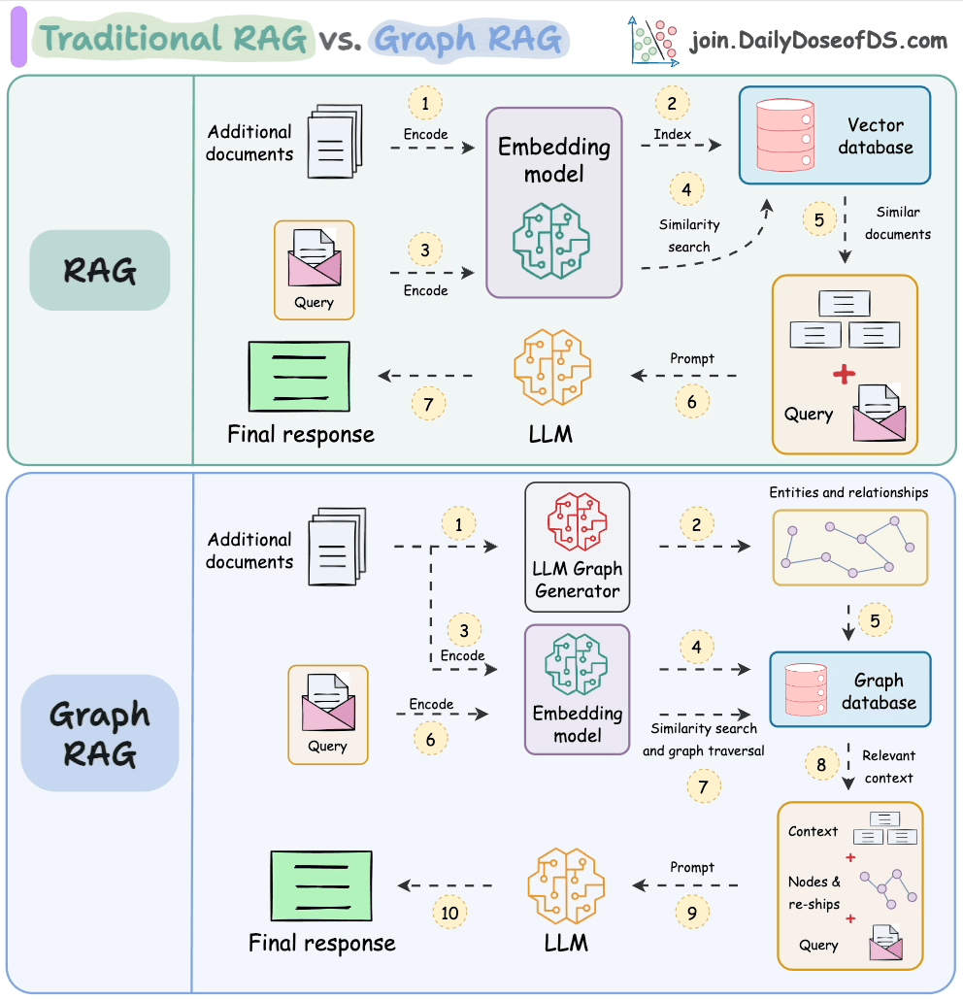

## Graph RAG

### What is Graph RAG?

**Graph RAG (Graph Retrieval-Augmented Generation)** is a RAG approach that uses a **knowledge graph** to retrieve information based on entities and relationships.

Traditional RAG primarily retrieves information based on **semantic similarity**.

Graph RAG additionally uses:

* Entities
* Relationships
* Graph structure
* Connections between entities

The core idea is:

> **Instead of only asking "Which chunks are similar to my query?", Graph RAG can ask "Which entities and relationships are relevant to my query?"**


## Traditional RAG vs Graph RAG

### Traditional RAG

```text
User Query
    ↓
Embedding
    ↓
Vector Search
    ↓
Relevant Chunks
    ↓
Context
    ↓
LLM
    ↓
Answer
```

Traditional RAG is very good when the answer is contained in one or a few relevant pieces of text.


### Graph RAG

```text
User Query
    ↓
Entity / Concept Identification
    ↓
Graph Retrieval
    ↓
Relevant Entities + Relationships
    ↓
Relevant Subgraph
    ↓
Context
    ↓
LLM
    ↓
Answer
```

Graph RAG focuses on the **relationships between pieces of information**.


## Why Graph RAG?

Consider a knowledge base containing information about:

```text
Companies
Employees
Products
Projects
Technologies
Customers
Locations
```

Suppose the question is:

> "Which technologies are used by projects managed by employees working at Company X?"

This question requires multiple relationships:

```text
Company X
   ↓
Employees
   ↓
Projects
   ↓
Technologies
```

A simple vector search may retrieve several relevant chunks, but it does not inherently understand the complete relationship structure.

A graph represents these relationships explicitly.

## Knowledge Graph

A **knowledge graph** represents knowledge as entities and relationships.

Example:

```text
Alice ──works_at──→ Google
Alice ──manages──→ Project A
Project A ──uses──→ Python
Project A ──uses──→ PyTorch
```

This can be represented as:

```text
        works_at
Alice ─────────────→ Google
  │
  │ manages
  ↓
Project A
  │
  ├── uses ──→ Python
  │
  └── uses ──→ PyTorch
```

The graph makes relationships explicit.


## Graph Components

A knowledge graph primarily contains:

```text
Entities
   +
Relationships
   +
Properties
```

For example:

```text
Entity:
Alice

Relationship:
works_at

Entity:
Google
```

Represented as:

```text
Alice ──works_at──→ Google
```


###  Entities

An **entity** is a distinct object or concept.

Examples:

```text
Person
Company
Product
Location
Organization
Technology
Project
Event
```

Example:

```text
Alice
Google
Python
Project A
```

These can all be entities.


### Relationships

A **relationship** describes how two entities are connected.

Examples:

```text
works_at
manages
created
uses
located_in
belongs_to
depends_on
```

Example:

```text
Alice ──works_at──→ Google

Alice ──manages──→ Project A

Project A ──uses──→ Python
```

### Properties

Entities and relationships can also have properties.

Example:

```text
Person:
Alice

Properties:
age = 30
role = Engineer
location = Bangalore
```

A relationship may also have properties.

```text
Alice
   │
   └── works_at ──→ Google

Relationship property:
start_year = 2022
```

##  Graph Structure

A graph can be represented as:

```text
G = (V, E)
```

where:

* \(V\) = set of vertices/nodes
* \(E\) = set of edges/relationships

Example:

```text
V = {Alice, Google, Project A, Python}

E = {
    Alice → Google,
    Alice → Project A,
    Project A → Python
}
```

---

##  Graph RAG Pipeline

A simplified Graph RAG system looks like:

```text
Documents
    ↓
Document Processing
    ↓
Entity Extraction
    ↓
Relationship Extraction
    ↓
Knowledge Graph
    ↓
Graph Retrieval
    ↓
Relevant Subgraph
    ↓
Context Construction
    ↓
LLM
    ↓
Answer
```

## Graph Construction

Before Graph RAG can retrieve information, the graph needs to be constructed.

Suppose we have:

```text
"OpenAI developed GPT models.
GPT models are used in ChatGPT."
```

The system can extract:

```text
Entities:

OpenAI
GPT
ChatGPT
```

Relationships:

```text
OpenAI ──developed──→ GPT

GPT ──used_in──→ ChatGPT
```

The resulting graph:

```text
OpenAI
   │
   │ developed
   ↓
  GPT
   │
   │ used_in
   ↓
ChatGPT
```


## Entity Extraction

Entity extraction identifies important entities from documents.

Example:

```text
"Tesla developed the Model S in 2012."
```

Possible entities:

```text
Tesla
Model S
2012
```

Depending on the application, the year may be treated as a property rather than an entity.

# Relationship Extraction

After identifying entities, the system identifies relationships.

Example:

```text
"Tesla developed the Model S."
```

Becomes:

```text
Tesla ──developed──→ Model S
```

The graph therefore captures semantic relationships that may not be obvious from isolated chunks.


## Graph Retrieval

Graph retrieval means searching the graph for information relevant to a query.

Suppose:

```text
Alice
  ↓
works_at
  ↓
Google
  ↓
owns
  ↓
Project A
  ↓
uses
  ↓
Python
```

Question:

> "Which technology does Alice's project use?"

The graph can traverse:

```text
Alice
 ↓
Google
 ↓
Project A
 ↓
Python
```

The retrieved subgraph becomes evidence for the LLM.

 ## Graph Traversal

Graph retrieval may involve traversing relationships.

Example:

```text
Alice
  ↓ works_at
Google
  ↓ owns
Project A
  ↓ uses
Python
```

A traversal can follow:

```text
Alice
→ Google
→ Project A
→ Python
```

The retrieved neighborhood can then be converted into context.


##  Local Retrieval

**Local retrieval** focuses on a specific entity or small neighborhood.

Example:

```text
Alice
 ├── works_at → Google
 ├── manages → Project A
 └── lives_in → Bangalore
```

Question:

> "Where does Alice work?"

Only the local neighborhood around Alice may be required.

```text
Alice
   ↓
Google
```

Local retrieval is useful for focused questions.

## Global Retrieval

**Global retrieval** focuses on broader information across the graph.

Example question:

> "What are the major technologies used across the company's projects?"

This may require information from many parts of the graph.

```text
Project A ──uses──→ Python
Project B ──uses──→ PyTorch
Project C ──uses──→ Kubernetes
Project D ──uses──→ Python
```

The system needs to reason across a larger portion of the graph.


##  Multi-Hop Questions

One of the strongest use cases for Graph RAG is **multi-hop reasoning**.

A multi-hop question requires following multiple relationships.

Example:

> "Who manages projects that use PyTorch?"

Graph:

```text
Alice
  │
  └── manages ──→ Project A
                       │
                       └── uses ──→ PyTorch
```

The answer requires:

```text
Alice
  ↓
Project A
  ↓
PyTorch
```

Multiple relationships are involved.

## Vector RAG + Graph RAG

Graph RAG does not necessarily replace vector retrieval.

A system can combine both approaches.

```text
                    Query
                      ↓
             ┌────────┴────────┐
             ↓                 ↓
       Vector Retrieval   Graph Retrieval
             ↓                 ↓
       Relevant Chunks    Relevant Subgraph
             ↓                 ↓
             └────────┬────────┘
                      ↓
              Combined Context
                      ↓
                     LLM
                      ↓
                    Answer
```

This is often a powerful architecture because:

* Vector retrieval finds semantically similar information.
* Graph retrieval finds structurally connected information.


## Graph RAG vs Vector RAG

| Feature             | Vector RAG               | Graph RAG                    |
| ------------------- | ------------------------ | ---------------------------- |
| Main representation | Embeddings               | Entities + relationships     |
| Retrieval           | Similarity-based         | Relationship/graph-based     |
| Strong at           | Semantic similarity      | Connected information        |
| Multi-hop questions | Can be difficult         | Often more natural           |
| Relationships       | Implicit                 | Explicit                     |
| Data structure      | Vector database          | Knowledge graph              |
| Best for            | Document-level retrieval | Relationship-heavy knowledge |

### Example

Imagine the documents contain:

```text
"Dr. Smith works at Hospital A."

"Hospital A uses Machine X."

"Machine X was developed by Company B."

"Company B is headquartered in Germany."
```

Question:

> "Where is the company that developed the machine used by Dr. Smith's hospital headquartered?"

Graph:

```text
Dr. Smith
    │
    │ works_at
    ↓
Hospital A
    │
    │ uses
    ↓
Machine X
    │
    │ developed_by
    ↓
Company B
    │
    │ headquartered_in
    ↓
Germany
```

The reasoning path is:

```text
Dr. Smith
 → Hospital A
 → Machine X
 → Company B
 → Germany
```

Graph RAG can represent this chain explicitly.


## Graph RAG Context Construction

The retrieved graph cannot simply be given to the LLM as raw graph data.

It needs to be converted into useful context.

For example:

```text
Entity: Dr. Smith

Relationship:
Dr. Smith works at Hospital A.

Relationship:
Hospital A uses Machine X.

Relationship:
Machine X was developed by Company B.

Relationship:
Company B is headquartered in Germany.
```

Then:

```text
Graph Retrieval
      ↓
Relevant Subgraph
      ↓
Context Construction
      ↓
LLM
```

This connects Graph RAG to the context construction topic you already learned.

##  Graph RAG with Original Documents

A graph should not necessarily replace the original documents.

A useful architecture is:

```text
Documents
   │
   ├──────────────→ Chunks → Embeddings → Vector DB
   │
   └──────────────→ Entities + Relationships → Graph DB
```

Both can point back to the original source.

```text
Graph Entity
     ↓
Source Document
     ↓
Original Chunk
```

This is useful for citations and verification.

##  Graph RAG and Citations

Graph retrieval should preserve source information.

Example:

```text
Relationship:
Hospital A uses Machine X.

Source:
medical_report.pdf
page 12
```

Then the generated answer can cite the source.

```text
Hospital A uses Machine X. [1]

[1] medical_report.pdf, page 12
```

Therefore:

```text
Graph
 ↓
Relationships
 ↓
Source Metadata
 ↓
Answer
 ↓
Citation
```


## When Should You Use Graph RAG?

Graph RAG is especially useful when the data contains many relationships.

Good use cases:

* Organizational knowledge
* Research knowledge
* Enterprise data
* Supply chains
* Financial relationships
* Scientific knowledge
* Legal relationships
* Product dependencies
* Social networks
* Complex entity relationships


## When Standard RAG Is Enough

Graph RAG is not necessary for every RAG application.

For example:

> "What is the refund policy?"

If the answer exists in one document:

```text
Query
 ↓
Vector Search
 ↓
Relevant Chunk
 ↓
LLM
```

Standard RAG is likely sufficient.

Building a graph would add unnecessary complexity.

## Advantages of Graph RAG

### 1. Explicit relationships

Relationships are represented directly.

### 2. Multi-hop reasoning

The system can follow chains of relationships.

### 3. Structured knowledge

Knowledge becomes organized around entities and relationships.

### 4. Better relationship-based retrieval

Useful when semantic similarity alone is insufficient.

### 5. Explainability

The retrieval path can sometimes be inspected.

##  Limitations

Graph RAG also introduces complexity.

### Graph construction

Creating a high-quality graph from documents can be difficult.

### Entity resolution

The system must determine whether two mentions refer to the same entity.

Example:

```text
"Apple"
"Apple Inc."
"Apple Computer"
```

These may refer to the same organization depending on context.

### Relationship extraction errors

Incorrect relationships can produce incorrect retrieval.

### Maintenance

The graph may need to be updated as documents change.

### Complexity

Graph RAG generally requires more infrastructure than simple vector RAG.

---

## Entity Resolution

Entity resolution means identifying when different names refer to the same entity.

Example:

```text
"OpenAI"
"OpenAI Inc."
"OpenAI, Inc."
```

The system may need to map them to:

```text
Canonical Entity:
OpenAI
```

This prevents duplicate entities.

---

# 30. Graph RAG Architecture

A simplified  architecture:

```text
                 Documents
                     ↓
             Document Processing
                     ↓
          ┌──────────┴──────────┐
          ↓                     ↓
      Chunking              Extraction
          ↓                     ↓
     Embeddings         Entities + Relations
          ↓                     ↓
     Vector DB              Graph DB
          │                     │
          └──────────┬──────────┘
                     ↓
                   Query
                     ↓
            Hybrid Retrieval
                     ↓
            Context Construction
                     ↓
                    LLM
                     ↓
                  Answer
                     ↓
                 Citations
```

## Graph RAG vs Knowledge Graph

These terms are related but not identical.

### Knowledge Graph

The **data structure** containing:

```text
Entities
+
Relationships
+
Properties
```

### Graph RAG

A **RAG architecture** that uses graph-based knowledge during retrieval and generation.

```text
Knowledge Graph
      ↓
Graph Retrieval
      ↓
Context
      ↓
LLM
```

So:

> A knowledge graph is a representation of knowledge; Graph RAG is an application of graph-based knowledge retrieval to RAG.

## Advanced Topics — Quick Reference

We will soon explore **Neo4j** to build GraphRAG (Graph-Retrieval Augmented Generation) pipelines. This advanced approach combines vector similarity with structured knowledge graphs to solve complex data relationships:

### Graph Databases

Examples include databases designed to store and query graph structures.

Common concepts:

```text
Nodes
Edges
Properties
Traversal
Graph Queries
```

### Community Detection

Groups strongly connected entities into communities.

Useful for discovering high-level themes or clusters.

### Graph Algorithms

Examples:

```text
Shortest Path
PageRank
Centrality
Community Detection
Traversal
```

### Graph Embeddings

Graphs can also be represented using embeddings.

Examples of concepts:

```text
Node Embeddings
Graph Embeddings
Knowledge Graph Embeddings
```

### Graph + LLM Extraction

LLMs can help extract:

```text
Entities
Relationships
Properties
```

from unstructured documents.

## Common Graph RAG Failure Modes

```text
Document
   ↓
Entity Extraction Error
   ↓
Incorrect Entity
   ↓
Incorrect Relationship
   ↓
Incorrect Graph
   ↓
Incorrect Retrieval
   ↓
Incorrect Answer
```

Other failures include:

* Missing relationships
* Duplicate entities
* Incorrect entity resolution
* Too much graph traversal
* Irrelevant subgraphs
* Stale graph data
* Poor source mapping

## Key Points
1. **Graph RAG uses graphs for retrieval.**
2. A knowledge graph represents **entities and relationships**.
3. Graph retrieval can follow relationships between entities.
4. Graph RAG is particularly useful for **multi-hop and relationship-heavy questions**.
5. Graph RAG can work together with vector retrieval.
6. Retrieved graph information still needs **context construction** before generation.
7. Source metadata should be preserved for **citations**.
8. Graph construction and entity resolution are major challenges.
9. Not every RAG application needs Graph RAG.
10. Graph RAG adds complexity, so use it when relationships provide real value.

---

## One-Line Summary

> **Graph RAG extends RAG by using entities and relationships in a knowledge graph to retrieve connected information that may be difficult to retrieve using semantic similarity alone.**

