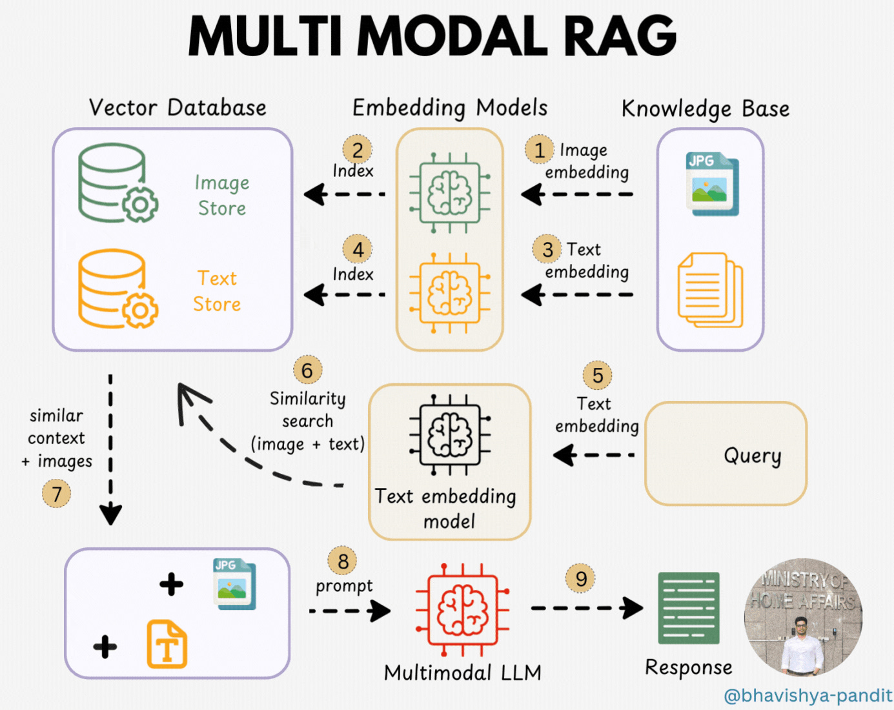

# Multimodal RAG

## What is Multimodal RAG?

**Multimodal RAG** extends RAG beyond text.

Instead of retrieving only text documents, the system can retrieve and reason over multiple types of information:

```text
Text
Images
Tables
Charts
Audio
Video
PDFs
```

The core idea:

> **Retrieve relevant information from multiple modalities and provide it to a multimodal model for generation.**



## Traditional RAG vs Multimodal RAG

### Traditional RAG

```text
User Query
    ↓
Text Embedding
    ↓
Vector Search
    ↓
Text Chunks
    ↓
LLM
    ↓
Answer
```

### Multimodal RAG

```text
User Query
    ↓
Multimodal Retrieval
    ↓
┌──────────┬──────────┬──────────┐
│   Text   │  Images  │  Tables  │
└──────────┴──────────┴──────────┘
              ↓
        Relevant Context
              ↓
      Multimodal LLM
              ↓
            Answer
```

###  Why Multimodal RAG?

Important information is often not represented purely as text.

For example, a PDF might contain:

```text
Page 1 → Text
Page 2 → Table
Page 3 → Architecture Diagram
Page 4 → Screenshot
Page 5 → Chart
```

A text-only RAG system may extract only the text and lose important visual information.

Multimodal RAG attempts to preserve and retrieve that information.

## Modalities

A modality is a type of information.

Common modalities include:

| Modality | Example                        |
| -------- | ------------------------------ |
| Text     | Documents, articles            |
| Image    | Photos, diagrams               |
| Table    | Spreadsheets, financial tables |
| Chart    | Bar charts, graphs             |
| Audio    | Meetings, interviews           |
| Video    | Tutorials, lectures            |
| PDF      | Mixed text + visual content    |


## Multimodal Documents

A single document can contain multiple modalities.

Example:

```text
Annual Report.pdf

├── Text
├── Tables
├── Charts
├── Images
└── Diagrams
```

A multimodal ingestion pipeline needs to identify and process these different components.

## Multimodal RAG Pipeline

A simplified pipeline:

```text
Documents
    ↓
Multimodal Ingestion
    ↓
┌──────────┬──────────┬──────────┐
│   Text   │  Images  │  Tables  │
└──────────┴──────────┴──────────┘
    ↓           ↓           ↓
Embeddings / Representations
    ↓
Multimodal Storage
    ↓
Retrieval
    ↓
Relevant Information
    ↓
Context Construction
    ↓
Multimodal LLM
    ↓
Answer
```

## Multimodal Embeddings

Different modalities can be represented as vectors.

For example:

```text
Text
  ↓
Embedding
  ↓
Vector
```

and:

```text
Image
  ↓
Embedding
  ↓
Vector
```

Some multimodal embedding systems are designed so that related text and images have representations that can be compared in a shared semantic space.

Conceptually:

```text
"cat"
  ↓
Text Vector

Image of a cat
  ↓
Image Vector

        ↓

Semantic similarity
```

## Text + Image Retrieval

Suppose the user asks:

> "What does the architecture diagram show?"

The system may need to retrieve:

```text
Relevant text
     +
Architecture image
```

Then:

```text
Query
 ↓
Retrieve text + image
 ↓
Multimodal context
 ↓
Vision-language model
 ↓
Answer
```

## Image Retrieval

Images can be retrieved based on:

* Image similarity
* Text-to-image similarity
* Metadata
* Captions
* OCR text
* Associated document information

Example:

```text
Image
 ↓
Image embedding
 ↓
Vector database
 ↓
Similarity search
```

##  OCR

**OCR (Optical Character Recognition)** extracts text from images.

Example:

```text
Image
 ┌──────────────────┐
 │ Revenue: $10M    │
 │ Growth: 25%      │
 └──────────────────┘
          ↓
         OCR
          ↓
"Revenue: $10M
 Growth: 25%"
```

OCR is useful when important information exists inside:

* Scanned PDFs
* Screenshots
* Documents
* Tables
* Images

## Tables in Multimodal RAG

Tables can contain information that is difficult to represent correctly as ordinary text.

Example:

```text
| Model | Accuracy | Latency |
|-------|----------|---------|
| A     | 91%      | 20 ms   |
| B     | 94%      | 30 ms   |
```

A multimodal system can preserve the table structure rather than treating it as arbitrary text.

This can improve questions such as:

> "Which model has the highest accuracy?"

##  Charts and Diagrams

Charts contain relationships that may not be obvious from surrounding text.

Example:

```text
Sales
  ↑
  │       █
  │   █   █
  │   █   █
  │ █ █   █
  └──────────→ Year
```

A multimodal model can analyze the visual structure.

This enables questions like:

> "Which year had the highest sales?"

## Multimodal Context

The final context may contain different types of information:

```text
Context:

[Text]
The system architecture consists of three services.

[Image]
architecture_diagram.png

[Table]
Service latency metrics...
```

The multimodal model receives the appropriate representations.
## Multimodal RAG Example

Imagine a technical documentation system.

User asks:

> "How is authentication implemented according to the architecture diagram?"

The system may retrieve:

```text
Document chunk:
"Authentication is handled by the Auth Service."

Architecture diagram:
Shows Client → Auth Service → API Gateway
```

The model combines both:

```text
Text Evidence
      +
Visual Evidence
      ↓
Multimodal LLM
      ↓
Answer
```

##  Multimodal RAG Architecture

```text
                         Documents
                            ↓
                  Multimodal Ingestion
                            ↓
          ┌─────────────────┼─────────────────┐
          ↓                 ↓                 ↓
        Text             Images            Tables
          ↓                 ↓                 ↓
     Embeddings        Embeddings        Structured Data
          ↓                 ↓                 ↓
          └─────────────────┼─────────────────┘
                            ↓
                         Storage
                            ↓
                          Query
                            ↓
                       Retrieval
                            ↓
                 Multimodal Context
                            ↓
                    Multimodal LLM
                            ↓
                         Answer
                            ↓
                        Citations
```

##  Multimodal RAG Use Cases

### Document Intelligence

Understand complex PDFs containing text, tables, and diagrams.

### Technical Documentation

Retrieve architecture diagrams and related explanations.

### Financial Analysis

Analyze reports, tables, and charts.

### Healthcare

Retrieve information from medical documents and images.

### Education

Answer questions using textbooks, diagrams, and figures.

### E-commerce

Retrieve product descriptions and product images.

### Video Knowledge Bases

Retrieve relevant segments from recorded videos.

## Video RAG

Video can be processed into useful units.

```text
Video
  ↓
Frames
  +
Audio
  +
Transcript
  ↓
Indexed Information
```

A query can then retrieve relevant portions.

Example:

> "At what point does the instructor explain backpropagation?"

Possible retrieval:

```text
Transcript → relevant text
Timestamp → 32:15
Frames → relevant visual content
```
## Audio RAG

Audio can be converted into text using transcription.

```text
Audio
  ↓
Speech-to-Text
  ↓
Transcript
  ↓
Chunking
  ↓
Embeddings
  ↓
Retrieval
```

Additional metadata can include:

```text
Speaker
Timestamp
Meeting
Topic
```

##  Multimodal RAG Challenges

### Modality Alignment

Text, images, tables, audio, and video need to be connected correctly.

### Retrieval Complexity

Different modalities may require different retrieval strategies.

### Storage

Multimodal data can require significantly more storage.

### Processing Cost

Image/video processing can be expensive.

### Context Management

The model must receive the right combination of modalities.

### Citation Complexity

Citations may need to reference:

```text
Document
Page
Image
Table
Timestamp
```

# RAG Evaluation

##  What is RAG Evaluation?

**RAG Evaluation** is the process of measuring how well a RAG system performs.

A RAG system can fail at different stages:

```text
Query
 ↓
Retrieval
 ↓
Context
 ↓
Generation
 ↓
Answer
```

Therefore, evaluation should not look only at the final answer.

##  Why RAG Evaluation?

Suppose a RAG system gives a wrong answer.

Why?

Possibilities include:

```text
Wrong documents retrieved
        ↓
Poor context
        ↓
LLM generates wrong answer
```

Or:

```text
Correct documents retrieved
        ↓
Good context
        ↓
LLM generates unsupported answer
```

Without evaluation, it is difficult to identify the actual problem.

## Evaluation Layers

A useful mental model:

```text
                 RAG Evaluation
                       │
       ┌───────────────┼───────────────┐
       ↓               ↓               ↓
   Retrieval       Generation      End-to-End
       ↓               ↓               ↓
 Recall/Precision  Faithfulness    Answer Quality
 Relevance         Correctness     User Satisfaction
```

## Retrieval Evaluation

Retrieval evaluation asks:

> **Did we retrieve the right information?**

Important concepts:

* Recall
* Precision
* Relevance
* Top-K performance

## Retrieval Recall

**Recall** measures how much of the relevant information was successfully retrieved.

Conceptually:

$$
Recall =
\frac{\text{Relevant items retrieved}}
{\text{Total relevant items}}
$$

Example:

```text
Relevant documents:
A, B, C, D

Retrieved:
A, B, C

Recall = 3 / 4 = 75%
```

High recall means the retriever is good at finding relevant information.

## Retrieval Precision

**Precision** measures how much of the retrieved information is actually relevant.

$$
Precision =
\frac{\text{Relevant items retrieved}}
{\text{Total items retrieved}}
$$

Example:

```text
Retrieved:
A, B, C, D, E

Relevant:
A, B, C

Precision = 3 / 5 = 60%
```

High precision means the retrieved results contain less irrelevant information.

###  Recall vs Precision

```text
Recall:
"Did we find the relevant information?"

Precision:
"How much of what we found is relevant?"
```

A RAG system often needs a balance.

```text
High Recall
     +
Good Precision
     ↓
Useful Context
```

##  Context Evaluation

After retrieval, we need to evaluate the context given to the LLM.

Questions include:

* Is the context relevant?
* Is important information missing?
* Is there too much irrelevant information?
* Is the context redundant?
* Does the context actually support the answer?

---

# 29. Context Relevance

**Context relevance** asks:

> Does the retrieved context contain information relevant to the user's question?

Example:

```text
Question:
"What is the refund period?"

Context:
"The refund period is 30 days."

→ Relevant
```

But:

```text
Context:
"The company was founded in 2010."

→ Irrelevant
```

##  Faithfulness

**Faithfulness** measures whether the generated answer is supported by the retrieved context.

Example:

```text
Context:
"The product costs $100."

Answer:
"The product costs $100."

→ Faithful
```

But:

```text
Context:
"The product costs $100."

Answer:
"The product costs $100 and includes free shipping."

→ Potentially unfaithful
```

The second claim is not supported by the context.

##  Answer Relevance

**Answer relevance** asks:

> Does the answer actually address the user's question?

Example:

```text
Question:
"What is the refund period?"

Answer:
"The refund period is 30 days."

→ Relevant
```

Bad example:

```text
"The company has been operating since 2010."
```

Even if factually correct, it does not answer the question.

##  Answer Correctness

**Answer correctness** asks whether the answer is actually correct.

Example:

```text
Expected:
"The refund period is 30 days."

Generated:
"The refund period is 15 days."

→ Incorrect
```

Correctness may require comparing the answer against:

* Ground-truth answers
* Trusted documents
* Human judgments
* Reference answers

## End-to-End RAG Evaluation

Ultimately we care about:

```text
User Query
     ↓
Retrieval
     ↓
Context
     ↓
Generation
     ↓
Answer
     ↓
Is the answer useful and correct?
```

This is **end-to-end evaluation**.

---

# 34. RAG Evaluation Framework

A useful conceptual framework:

```text
              RAG System
                  ↓
       ┌──────────┼──────────┐
       ↓          ↓          ↓
   Retrieval   Context    Generation
       ↓          ↓          ↓
    Recall     Relevance   Faithfulness
    Precision  Completeness Correctness
                            Relevance
                  ↓
            Final Evaluation
                  ↓
           User Satisfaction
```

##  Evaluation Dataset

To evaluate a RAG system, we can create test cases.

Example:

```text
Question:
"What is the refund period?"

Expected Answer:
"30 days."

Relevant Source:
refund_policy.pdf
```

Dataset:

```text
{
    question,
    expected_answer,
    relevant_documents
}
```

Then run the RAG system against many questions.

##  Golden Dataset

A **golden dataset** is a trusted evaluation dataset containing known expected results.

Example:

```text
Question 1 → Expected Answer 1
Question 2 → Expected Answer 2
Question 3 → Expected Answer 3
...
```

It can be used to compare different versions of a RAG system.

## Human Evaluation

Humans can evaluate generated answers.

Typical criteria:

```text
Correctness
Relevance
Faithfulness
Completeness
Clarity
```

Example scoring:

```text
1 → Poor
2 → Below Average
3 → Acceptable
4 → Good
5 → Excellent
```

Human evaluation is expensive but can provide high-quality judgments.

## LLM-as-a-Judge

An LLM can also evaluate another LLM's output.

Conceptually:

```text
Question
   +
Retrieved Context
   +
Generated Answer
   ↓
Evaluator LLM
   ↓
Score
```

The evaluator can assess:

* Relevance
* Faithfulness
* Correctness
* Completeness

However, automated judges can also make mistakes and should be validated.

##  Retrieval Metrics

Common retrieval metrics include:

```text
Recall@K
Precision@K
Hit Rate
MRR
NDCG
```

### Recall@K

Measures whether relevant information appears within the top K retrieved results.

### Precision@K

Measures the proportion of the top K results that are relevant.

### Hit Rate

Measures whether at least one relevant result was retrieved.

### MRR

**Mean Reciprocal Rank** evaluates how high the first relevant result appears.

### NDCG

**Normalized Discounted Cumulative Gain** evaluates ranking quality while giving more importance to highly ranked relevant results.

These are useful when evaluating retrieval separately.

## 
Generation can be evaluated using concepts such as:

```text
Faithfulness
Answer Relevance
Answer Correctness
Completeness
Groundedness
```

The exact metric depends on the application.

##  RAG Failure Analysis

Evaluation should identify **where** the system failed.

Example:

```text
Question
   ↓
Retrieval
   ↓
Wrong documents
   ↓
Failure
```

This is different from:

```text
Question
   ↓
Correct documents
   ↓
Good context
   ↓
Wrong answer
   ↓
Generation failure
```

Therefore:

> Evaluation should be diagnostic, not just a single score.

## 
```text
Test Dataset
     ↓
Run RAG System
     ↓
Collect:
 ├── Retrieved Documents
 ├── Context
 ├── Generated Answer
 └── Citations
     ↓
Evaluate
 ├── Retrieval
 ├── Context
 ├── Generation
 └── Citations
     ↓
Metrics
     ↓
Failure Analysis
     ↓
Improve System
```

##   Evaluation → Improvement Loop

RAG development should be iterative.

```text
Build
 ↓
Evaluate
 ↓
Find Failure
 ↓
Improve
 ↓
Evaluate Again
 ↓
Repeat
```

For example:

```text
Low Recall
    ↓
Improve Retrieval

Poor Context
    ↓
Improve Chunking / Context Construction

Poor Faithfulness
    ↓
Improve Prompt / Retrieval / Generation

Poor Ranking
    ↓
Improve Reranking
```

## RAG Evaluation by Stage

| Stage      | Main Question                     | Example Metrics               |
| ---------- | --------------------------------- | ----------------------------- |
| Retrieval  | Did we find relevant information? | Recall@K, Precision@K, MRR    |
| Context    | Is the context useful?            | Relevance, completeness       |
| Generation | Is the answer supported?          | Faithfulness, groundedness    |
| Answer     | Does it answer correctly?         | Correctness, relevance        |
| Citations  | Do sources support claims?        | Citation correctness          |
| End-to-End | Is the system useful?             | Overall quality, human rating |

##  Important Trade-offs

Improving one metric can sometimes affect another.

Example:

```text
Increase K
   ↓
Higher chance of finding relevant information
   ↓
Higher recall
   ↓
More context
   ↓
Potentially more noise
```

Similarly:

```text
More agentic steps
   ↓
Potentially better reasoning
   ↓
Higher latency + cost
```

RAG optimization is therefore about finding the right balance.

## Evaluation of Multimodal RAG

Multimodal RAG adds additional evaluation dimensions.

For example:

```text
Text Retrieval
Image Retrieval
Table Retrieval
OCR Quality
Visual Understanding
Answer Grounding
Citation Accuracy
```

Example:

```text
Question:
"Which year had the highest revenue?"

Chart
   ↓
Retrieved
   ↓
Model interprets chart
   ↓
Answer
```

Evaluation needs to determine whether the model correctly interpreted the visual information.

##  Evaluation of Agentic RAG

Agentic RAG can be evaluated at additional levels:

```text
Tool Selection
Planning
Number of Steps
Retrieval Quality
Reasoning
Final Answer
```

Example:

```text
Question
 ↓
Agent
 ↓
Wrong Tool
 ↓
Wrong Result
 ↓
Wrong Answer
```

The final answer alone does not reveal the full problem.

## Evaluation Pyramid

A useful way to think about RAG evaluation:

```text
                End-to-End Quality
                       ▲
                       │
                 Answer Quality
                       ▲
                       │
                Generation Quality
                       ▲
                       │
                 Context Quality
                       ▲
                       │
                Retrieval Quality
```

If retrieval is poor, generation cannot reliably fix it.


## Complete RAG Architecture

After everything you've learned, the complete picture is:

```text
                         USER QUERY
                             ↓
                    Query Transformation
                             ↓
                  ┌──────────┴──────────┐
                  ↓                     ↓
            Vector Retrieval       Graph Retrieval
                  ↓                     ↓
                  └──────────┬──────────┘
                             ↓
                        Reranking
                             ↓
                   Context Construction
                             ↓
                       Multimodal?
                      ↙           ↘
                    No             Yes
                    ↓               ↓
                 Context     Multimodal Context
                    └───────┬───────┘
                            ↓
                           LLM
                            ↓
                        Generation
                            ↓
                         Citations
                            ↓
                          Answer
                            ↓
                       Evaluation
                            ↓
                    Improve System
                            ↺
```

## Final Takeaway

> **Multimodal RAG extends retrieval beyond text to images, tables, audio, video, and other modalities. RAG Evaluation measures whether the entire system retrieves the right evidence, constructs useful context, generates grounded answers, and provides correct sources.**

## RAG Master  Model

```text
                       RAG
                        │
        ┌───────────────┴────────────────┐
        ↓                                ↓
    RETRIEVAL                         GENERATION
        │                                │
   Vector / Graph                  Context → LLM
        │                                │
        └───────────────┬────────────────┘
                        ↓
                     ANSWER
                        ↓
                    CITATIONS
                        ↓
                   EVALUATION
                        ↓
                   IMPROVEMENT
                        ↺
```

> **The goal of RAG is not simply to retrieve documents. The goal is to retrieve the right evidence, give it to the model in the right form, generate a grounded answer, cite the evidence, and continuously evaluate and improve the system.**
