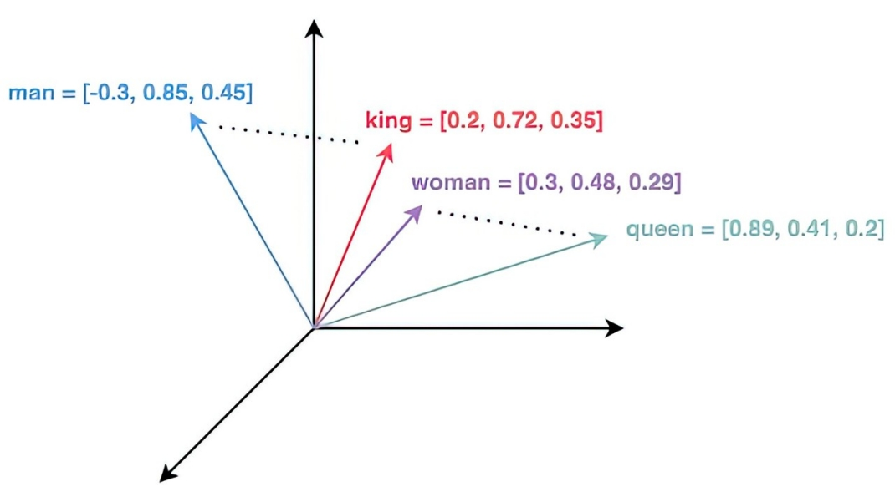
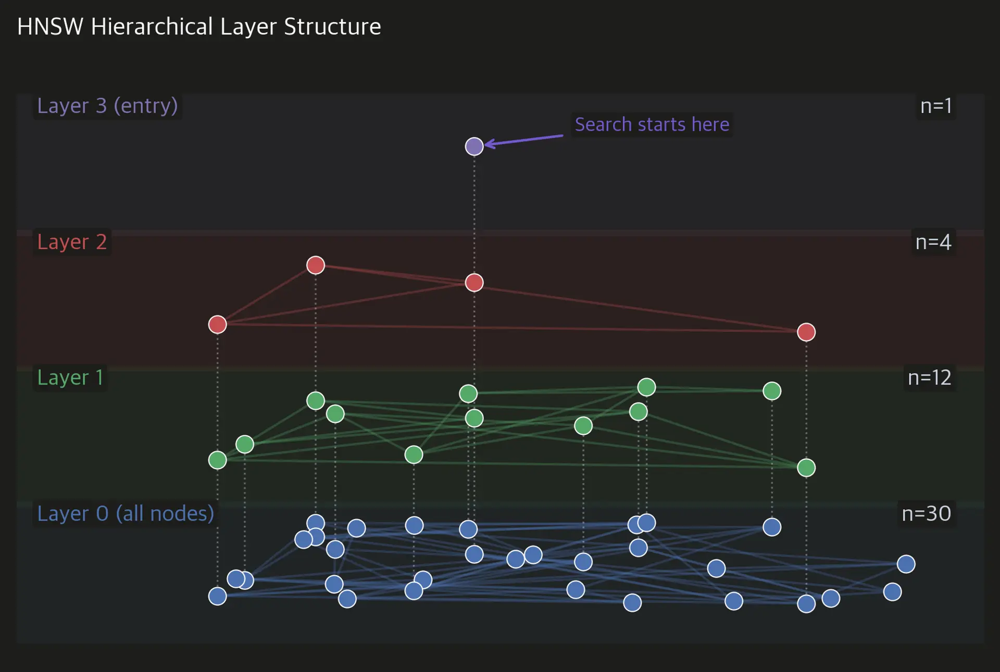

# Vector Databases — Fundamentals

##  What is a Vector Database?

A **Vector Database (Vector DB)** is a database designed to store, index, and efficiently search **high-dimensional vectors**.

In AI/ML, these vectors usually come from an **embedding model**.

For example:

$$
\text{"I love machine learning"}
\rightarrow
[0.21,\,-0.43,\,0.87,\,\ldots,\,0.15]
$$

The vector may contain hundreds or thousands of dimensions.

The important question is:

> Given a query vector, how can we efficiently find the vectors that are most similar to it?

That is the fundamental problem a Vector DB helps solve.


## Why Do We Need Vector Databases?

Suppose we have:

$$
N = 10,000,000
$$

document embeddings.

A user asks:

> "How can I reset my password?"

We convert the query into an embedding:

$$
q \in \mathbb{R}^{d}
$$

where \(d\) is the embedding dimension.

Our database contains:

$$
v_1,v_2,v_3,\ldots,v_N
$$

We want to find the vectors most similar to \(q\).

### a. Brute-force approach

We compare \(q\) with every vector:

$$
sim(q,v_1), sim(q,v_2), \ldots, sim(q,v_N)
$$

Then select the top \(K\) results.

For a huge \(N\), this becomes expensive.

So Vector DBs use **vector indexes and approximate search algorithms** to make retrieval much faster.


## What is Vector Search?

**Vector search** means finding vectors that are closest or most similar to a query vector.

Given:

$$
q = \text{query vector}
$$

and a collection:

$$
V = \{v_1,v_2,\ldots,v_N\}
$$

we want:

$$
\operatorname{TopK}(q,V)
$$

That means:

> Return the \(K\) vectors most relevant to the query.

Example:

```text
Query
  ↓
"How do I reset my password?"
  ↓
Embedding
  ↓
q = [0.12, -0.31, 0.72, ...]
  ↓
Vector Search
  ↓
┌─────────────────────────────────┐
│ Document 17   similarity = 0.94 │
│ Document 83   similarity = 0.91 │
│ Document 42   similarity = 0.88 │
│ Document 91   similarity = 0.84 │
└─────────────────────────────────┘
```

These documents are returned because their vectors are close to the query vector in the chosen similarity space.


## What Does "Similar" Mean?

A Vector DB needs a mathematical way to measure similarity or distance.

The three important measures are:

1. **Cosine similarity**
2. **Dot product**
3. **Euclidean distance**


## Cosine Similarity

Cosine similarity measures the **angle** between two vectors.

For vectors \(A\) and \(B\):

$$
\cos(\theta)
=
\frac{A\cdot B}
{\|A\|\|B\|}
$$

where:

$$
A\cdot B = \sum_{i=1}^{d} A_iB_i
$$

and:

$$
\|A\| = \sqrt{\sum_{i=1}^{d}A_i^2}
$$

### Intuition


Smaller angle → more similar direction.
Here:
```text 
Just as 'man' and 'king' share a close conceptual relationship,
'woman' and 'queen' are similarly linked. 
In vector space, this strong connection is represented
by a smaller angle between the words

```

For normalized vectors:

$$
\cos(\theta) \approx 1
$$

means highly similar.

A value near:

$$
0
$$

means little directional similarity.


## Dot Product

The dot product is:

$$
A\cdot B
=
\sum_{i=1}^{d}A_iB_i
$$

For example:

$$
A=[1,2,3]
$$

$$
B=[4,5,6]
$$

Then:

$$
A\cdot B
=
(1)(4)+(2)(5)+(3)(6)
$$

$$
=4+10+18=32
$$

A larger dot product generally means stronger alignment.

### Important

If vectors are **L2-normalized**:

$$
\|A\|=\|B\|=1
$$

then:

$$
A\cdot B=\cos(\theta)
$$

So normalized dot product and cosine similarity become equivalent.


## Euclidean Distance

Euclidean distance measures the straight-line distance between two vectors.

$$
d(A,B)
=
\sqrt{\sum_{i=1}^{d}(A_i-B_i)^2}
$$

For:

$$
A=[1,2]
$$

$$
B=[4,6]
$$

we get:

$$
d(A,B)
=
\sqrt{(1-4)^2+(2-6)^2}
$$

$$
=\sqrt{9+16}
$$

$$
=5
$$

For Euclidean distance:

> **Smaller distance = more similar**


## Similarity vs Distance

Remember this simple distinction:

| Metric             | Better Match   |
| ------------------ | -------------- |
| Cosine similarity  | Higher         |
| Dot product        | Usually higher |
| Euclidean distance | Lower          |

The embedding model and retrieval system should generally use a metric appropriate to how the embeddings were trained/normalized.


## Nearest Neighbor Search

The **Nearest Neighbor (NN)** problem is:

> Given a query vector, find the closest vector(s) in a dataset.

Given:

$$
q
$$

and vectors:

$$
V=\{v_1,v_2,\ldots,v_N\}
$$

we want:

$$
v^*=\arg\min_{v\in V}d(q,v)
$$

for a distance function \(d\).

Or, for similarity:

$$
v^*=\arg\max_{v\in V}sim(q,v)
$$

---

##  Top-K Search

Usually we don't want only one result.

We want the best \(K\) results.

For example:

$$
K=5
$$

means:

> Return the 5 most relevant vectors.

This is called **Top-K retrieval**.

Example:

```text
Query
 ↓
Vector DB
 ↓
Similarity calculation
 ↓
Rank results
 ↓
Top 5
 ↓
Return documents
```

Top-K retrieval is fundamental to **RAG**.


## Exact Search

The simplest approach is **exact nearest-neighbor search**.

For every query:

```text
Query
 ↓
Compare with Vector 1
Compare with Vector 2
Compare with Vector 3
...
Compare with Vector N
 ↓
Rank everything
 ↓
Top-K
```

### Advantage

Very accurate.

### Problem

As \(N\) becomes very large, searching every vector becomes expensive.

If:

$$
N=10^7
$$

we potentially perform comparisons against:

$$
10,000,000
$$

vectors for every query.


## Approximate Nearest Neighbor (ANN)

**Approximate Nearest Neighbor (ANN)** methods try to find very good nearest neighbors **without comparing against every vector**.

Instead of:

```text
Query
 ↓
ALL 10,000,000 vectors
```

we want something closer to:

```text
Query
 ↓
Index
 ↓
Promising candidates
 ↓
Top-K
```

The goal is:

$$
\text{Much faster search}
$$

while maintaining:

$$
\text{High retrieval quality}
$$

This introduces a trade-off:

$$
\text{Speed} \leftrightarrow \text{Recall}
$$


## Recall in Vector Search

**Recall** tells us how many of the truly relevant nearest neighbors our approximate search successfully finds.

Conceptually:

$$
Recall@K
=
\frac{\text{relevant results retrieved}}
{\text{relevant results that should have been retrieved}}
$$

For ANN systems, we often accept a tiny reduction in exactness to obtain a large improvement in speed.


## Vector Index

A **vector index** is a data structure that helps the database search vectors efficiently.

Without an index:

```text
Query
 ↓
Compare against everything
```

With an index:

```text
Query
 ↓
Vector Index
 ↓
Navigate/search intelligently
 ↓
Candidate vectors
 ↓
Top-K
```

Important index families include:

* **HNSW**
* **IVF**
* **PQ**


## HNSW — High-Level Idea

HNSW stands for:

**Hierarchical Navigable Small World**

It builds a graph over vectors.

Conceptually:



Instead of comparing a query with every vector, the search can **navigate through the graph toward increasingly closer vectors**.

Think of it like using a map:

```text
Without index:

Start
 ↓
Check every house in the city


With HNSW:
Start
 ↓
Find correct neighborhood
 ↓
Find correct street
 ↓
Find nearby houses
```
Remember :

> HNSW provides an efficient approximate nearest-neighbor search structure.


## What Does a Vector Database Store?

A typical vector record contains:

```text
ID
Vector
Metadata / Payload
Content or reference
```

Example:

```json
{
  "id": "doc_123",
  "vector": [0.21, -0.43, 0.72],
  "metadata": {
    "source": "company_handbook",
    "page": 12,
    "department": "HR"
  },
  "text": "Employees receive..."
}
```

The vector is used for **semantic retrieval**.

The metadata helps us **filter and organize results**.


## Metadata Filtering

Vector similarity alone is sometimes insufficient.

Suppose we have:

```text
Query:
"What is the leave policy?"
```

We may want:

```text
department = HR
country = India
year >= 2025
```

So retrieval becomes:

$$
\text{Vector Similarity}
+
\text{Metadata Filtering}
$$

Example:

```text
Query
 ↓
Vector Search
 +
department = HR
 +
country = India
 ↓
Top-K relevant documents
```

This is extremely important for real-world RAG systems.


## Vector Database in RAG

A typical RAG pipeline looks like:

```text
             Documents
                  ↓
               Chunking
                  ↓
              Embeddings
                  ↓
             Vector DB
                  ↑
                  │
User Question → Embedding
                  ↓
             Vector Search
                  ↓
             Top-K Chunks
                  ↓
                  LLM
                  ↓
                Answer
```

The Vector DB's job is primarily:

> **Retrieve relevant information efficiently.**

The LLM's job is:

> **Use the retrieved information to generate an answer.**


## The Core Mental Model

Remember this:

$$
\mathrm{Query} \rightarrow \mathrm{Vector} \rightarrow \mathrm{Search} \rightarrow \mathrm{Top\text{-}K}
$$

And for RAG:

$$
\mathrm{Query} \rightarrow \mathrm{Retrieval} \rightarrow \mathrm{Context} \rightarrow \mathrm{LLM} \rightarrow \mathrm{Answer}
$$


## Advanced Topics to Explore Later

Advanced Vector Database Concepts — Quick Reference

These concepts are important for understanding **large-scale vector databases**, but they don't need deep study initially.


### IVF — Inverted File Index

**IVF** divides the vector space into multiple clusters.

Instead of searching every vector:

$$
\text{Query} \rightarrow \text{all vectors}
$$

we search only the most relevant clusters:

$$
\text{Query} \rightarrow \text{nearest clusters} \rightarrow \text{vectors}
$$

**Goal:** Reduce search time.


### Product Quantization (PQ)

**Product Quantization** compresses vectors by splitting them into smaller parts and representing those parts using compact codes.

$$
\text{Large vector}
\rightarrow
\text{smaller representation}
$$

**Goal:** Reduce memory usage and make large-scale search more efficient.

Trade-off:

$$
\text{Memory/Speed} \leftrightarrow \text{Accuracy}
$$


###  Quantization

**Quantization** represents numerical values using lower precision.

For example:

$$
FP32 \rightarrow INT8
$$

Instead of storing every value with high precision, we use fewer bits.

**Goal:**

* Lower memory usage
* Faster computation
* Lower storage cost

Trade-off:

$$
\text{Efficiency} \leftrightarrow \text{Precision}
$$


### Sharding

**Sharding** splits a large dataset across multiple machines.

```text
10 million vectors
       ↓
 ┌─────┼─────┐
 ↓     ↓     ↓
Shard  Shard  Shard
 1      2      3
```

**Goal:** Scale storage and search horizontally.


### Replication

**Replication** keeps multiple copies of data.

```text
Primary
   ↓
Replica 1
Replica 2
```

**Goals:**

* High availability
* Fault tolerance
* Sometimes better read throughput


### Distributed Vector Search

When vectors are spread across multiple machines/shards, a query may need to search several nodes.

```text
             Query
               ↓
        ┌──────┼──────┐
        ↓      ↓      ↓
      Node 1 Node 2 Node 3
        ↓      ↓      ↓
       Top-K  Top-K  Top-K
        └──────┼──────┘
               ↓
         Merge Results
               ↓
            Final Top-K
```

**Goal:** Search very large datasets across multiple machines.


### Performance Tuning

Performance tuning means optimizing the system for:

* **Latency** — how fast a query returns
* **Throughput** — queries per second
* **Recall** — retrieval quality
* **Memory** — RAM/storage usage
* **Cost** — infrastructure cost

A common  trade-off is:

$$
\text{Latency}
\leftrightarrow
\text{Recall}
\leftrightarrow
\text{Cost}
$$


### Multi-Tenancy

**Multi-tenancy** means one vector database serves multiple customers/users while keeping their data logically isolated.

```text
Vector DB
│
├── Tenant A → Documents
├── Tenant B → Documents
└── Tenant C → Documents
```

Important concerns:

* Data isolation
* Access control
* Filtering
* Performance
* Cost allocation

## What to Remember

For now, remember only the purpose:

| Concept            | Main Idea                               |
| ------------------ | --------------------------------------- |
| IVF                | Search selected clusters                |
| PQ                 | Compress vectors                        |
| Quantization       | Use fewer bits                          |
| Sharding           | Split data across machines              |
| Replication        | Keep multiple copies                    |
| Distributed Search | Search across machines                  |
| Performance Tuning | Optimize speed, quality, memory & cost  |
| Multi-Tenancy      | Serve multiple isolated users/customers |


Later, when working with **Qdrant  Vector DB**, we will come back to these notes and study the specific implementation.
