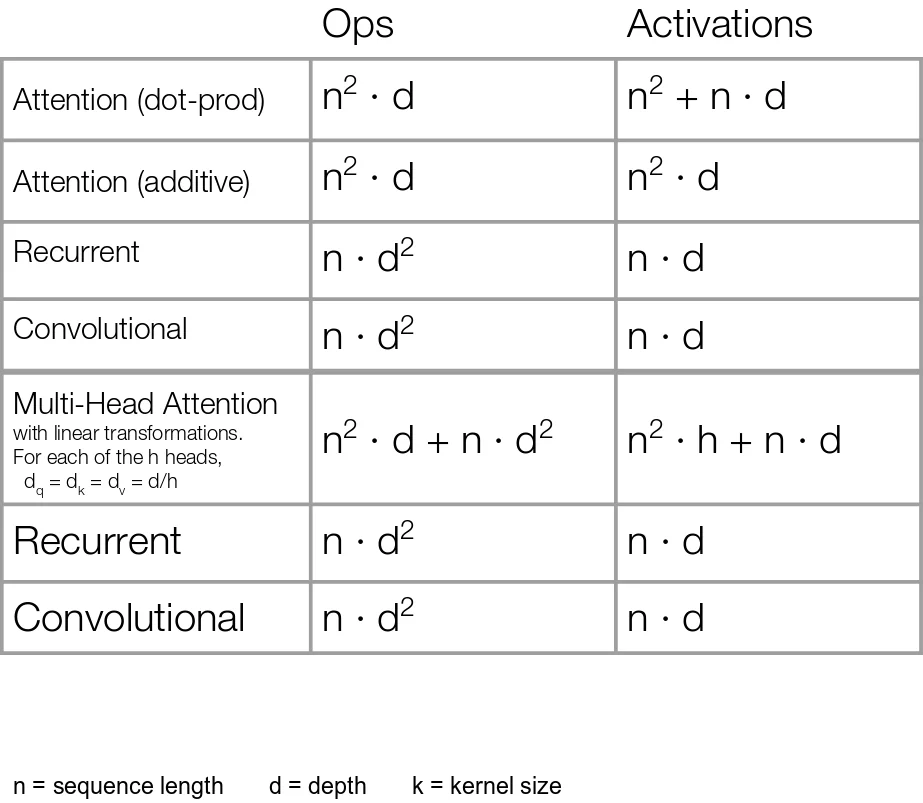

# Attention Complexity

## What is Attention Complexity?

Attention Complexity refers to the amount of **computation** and **memory** required by the attention mechanism as the sequence length grows.


## Why is it Important?

As input length increases, attention becomes expensive because every token attends to every other token.

Example:

```text
Token 1 → attends to all tokens
Token 2 → attends to all tokens
Token 3 → attends to all tokens
...
Token n → attends to all tokens
```


Ops (Operations) =Number of mathematical computations the model performs
Activations = Intermediate values stored in memory during the forward pass
## Attention Matrix

For a sequence of length $n$:

$$
QK^T
$$

produces an attention matrix of size:

$$
n \times n
$$

Example:

```text
Sequence Length = 4

      T1 T2 T3 T4
T1     •  •  •  •
T2     •  •  •  •
T3     •  •  •  •
T4     •  •  •  •
```

Total comparisons:

$$
4^2 = 16
$$


## Computational Complexity

Self-Attention complexity:

$$
O(n^2)
$$

where:

- $n$ = sequence length

Doubling the sequence length increases computation approximately by **4×**.

Example:

```text
1,000 tokens → 1,000,000 comparisons

2,000 tokens → 4,000,000 comparisons

4,000 tokens → 16,000,000 comparisons
```


## Memory Complexity

Attention scores must also be stored.

Memory complexity:

$$
O(n^2)
$$

Longer contexts require significantly more GPU memory.

## Problem with Long Contexts

For:

```text
32K
64K
128K
1M tokens
```

the attention matrix becomes extremely large, making training and inference expensive.

-

## Solutions

Modern LLMs use techniques such as:

- FlashAttention
- Sliding Window Attention
- Sparse Attention
- Grouped Query Attention (GQA)
- Multi Query Attention (MQA)

to reduce memory usage and improve speed.
