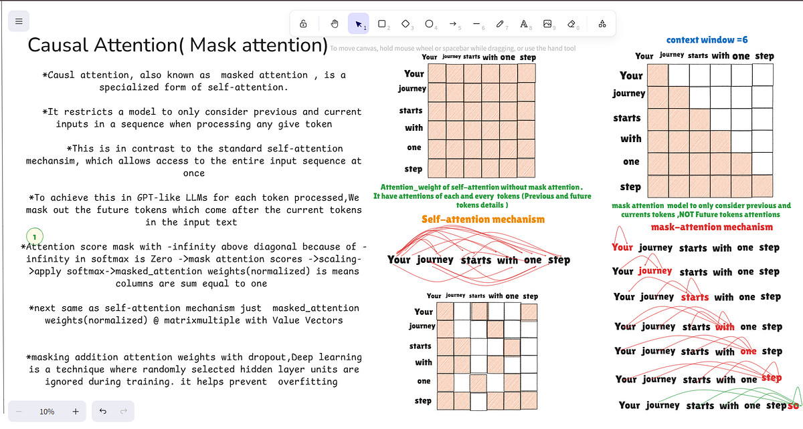

## What is Causal Attention?

Causal Attention is a special type of **Self-Attention** used in decoder-only Transformer models such as:

- GPT
- LLaMA
- Qwen
- Mistral
- DeepSeek

It ensures that each token can only attend to:

- Itself
- Previous tokens

and **cannot attend to future tokens**.

This prevents the model from "cheating" during training and generation.


## Intuition

Consider the sentence:

```text
I love artificial intelligence
```

While predicting **"artificial"**, the model can look at:

```text
I
love
```

but it cannot look at:

```text
intelligence
```

because that word belongs to the future.


## Why Do We Need Causal Attention?

Suppose the model must generate:

```text
The sky is _____
```

Expected output:

```text
blue
```

Without causal attention, the model could already see:

```text
The sky is blue
```

and simply copy the answer.

However, during inference, future words do not exist yet.

Causal attention ensures that training and inference behave consistently.


## Self-Attention vs Causal Attention

### Self-Attention

Every token can attend to every other token.

```text
         I   love   AI
I        ✓    ✓     ✓
love     ✓    ✓     ✓
AI       ✓    ✓     ✓
```

---

### Causal Attention

Future tokens are masked.

```text
         I   love   AI
I        ✓    ✗     ✗
love     ✓    ✓     ✗
AI       ✓    ✓     ✓
```

Only tokens on the left (past) are visible.


## Causal Mask

The mask applied to attention scores looks like:

```text
[
 [0, -∞, -∞],
 [0,  0, -∞],
 [0,  0,  0]
]
```

Where:

- `0` = Allowed
- `-∞` = Blocked

This creates a lower-triangular visibility pattern.


## Mathematical Formula

### Standard Attention

$$
Attention(Q,K,V)
=
Softmax
\left(
\frac{QK^T}{\sqrt{d_k}}
\right)
V
$$

---

### Causal Attention

$$
Attention(Q,K,V)
=
Softmax
\left(
\frac{QK^T}{\sqrt{d_k}}
+
Mask
\right)
V
$$

where:

$$
Mask =
\begin{bmatrix}
0 & -\infty & -\infty\\
0 & 0 & -\infty\\
0 & 0 & 0
\end{bmatrix}
$$

Since:

$$
e^{-\infty}=0
$$

future tokens receive zero attention weight.


## Example

Sentence:

```text
I love AI
```

When processing token:

```text
love
```

Allowed:

```text
I
love
```

Blocked:

```text
AI
```

Thus the model cannot use future information.

---

## Training with Causal Attention

Input:

```text
I love AI
```

Target:

```text
love AI <EOS>
```

Training objective:

```text
I        -> predict love
I love   -> predict AI
I love AI -> predict <EOS>
```

Causal masking ensures each prediction only uses past context.

---

## Inference

Generation occurs from left to right.

Input:

```text
I love
```

↓

Predict:

```text
AI
```

New sequence:

```text
I love AI
```

↓

Predict next token.

This process continues until generation stops.

---

## Causal Attention in GPT

GPT-style models use:

```text
Masked Multi-Head Self-Attention
```

Pipeline:

```text
Input Tokens
      ↓
Token Embeddings
      ↓
Positional Encoding
      ↓
Causal Attention
      ↓
Feed Forward Network
      ↓
Next Token Prediction
```


## Computational Complexity

Attention matrix size:

$$
n \times n
$$

Time complexity:

$$
O(n^2)
$$

Space complexity:

$$
O(n^2)
$$

Causal masking does not reduce complexity.

It only restricts which tokens can be seen.


## Models Using Causal Attention

### GPT Family

```text
GPT-2
GPT-3
GPT-4
GPT-5
```

Uses:

```text
Decoder + Causal Attention
```


### LLaMA Family

```text
LLaMA
LLaMA 2
LLaMA 3
```

Uses:

```text
Decoder + Causal Attention + RoPE
```


### Other Modern LLMs

- DeepSeek
- Mistral
- Qwen
- Gemma

All rely on causal attention for autoregressive text generation.


## Self-Attention vs Causal Attention

| Feature | Self-Attention | Causal Attention |
|----------|----------|----------|
| Can see future tokens | ✅ | ❌ |
| Can see previous tokens | ✅ | ✅ |
| Used in BERT | ✅ | ❌ |
| Used in GPT | ❌ | ✅ |
| Used for generation | ❌ | ✅ |
| Uses masking | ❌ | ✅ |


## Real-World Analogy

Imagine reading a book.

While reading page 10:

- You can see pages 1-10.
- You cannot see page 11 yet.

Causal attention works exactly the same way.

A token can only access information that appeared before it.

## Remember

> **Causal Attention allows a token to see only the past, never the future, enabling LLMs to generate text one token at a time.**
