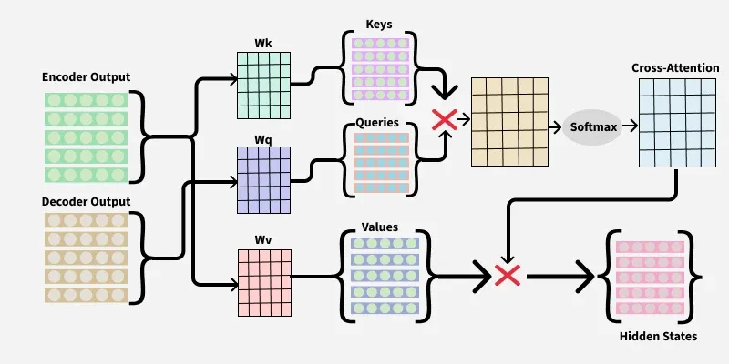

## What is Cross-Attention?

Cross-Attention is a mechanism in Transformer architectures that allows the **decoder to access information from the encoder**. It helps the decoder focus on the most relevant parts of the input sequence while generating the output sequence.

In simple terms, **Cross-Attention acts as a bridge between the encoder and decoder**, allowing information to flow from the source input to the generated output.

> Think of Cross-Attention as a student answering questions while looking back at their notes. The decoder generates output, and Cross-Attention helps it look at the most relevant encoder information when needed.

---

## Why Do We Need Cross-Attention?

During sequence generation, the decoder must know:

- What information exists in the input.
- Which part of the input is currently important.
- How to align the generated output with the source input.

Without Cross-Attention, the decoder would have difficulty utilizing the rich contextual information learned by the encoder.

### Example: Machine Translation

**Input (Encoder):**

```text
I like eating ice cream
```

**Output (Decoder):**

```text
Me gusta comer helado
```

While generating the word **"helado"**, the decoder should focus mainly on **"ice cream"** from the encoder output.

Cross-Attention enables this alignment.


## Intuition

Imagine:

### Encoder = English Story

The encoder reads and understands the entire English sentence and converts it into contextual representations.

### Decoder = Translator

The decoder generates translated words one by one.

### Cross-Attention = Helper

The helper tells the decoder:

> "For the current word you're generating, these encoder words are the most relevant."


## How Cross-Attention Works

### Step 1: Decoder Creates Queries (Q)

For each output token being generated, the decoder creates a **Query vector**.

The query asks:

> "Which encoder information should I focus on right now?"


### Step 2: Encoder Provides Keys (K) and Values (V)

The encoder output is transformed into:

- **Keys (K)** → Used for matching relevance.
- **Values (V)** → Actual information to be retrieved.

Think of:

- Key = Label
- Value = Content


### Step 3: Query-Key Matching

The decoder's Query is compared with all encoder Keys using the dot product.

Higher similarity means higher relevance.

```text
Score = Q · Kᵀ
```

The model learns which encoder tokens are most useful for the current decoding step.

### Step 4: Generate Attention Weights

The scores are normalized using Softmax.

```text
Attention Weights = softmax(QKᵀ)
```

The weights determine how much attention should be given to each encoder token.


### Step 5: Weighted Sum of Values

The attention weights are multiplied by the encoder Values.

```text
Output = Attention Weights × V
```

The resulting vector contains the most relevant encoder information needed by the decoder.


## Mathematical Formula

Cross-Attention uses the same formula as Scaled Dot-Product Attention.

$$
Attention(Q,K,V)
=
softmax\left(\frac{QK^T}{\sqrt{d_k}}\right)V
$$

Where:

- $Q$ = Queries from Decoder
- $K$ = Keys from Encoder
- $V$ = Values from Encoder
- $d_k$ = Dimension of Key vectors


## Difference Between Self-Attention and Cross-Attention

### Self-Attention

```text
Q ← Same Sequence
K ← Same Sequence
V ← Same Sequence
```

All vectors come from the same source.

Example:

```text
"The cat sat on the mat"
```

Each word attends to other words within the same sentence.

### Cross-Attention

```text
Q ← Decoder Output
K ← Encoder Output
V ← Encoder Output
```

Queries come from the decoder, while Keys and Values come from the encoder.

This allows communication between two different sequences.


## Key Difference

| Self-Attention | Cross-Attention |
|---------------|----------------|
| Looks within the same sequence | Looks at another sequence |
| Q, K, V come from the same source | Q comes from decoder, K and V come from encoder |
| Captures internal relationships | Connects encoder and decoder |
| Used in Encoder and Decoder blocks | Used mainly in Decoder blocks |


## Time Complexity

For sequence length $n$ and hidden dimension $d$:

$$
O(n^2 \cdot d)
$$

Reason:

- Every Query compares with every Key.
- Produces an $n \times n$ attention matrix.


## Space Complexity

$$
O(n^2)
$$

Reason:

- The attention score matrix must be stored.
- Matrix size grows quadratically with sequence length.

> Long sequences require large memory and computation, which motivates efficient attention techniques such as Sparse Attention and Flash Attention.


## Why Cross-Attention is Important

Cross-Attention enables:

- Better alignment between input and output.
- More accurate translations.
- Improved text generation.
- Effective information transfer between encoder and decoder.
- Stronger contextual understanding.

Without Cross-Attention, the decoder would have limited access to the original input information.


## Applications of Cross-Attention

### Machine Translation
Maps source-language words to target-language words during translation.

Example:

```text
English → French
English → Spanish
English → German
```

### Speech Recognition

Helps the decoder focus on important audio segments while generating text transcripts.

```text
Audio → Text
```


### Question Answering

Allows the model to connect the question with the most relevant parts of a passage.

```text
Question + Context → Answer
```


### Text Summarization

Helps identify and retrieve the most important information from long documents.

```text
Long Article → Short Summary
```


### Vision-Language Models

Connects image features with text generation.

Examples:

- Image Captioning
- Visual Question Answering (VQA)
- Multimodal LLMs (GPT-4V, Gemini, Claude Vision)

```text
Image Features ↔ Text Tokens
```


> **Cross-Attention lets the decoder look at the most relevant encoder information before generating the next token.**
