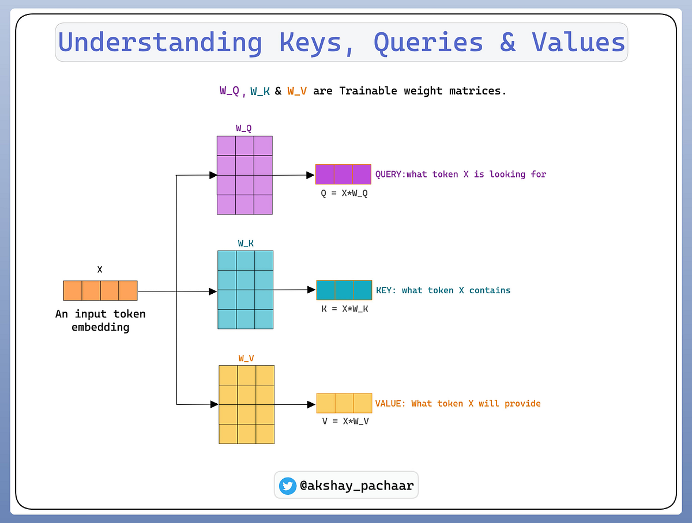

## What is Query, Key, and Value in Transformers?

Before understanding the Attention mechanism, we need to understand three important concepts: **Query (Q), Key (K), and Value (V)**.

Imagine you are at a party and want to find information about a specific topic. You can think of the **topic you're interested in as the Query**, the **people and what they are talking about as the Keys**, and the **actual information you retrieve from the relevant conversations as the Values**.

The basic idea is:

```text
Query → What information am I looking for?
Key   → How relevant am I to that query?
Value → What information should I provide if I'm relevant?
```

### Query

A **Query (Q)** is a vector representing what a token is currently looking for.

It is used to search for relevant information from other tokens by comparing the Query with their Keys.

**Query = what information am I looking for?**

### Key

A **Key (K)** is a vector representing information about a token that is used to determine its relevance to a Query.

The model compares a Query with Keys to calculate how strongly the Query should attend to each token.

**Key = how relevant am I to this query?**

### Value

A **Value (V)** is a vector containing the actual information that a token contributes to the attention output.

Once the model determines how relevant each Key is to the Query, those relevance scores are used to weight the corresponding Values.

**Value = what information do I provide?**

## Why Separate Q, K, and V?

Query, Key, and Value have different roles in the Attention mechanism:

```text
Query → Searches for relevant information
   ↓
Compare with Keys
   ↓
Attention Scores
   ↓
Use scores to weight Values
   ↓
Attention Output
```

For example:

```text
Query → "What information is relevant to me?"

Key   → "This token contains information relevant to your query."

Value → "Here is the actual information from this token."
```

The important idea is that **Keys are used for matching**, while **Values are used for retrieving information**.

In a Transformer, Q, K, and V are not manually defined. They are learned vector representations produced from the input representations using learned weight matrices.

Later, we will see:

$$
Q = XW_Q
$$

$$
K = XW_K
$$

$$
V = XW_V
$$

where $(W_Q)$, $(W_K)$, and $(W_V)$  are learned parameter matrices.

