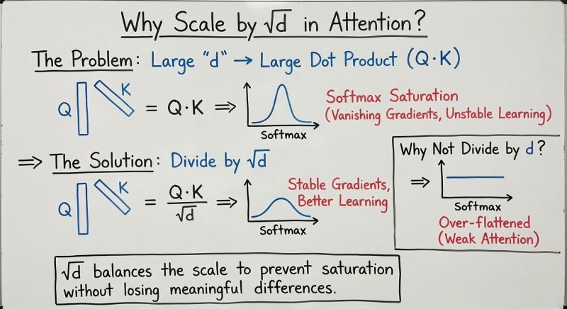

---

title: Scaled Dot-Product Attention
type: Notes
level: Beginner
status:
tags:

* Deep Learning
* Transformers
* Attention
* Python

---

## Scaled Dot-Product Attention

The **Scaled Dot-Product Attention** mechanism is the fundamental attention operation used inside the Transformer architecture.

The entire mechanism can be summarized by the equation:

$$
{
\text{Attention}(Q,K,V)
=
\text{softmax}
\left(
\frac{QK^T}{\sqrt{d_k}}
\right)V
}
$$

Where:

* $Q$ = matrix of **Queries**
* $K$ = matrix of **Keys**
* $V$ = matrix of **Values**
* $d_k$ = dimension of each Query/Key vector

The mechanism consists of four main operations:

```text
Q and K
   ↓
QKᵀ
   ↓
Raw Attention Scores
   ↓
Divide by √dₖ
   ↓
Scaled Scores
   ↓
Softmax
   ↓
Attention Weights
   ↓
Multiply by V
   ↓
Attention Output
```

---

## Working of Scaled Dot-Product Attention

### Step 1: Calculate $QK^T$

The first operation is:

$$
{QK^T}
$$

This compares every **Query** with every **Key**.

The comparison is performed using the **dot product**.

The goal is to determine:

> **How relevant is each Key to a given Query?**

### Dot Product

For two vectors:

$$
Q=[q_1,q_2,q_3]
$$

$$
K=[k_1,k_2,k_3]
$$

their dot product is:

$$
Q\cdot K
=
q_{1} k_{1} + q_{2} k_{2} + q_{3} k_{3}
$$

For example:

$$
Q=[1,2,3]
$$

$$
K=[4,5,6]
$$

Then:

$$
Q\cdot K
=
(1)(4)+(2)(5)+(3)(6)
$$

$$
=4+10+18
$$

$$
=32
$$


The result is a **raw attention score**.

Step 2: Divide by $\sqrt{d_k}$ and we get:

$$
\frac{QK^T}{\sqrt{d_k}}
$$

where $(d_k)$ is the dimension of the Key/Query vector.

---
### **Why divide by**  $\sqrt{d_k}$ ? 

>As the dimension of the Key/Query vectors increases, the dot products also tend to increase. This can lead to very large values in the attention scores, which can cause issues during the softmax operation. Dividing by $\sqrt{d_k}$ helps to normalize these scores and keep them in a more manageable range.  


Imagine our Query and Key vectors have a dimension of \(3\):

$$ Q=[1,2,3] $$ $$ K=[4,5,6] $$

We calculated:

$$ Q\cdot K=32 $$

Now imagine the vectors have much larger dimensions, such as:

$$ d_k=512 $$

The dot product now contains 512 multiplication-and-addition terms.

As \(d_k\) becomes larger, the dot products tend to become larger in magnitude.

For example, you might get scores such as:

$$ [12,\ 35,\ 48,\ 72] $$

instead of something smaller like:

$$ [1.2,\ 3.5,\ 4.8,\ 7.2] $$

These large values become a problem when we apply softmax.

The problem with large scores

Remember that softmax converts scores into probabilities:

$$ \text{softmax}(x_i) = \frac{e^{x_i}}{\sum_j e^{x_j}} $$

The exponential function grows extremely quickly.

For example:

$$ e^2\approx7.39 $$

but:

$$ e^{10}\approx22026 $$

and:

$$ e^{20}\approx4.85\times10^8 $$

So if attention scores become very large, softmax can become extremely peaked.

## For example:

$$ [16,32,48] $$
is the raw attention score without divinding it by $\sqrt{d_k}$.

e
16
≈8,886,111
$$ e^{32}\approx 7,896,296,018,268 $$ $$ e^{48}\approx 1.858\times10^{20} $$

Then softmax is:

$$ \text{softmax}([16,32,48]) = \left[ \frac{e^{16}}{e^{16}+e^{32}+e^{48}}, \frac{e^{32}}{e^{16}+e^{32}+e^{48}}, \frac{e^{48}}{e^{16}+e^{32}+e^{48}} \right] $$

Approximately:

[0.0000000000000478, 0.0000000000425, 1.0]
	​


Almost all the attention goes to one Key.

This can make learning difficult because the softmax gradients can become very small.

## solution: scaling

We divide the scores by:

$$ \sqrt{d_k} $$

Suppose:

$$ d_k=64 $$

Then:

$$ \sqrt{d_k}=\sqrt{64}=8 $$

Imagine our raw scores are:

$$ [16,32,48] $$

Without scaling:

$$ [16,32,48] $$

With scaling:

$$ \frac{[16,32,48]}{8} $$

giving:

$$ [2,4,6] $$

These are much more manageable for softmax.
---

Why specifically $(\sqrt{d_k}$)?

This is the key intuition.

If the components of \(Q\) and \(K\) are roughly zero-centered with variance around 1, then the variance of their dot product grows approximately with \(d_k\).

That means:

$$ \operatorname{Var}(Q\cdot K)\propto d_k $$

To bring the variance back to roughly the same scale, we divide by:

$$ \sqrt{d_k} $$

because dividing by $(\sqrt{d_k})$ divides the variance by $d_k$.

So:

$$ \boxed{\text{Scaling keeps attention scores at a stable numerical scale.}} $$

