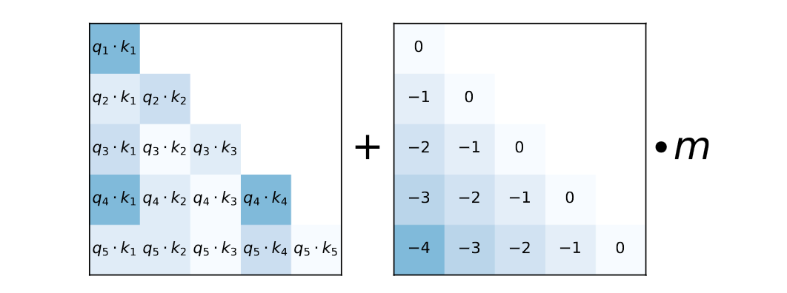

## ALiBi (Attention with Linear Biases)

> ALiBi (Attention with Linear Biases) is a positional encoding technique that introduces position information directly into attention scores using a simple linear penalty based on token distance.

Unlike:

```text
Sinusoidal Encoding
```

which adds positional vectors to embeddings,

and unlike:

```text
RoPE
```

which rotates Query and Key vectors,

ALiBi modifies the attention score itself.


## Why Was ALiBi Introduced?

Traditional positional encoding methods have limitations.

### Learned Position Embeddings

Problems:

- Cannot extrapolate well beyond training context.
- Fixed maximum context length.
- Additional parameters.

---

### Sinusoidal Encoding

Problems:

- Position and semantic information are mixed.
- Long-context performance is limited.

---

### RoPE

Advantages:

- Relative-position aware.
- Better long-context behavior.

But:

- Still uses periodic rotations.
- Similarity can oscillate at very long distances.
- Context extension may require scaling tricks.

---

ALiBi was designed to:
- Be extremely simple.

- Scale to longer contexts.

- Use no positional embeddings
- Generalize beyond training sequence lengths


## Core Idea

ALiBi uses a simple principle:

> Tokens that are farther apart should generally receive lower attention scores.

Instead of encoding position using vectors:

```text
Embedding + Position
```

ALiBi directly modifies:

$$
QK^T
$$

by subtracting a distance penalty.


## Intuition

Consider:

```text
The cat sat on the mat
```

When processing:

```text
mat
```

Nearby words:

```text
on
the
```

are usually more important than:

```text
The
```

which appeared much earlier.

ALiBi encourages this behavior by applying:

```text
Small penalty
→ nearby tokens
```

```text
Large penalty
→ distant tokens
```


## Key Idea

Attention score normally:

$$
score = QK^T
$$

ALiBi changes it to:

$$
score = QK^T - bias
$$

where:

```text
bias
=
distance penalty
```

As token distance increases:

```text
Penalty Increases
```

Therefore:

```text
Attention Decreases
```

naturally.


## Visual Intuition

Without ALiBi:

```text
Token A ---------------- Token B

Distance = Large

Attention may still be high
```

With ALiBi:

```text
Token A ---------------- Token B

Large Distance
      ↓

Large Penalty
      ↓

Lower Attention
```


## How Distance Is Measured

Suppose:

```text
Position 3
```

attends to:

```text
Position 1
```

Distance:

```text
2
```

If attending to:

```text
Position 0
```

Distance:

```text
3
```

Greater distance receives larger penalty.


## Linear Bias

The bias is:

$$
Bias = m \times distance
$$

where:

- $m$ = slope
- distance = token separation

Thus:

```text
Distance 1 → Small Penalty

Distance 10 → Larger Penalty

Distance 100 → Much Larger Penalty
```

The relationship is linear.


## Example

Suppose attention scores are:

```text
Token A → Token B = 8

Token A → Token C = 8
```

Without ALiBi:

```text
Both receive equal attention.
```

Now assume:

```text
B distance = 2

C distance = 20
```

Apply bias:

```text
B → 8 - 0.2 = 7.8

C → 8 - 2.0 = 6.0
```

After Softmax:

```text
B gets higher attention.
```


## Where Is ALiBi Applied?

Standard attention:

```text
Q
K
V

 │
 ▼

QKᵀ

 │
 ▼

Softmax

 │
 ▼

Output
```

ALiBi attention:

```text
Q
K
V

 │
 ▼

QKᵀ

 │
 ▼

Add Linear Bias

 │
 ▼

Softmax

 │
 ▼

Output
```


## Mathematical Form

Standard Attention:

$$
Attention(Q,K,V)
=
Softmax
\left(
\frac{QK^T}{\sqrt{d_k}}
\right)V
$$

ALiBi:

$$
Attention(Q,K,V)
=
Softmax
\left(
\frac{QK^T}{\sqrt{d_k}}
+
B
\right)V
$$

where:

$$
B
=
\text{Linear Distance Bias}
$$


## Why Different Heads Use Different Slopes?

One clever idea in ALiBi:

Different attention heads use different penalties.

Example:

```text
Head 1 → Strong Penalty

Head 2 → Medium Penalty

Head 3 → Weak Penalty
```

This allows different heads to specialize.

---

### Strong Penalty Heads

Focus on:

```text
Local Context
```

Examples:

```text
Adjective ↔ Noun

Verb ↔ Object
```

Nearby tokens matter most.

---

### Weak Penalty Heads

Focus on:

```text
Long-Range Dependencies
```

Examples:

```text
Earlier Topic

Function Definition

Document Context

Variable References
```

Distant tokens can still influence attention.

---

## Why ALiBi Works

Different heads naturally learn:

```text
Local Attention

Medium Attention

Long Attention
```

without requiring positional embeddings.

---

## Relative Position Awareness

Consider:

```text
cat ↔ sat
```

at positions:

```text
10 and 11
```

Distance:

```text
1
```

Now move them:

```text
100 and 101
```

Distance:

```text
1
```

The bias remains identical.

This means ALiBi focuses on:

```text
Relative Distance
```

rather than:

```text
Absolute Position
```


## Long Context Extrapolation

Assume a model is trained on:

```text
2048 Tokens
```

and tested on:

```text
8192 Tokens
```

Learned positional embeddings typically struggle.

ALiBi works surprisingly well because:

```text
Distance Penalty
```

can be computed for any sequence length.

No positional embedding table exists.


## Comparison With Positional Embeddings

Traditional approach:

```text
Position 1
Position 2
Position 3
...
```

Need stored vectors.

---

ALiBi:

```text
No position vectors.

Only distance penalty.
```

Much simpler.


## Advantages

### Extremely Simple

Only modifies attention scores.

---

### No Additional Parameters

Nothing new to train.

---

### Excellent Extrapolation

Works beyond training context lengths.

---

### Relative Position Awareness

Captures token distances naturally.

---

### Memory Efficient

No positional embedding table required.

---

### Easy To Implement

Only a small change to attention scores.


## Limitations

### Position Information Is Simpler

RoPE captures more complex positional interactions.

ALiBi mainly models:

```text
Distance
```

---

### Slightly Less Expressive

RoPE can represent richer positional relationships.

---

### Not The Most Common Choice

Modern LLMs have largely standardized around:

```text
RoPE
```

although ALiBi remains very influential.


## ALiBi vs Sinusoidal Encoding

| Feature | Sinusoidal | ALiBi |
|----------|------------|--------|
| Added To Embeddings | Yes | No |
| Relative Position Aware | Limited | Strong |
| Additional Parameters | No | No |
| Long Context Support | Moderate | Strong |
| Position Representation | Vector | Linear Bias |


## ALiBi vs RoPE

| Feature | ALiBi | RoPE |
|----------|--------|--------|
| Position Method | Distance Bias | Rotation |
| Modifies Embeddings | No | No |
| Modifies Attention | Yes | Yes |
| Relative Position Awareness | Strong | Strong |
| Long Context Extrapolation | Excellent | Very Good |
| Complexity | Very Simple | More Complex |


## Attention Flow With ALiBi

```text
Input Tokens
      │
      ▼

Q K V
      │
      ▼

Compute QKᵀ
      │
      ▼

Apply Linear Distance Bias
      │
      ▼

Softmax
      │
      ▼

Attention Weights
      │
      ▼

Output
```


## Which Models Use ALiBi?

Examples include:

```text
MPT
BLOOM Variants
Several Long-Context Research Models
```

Many long-context architectures borrow ideas from ALiBi.
