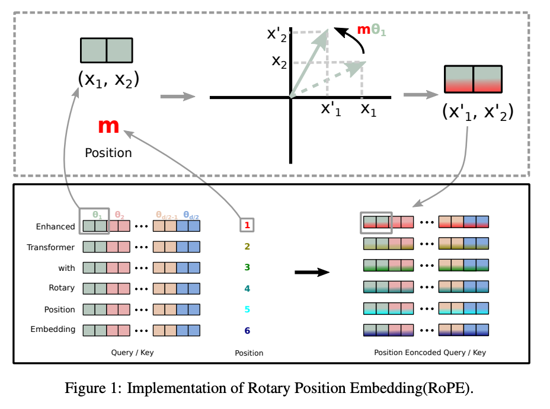

## Rotary Position Embedding (RoPE)

> Rotary Position Embedding (RoPE) is a positional encoding technique used in modern LLMs that injects positional information directly into the Attention mechanism by rotating Query (Q) and Key (K) vectors.

Unlike traditional positional encodings that add position information to embeddings, RoPE modifies the attention calculation itself.


## Why Was RoPE Introduced?

Traditional positional encodings had limitations:

### Sinusoidal Encoding

```text
Semantic Embedding
        +
Position Encoding
```

Problems:

- Position and semantic information become mixed.
- Long-context performance degrades.
- Harder to generalize beyond training length.

---

### Learned Position Embeddings

```text
Position 1 → Learned Vector
Position 2 → Learned Vector
Position 3 → Learned Vector
```

Problems:

- Can overfit to training positions.
- Cannot naturally extend beyond training context window.
- Requires additional parameters.


## Core Intuition

The most important idea:

> Attention should depend more on the **distance between tokens** than on their absolute positions.

Consider:

```text
The cat sat
```

and

```text
Yesterday the cat sat
```

The relationship:

```text
cat ↔ sat
```

should remain similar.

The actual positions changed.

The relative distance didn't.

RoPE focuses on:

```text
Relative Position
```

instead of:

```text
Absolute Position
```


## The Big Idea

RoPE applies a rotation to:

```text
Query (Q)
Key (K)
```

before attention is computed.

```text
Q → Rotate
K → Rotate
```

Then attention becomes:

```text
Rotated Q · Rotated K
```

The amount of rotation depends on token position.

## Why Rotation?

Rotation has a very useful property:

```text
It changes direction
but preserves magnitude.
```

Example:

```text
Original Vector

   ↑
   │
   │

Rotated Vector

↗
```

Length remains:

```text
Same
```

Only orientation changes.

This preserves semantic information while introducing positional information.


## Basic Intuition

Imagine two identical vectors.

```text
Token A

→

Token B

→
```

Similarity:

```text
Very High
```

Now rotate them based on position.

Nearby tokens:

```text
Small Rotation
```

Distant tokens:

```text
Large Rotation
```

Result:

```text
Nearby Tokens
      →
      ↗

Still Similar
```

```text
Far Tokens
      →
      ↓

Less Similar
```

Therefore:

```text
Attention decreases as distance increases.
```


## What Gets Rotated?

RoPE rotates only:

```text
Q (Query)

K (Key)
```

It does NOT rotate:

```text
V (Value)
```

because attention scores are computed using:

$$
QK^T
$$

Modifying Q and K is sufficient.


## Where RoPE Is Applied

Without RoPE:

```text
Input
  │
  ▼

Q K V

  │
  ▼

Attention
```

With RoPE:

```text
Input
  │
  ▼

Q K V

  │
  ▼

RoPE Rotation

  │
  ▼

Rotated Q
Rotated K

  │
  ▼

Attention
```


## Relative Position Magic

Suppose:

```text
Token A → Position 10

Token B → Position 12
```

Distance:

```text
2
```

Now move both:

```text
Token A → Position 100

Token B → Position 102
```

Distance remains:

```text
2
```

RoPE preserves this relationship.

Therefore:

```text
Attention focuses on distance.
```

not:

```text
Absolute Position.
```


## Rotation Angle

The rotation angle depends on:

### Token Position

```text
Higher Position
=
More Rotation
```

Example:

```text
Position 1 → Small Rotation

Position 100 → Larger Rotation

Position 1000 → Even Larger Rotation
```

---

### Embedding Dimension

Different dimensions rotate at different speeds.

Early dimensions:

```text
Rotate Faster
```

Later dimensions:

```text
Rotate Slower
```

This creates multiple positional scales.


## Why Different Rotation Speeds?

Different dimensions capture different ranges.

---

### Fast Rotating Dimensions

Capture:

```text
Short-Range Dependencies
```

Examples:

```text
Adjective ↔ Noun

beautiful ↔ mountain
```

These words are usually close.

---

### Slow Rotating Dimensions

Capture:

```text
Long-Range Dependencies
```

Examples:

```text
Variable definitions

Function calls

Earlier context

Document references
```

These relationships may occur hundreds or thousands of tokens apart.


## Intuition With Language

Sentence:

```text
A beautiful mountain stretches beyond the valley.
```

Relationship:

```text
beautiful ↔ mountain
```

This is local information.

Fast-rotating dimensions capture it.

---

Now consider:

```text
A variable "df" is created ...

... 500 lines later ...

df.head()
```

Relationship:

```text
df ↔ df
```

This is long-range information.

Slow-rotating dimensions capture it.


## Why RoPE Works So Well

RoPE allows different parts of the embedding space to learn:

```text
Short-Term Context

Medium-Term Context

Long-Term Context
```

simultaneously.


## High-Level Mathematical Idea

Rotation angle:

$$
\text{angle} = m \times \theta
$$

where:

- $m$ = token position
- $\theta$ = rotation frequency

Different dimensions use different values of:

$$
\theta
$$

which creates multiple positional frequencies.


## What Happens During Attention?

Normal attention:

$$
QK^T
$$

RoPE attention:

$$
Q_{rot}K_{rot}^T
$$

Because Q and K have been rotated according to position:

```text
Nearby Tokens
=
Higher Similarity

Far Tokens
=
Lower Similarity
```

naturally emerges.


## Advantages of RoPE

### Relative Position Awareness

Learns token distances naturally.

---

### Better Long Context Handling

Performs much better than traditional position embeddings.

---

### No Additional Parameters

Position information is generated mathematically.

---

### Preserves Semantic Information

Rotations preserve vector magnitude.

---

### Strong Extrapolation

Can generalize beyond training lengths better than learned embeddings.

## Limitations

### Similarity Oscillations

Because rotation uses periodic functions:

```text
sin()
cos()
```

similarity may occasionally increase again at very large distances.

---

### Context Length Still Has Limits

RoPE improves context handling but does not make context length infinite.

Very long contexts may still require:

```text
YaRN
NTK Scaling
LongRoPE
```


## Models Using RoPE

Modern LLMs heavily rely on RoPE.

Examples:

```text
LLaMA
LLaMA 2
LLaMA 3
Mistral
Mixtral
Gemma
Qwen
DeepSeek
Phi
```

RoPE has effectively become the industry-standard positional encoding method for modern decoder-only LLMs.

## RoPE vs Sinusoidal Encoding

| Feature | Sinusoidal | RoPE |
|----------|----------|----------|
| Added to Embeddings | Yes | No |
| Modifies Attention | No | Yes |
| Relative Position Awareness | Limited | Strong |
| Long Context Performance | Moderate | Better |
| Additional Parameters | No | No |
| Used In Modern LLMs | Rarely | Very Common |


## RoPE vs Learned Embeddings

| Feature | Learned Embeddings | RoPE |
|----------|----------|----------|
| Learnable Parameters | Yes | No |
| Generalization | Limited | Better |
| Long Context Support | Weak | Strong |
| Relative Position Awareness | Weak | Strong |
