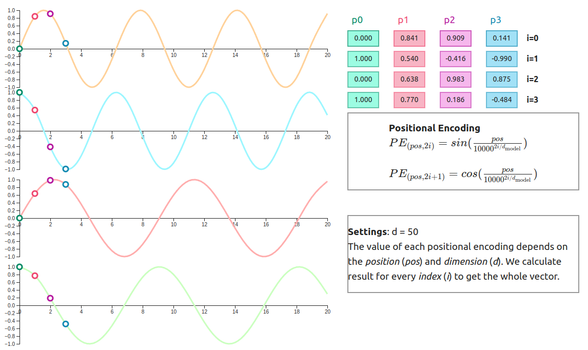

## Positional Encoding

> Positional Encoding is a technique used to inject position information into token embeddings so that Transformers can understand the order of words in a sequence.

Without positional information, a Transformer treats a sentence as a collection of tokens and cannot distinguish between:

```text
Dog bites man

and

Man bites dog
```

Even though both sentences contain the same words, their meanings are completely different.

Positional Encoding solves this problem by providing information about where each token appears in the sequence.



## Why Do We Need Positional Encoding?

Unlike RNNs and LSTMs, Transformers process all tokens in parallel.

Because of this:

```text
Transformers know:
✓ Which tokens exist

Transformers do not know:
✗ The order of tokens
```

Attention itself has no notion of sequence order.

For example:

```text
I love AI

AI love I
```

Without positional information, these sentences would look very similar to the model.

Positional Encoding provides a sense of:

- Order
- Distance
- Relative Position
- Sequence Structure


## Example

Consider the sentence:

```text
The cat sat on the mat
```

After tokenization:

```text
["The", "cat", "sat", "on", "the", "mat"]
```

Each token is converted into an embedding:

```text
E1
E2
E3
E4
E5
E6
```

These embeddings contain semantic meaning.

Example:

```text
cat → animal
mat → object
sat → action
```

However, embeddings do not contain positional information.

The model still doesn't know:

```text
Which word came first?

Which word came last?

What is the distance between words?
```

This is where Positional Encoding is added.


## Adding Positional Information

Each position gets its own positional vector.

```text
Position 1 → PE1
Position 2 → PE2
Position 3 → PE3
Position 4 → PE4
Position 5 → PE5
Position 6 → PE6
```

The final representation becomes:

```text
Token Embedding + Positional Encoding
```

Example:

```text
"The"

Embedding:
[0.12, 0.44, 0.71]

Position Encoding:
[0.51, 0.23, 0.88]

Final Input:
[0.63, 0.67, 1.59]
```

This combined vector now contains:

- Word Meaning
- Position Information


## Positional Encoding in the Transformer

The Transformer pipeline:

```text
Input Tokens
      │
      ▼

Token Embeddings
      │
      ▼

Positional Encoding
      │
      ▼

Embedding + Position
      │
      ▼

Transformer Layers
```

The model receives positional information before entering the attention layers.


## Sinusoidal Positional Encoding

The original Transformer paper introduced Sinusoidal Positional Encoding.

Instead of learning position vectors, positions are generated using sine and cosine functions.

---

### Formula

For even dimensions:

$$
PE(pos,2i)
=
\sin\left(
\frac{pos}{10000^{2i/d_{model}}}
\right)
$$

For odd dimensions:

$$
PE(pos,2i+1)
=
\cos\left(
\frac{pos}{10000^{2i/d_{model}}}
\right)
$$

---

### Meaning of Variables

Where:

- $pos$ = position of the token
- $i$ = embedding dimension index
- $d_{model}$ = embedding size

Example:

```text
Embedding Size = 512
```

Then:

```text
dmodel = 512
```


## Why Use Sine and Cosine?

Sine and cosine create unique patterns for every position.

Example:

```text
Position 1 → [sin, cos]
Position 2 → [sin, cos]
Position 3 → [sin, cos]
```

No two positions have exactly the same encoding.

Benefits:

- Unique representation for every position.
- Smooth transition between nearby positions.
- Generalizes to longer sequences.
- No additional parameters to learn.


## Intuition Behind Sinusoidal Encoding

Different dimensions use different frequencies.

Low-frequency dimensions:

```text
Capture long-range positions.
```

High-frequency dimensions:

```text
Capture short-range positions.
```

Together they provide rich positional information.

Visualization:

```text
sin(x)
~~~~~~~

cos(x)
^^^^^^^
```

Multiple waves with different frequencies are combined.


## Example With 4-Dimensional Embedding

Assume:

```text
Embedding Size = 4
```

Position 1:

```text
PE(1)
=
[
sin(...),
cos(...),
sin(...),
cos(...)
]
```

Position 2:

```text
PE(2)
=
[
sin(...),
cos(...),
sin(...),
cos(...)
]
```

Position 6:

```text
PE(6)
=
[
sin(...),
cos(...),
sin(...),
cos(...)
]
```

Every position receives a unique vector.


## Position Encoding Table

Example:

```text
Position 0 → [0.000, 1.000, 0.000, 1.000]

Position 1 → [0.841, 0.540, 0.010, 0.999]

Position 2 → [0.909,-0.416, 0.020, 0.999]

Position 3 → [0.141,-0.990, 0.030, 0.999]
```

Notice:

```text
Each position has a unique pattern.
```


## Combining Embeddings and Positions

Final input:

$$
Input = Embedding + PositionalEncoding
$$

Example:

```text
Embedding:
[0.3, 0.8, 0.4, 0.1]

Position:
[0.8, 0.5, 0.0, 1.0]
```

Final representation:

```text
[1.1, 1.3, 0.4, 1.1]
```

This vector now carries:

```text
Meaning + Position
```


## Advantages of Sinusoidal Encoding

### No Additional Parameters

Nothing is learned.

Values are generated mathematically.

---

### Works For Long Sequences

Can generate positional encodings for positions never seen during training.

---

### Captures Relative Distance

Nearby positions have similar encodings.

Far positions have different encodings.

---

### Memory Efficient

No additional embedding table is required.


## Limitations

### Fixed Representation

Positions cannot adapt to the task.

---

### Less Flexible

Learned position embeddings often perform better in some applications.

---

### Poor Long Context Extrapolation

Very long contexts may still be challenging.

This led to newer methods such as:

```text
RoPE
ALiBi
```


## Learned Positional Embeddings

Instead of mathematically generating position vectors:

```text
Position 1 → Learnable Vector

Position 2 → Learnable Vector

Position 3 → Learnable Vector
```

The model learns position representations during training.

Used in:

```text
BERT
GPT-2
```

Advantages:

- More flexible
- Task-specific

Disadvantages:

- Cannot easily handle positions beyond training length


## Comparison

| Method | Learned | Can Extrapolate | Used In |
|----------|----------|----------|----------|
| Sinusoidal | No | Yes | Original Transformer |
| Learned Embeddings | Yes | No | BERT, GPT-2 |
| RoPE | No | Better | LLaMA, Mistral |
| ALiBi | No | Excellent | Long Context Models |
