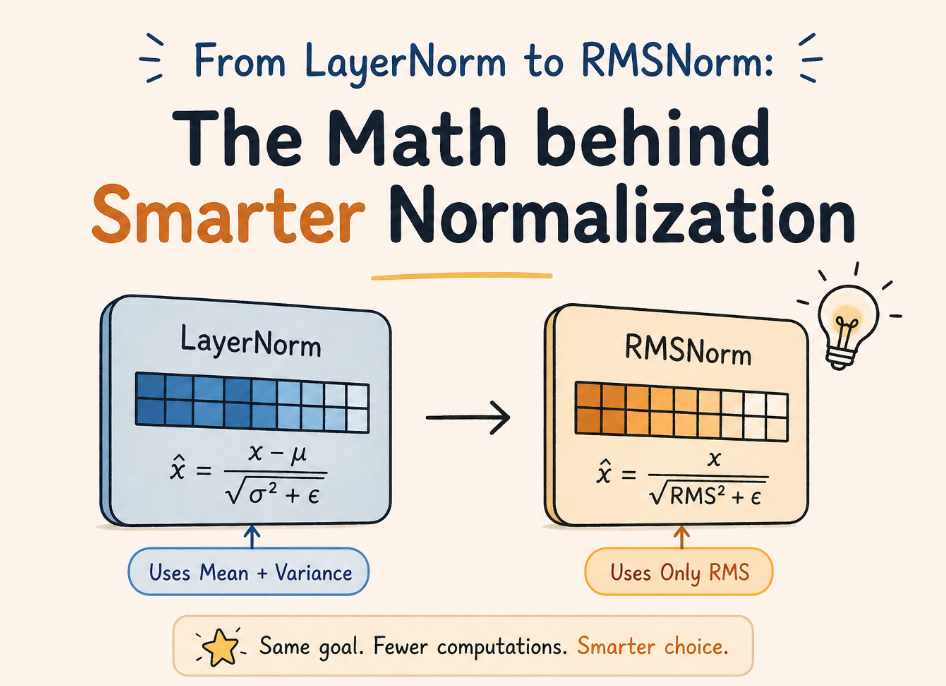
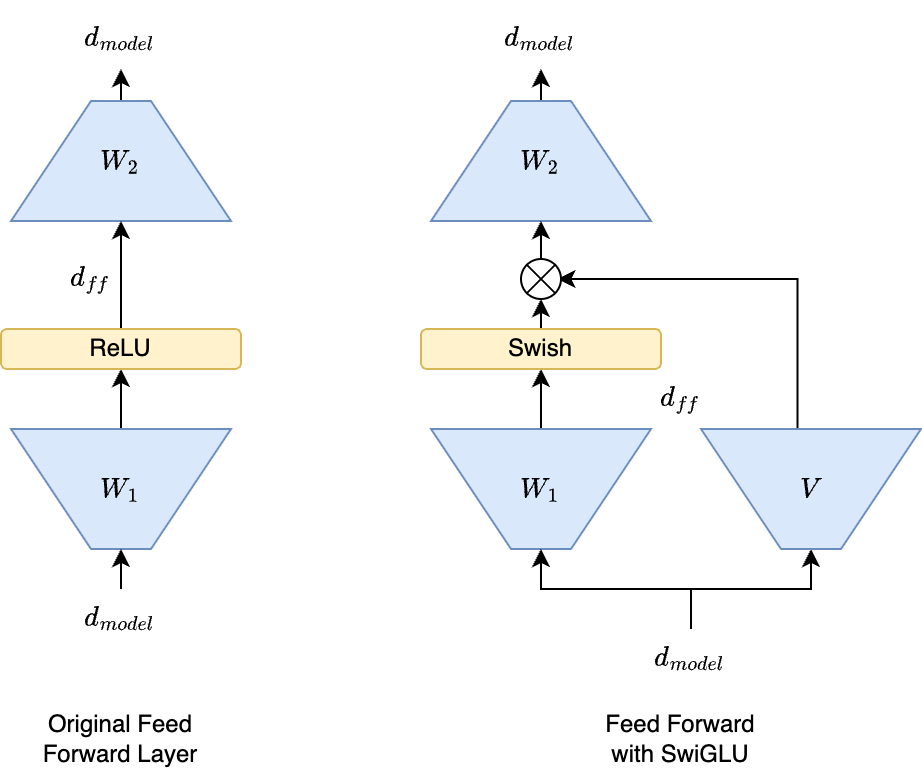
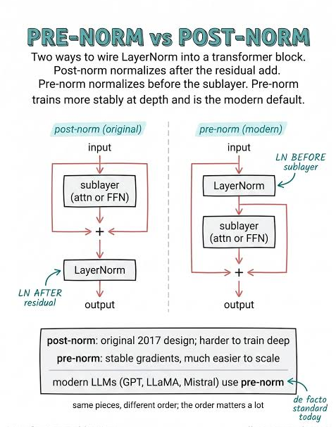

## Transformer Optimization

> The original Transformer (2017) introduced the fundamental architecture, but modern LLMs such as LLaMA, Gemma, Mistral, DeepSeek, Claude, and Qwen rely on several optimization techniques that dramatically improve training stability, efficiency, and scalability.

These optimizations mainly focus on:

```text
Better Normalization
Better Feed Forward Networks
Better Gradient Flow
Faster Attention
Lower Memory Usage
Longer Context Windows
```


## RMSNorm

### What is RMSNorm?

RMSNorm (Root Mean Square Normalization) is a simplified alternative to Layer Normalization.

Instead of normalizing using:

```text
Mean + Variance
```

RMSNorm normalizes using:

```text
Root Mean Square (RMS)
```

only.

---

### Why Was RMSNorm Introduced?

LayerNorm works well but:

```text
Computes Mean
Computes Variance
Performs Extra Operations
```

These operations become expensive in huge models.

RMSNorm removes mean-centering and keeps only scaling.

Result:

```text
Faster
Simpler
Less Memory
```

while maintaining performance.


---
### Intuition

Suppose:

```text
x = [2,4,6]
```

LayerNorm:

```text
Center values around zero
Normalize variance
```

RMSNorm:

```text
Only scale values
```

Think:

```text
LayerNorm:
"Shift and Scale"

RMSNorm:
"Only Scale"
```

---

### Formula

Root Mean Square:

$$
RMS(x)
=
\sqrt{
\frac{1}{n}
\sum_{i=1}^{n}
x_i^2
}
$$

Normalization:

$$
RMSNorm(x)
=
\frac{x}{RMS(x)}
\cdot g
$$

where:

$$
g
$$

is a learnable scaling parameter.

---

### Visualization

```text
Input
  │
  ▼

Compute RMS

  │
  ▼

Scale Values

  │
  ▼

Output
```

---

### Advantages

### Faster Training

Fewer operations than LayerNorm.

---

### Lower Memory Usage

No mean computation.

---

### Better For Large Models

Scales well to billions of parameters.

---

### Easier Optimization

Stable training dynamics.

---

### Models Using RMSNorm

```text
LLaMA
LLaMA 2
LLaMA 3
Mistral
Mixtral
Gemma
DeepSeek
Qwen
```

Modern LLMs almost universally prefer RMSNorm over LayerNorm.

---

### LayerNorm vs RMSNorm

| Feature | LayerNorm | RMSNorm |
|----------|-----------|----------|
| Mean Centering | Yes | No |
| Variance Normalization | Yes | No |
| RMS Scaling | Yes | Yes |
| Computational Cost | Higher | Lower |
| Modern LLM Usage | Rare | Common |

---

### Key Takeaways

- RMSNorm is a lightweight LayerNorm.
- Uses Root Mean Square only.
- Faster and more memory efficient.
- Standard choice in modern LLMs.


## SwiGLU

### What is SwiGLU?

SwiGLU is a modern Feed Forward Network (FFN) activation mechanism used in state-of-the-art LLMs.

It replaces:

```text
ReLU
GELU
```

with a gated architecture.

---

### Why Was SwiGLU Introduced?

Traditional FFNs:

```text
Linear
  ↓
GELU
  ↓
Linear
```

work well but waste representational capacity.

Researchers found that introducing gates dramatically improves performance.

---

### Core Idea

Instead of:

```text
FFN(x)
```

the network learns:

```text
Feature
     ×
Gate
```

The gate decides:

```text
How much information should pass through.
```

---

### Intuition

Think of FFN as:

```text
Feature Generator
```

and SwiGLU as:

```text
Feature Generator
       +
Intelligent Filter
```

---

### Formula

Simplified:

$$
SwiGLU(x)
=
Swish(xW_1)
\odot
(xW_2)
$$

where:

$$
\odot
$$

represents element-wise multiplication.

Swish:

$$
Swish(x)
=
x\sigma(x)
$$

---

### Visualization

```text
Input
  │
  ├────► Branch A
  │
  └────► Branch B

        │
        ▼

 Element-wise Multiply

        │
        ▼

 Output
```

---

### Why SwiGLU Works

The gate learns:

```text
Important Features
```

and suppresses:

```text
Unimportant Features
```

automatically.

---

### Benefits

#### Higher Model Quality

Better language understanding.

---

#### Better Parameter Efficiency

More capability per parameter.

---

#### Improves Training

Smoother gradients.

---

#### Better Scaling

Works extremely well in large models.

---

### Models Using SwiGLU

```text
PaLM
LLaMA
Gemma
Mistral
DeepSeek
Qwen
```

---

### GELU vs SwiGLU

| Feature | GELU | SwiGLU |
|----------|------|---------|
| Gating | No | Yes |
| Capacity | Lower | Higher |
| Modern LLM Usage | Moderate | Very High |

---

## Key Takeaways

- SwiGLU replaces traditional FFN activations.

- Uses gating.

- Improves model quality.

- Standard FFN choice in modern LLMs.


## Pre-Norm vs Post-Norm

### The Problem

Transformer blocks contain:

```text
Attention
FFN
Residual Paths
Normalization
```

The question is:

```text
Where should normalization occur?
```

---

### Visualization

```text
Input
 │
 ▼

Attention

 │
 ▼

Add

 │
 ▼

Norm
```

---

### Problem

When models become very deep:

```text
24 Layers
48 Layers
96 Layers
```

gradient flow becomes unstable.

Training may fail.

---

### Pre-Norm

Modern approach:

```text
Norm
 │
 ▼

Attention

 │
 ▼

Residual Add
```

Then:

```text
Norm
 │
 ▼

FFN

 │
 ▼

Residual Add
```

---

### Visualization

```text
Input

 │
 ▼

Norm

 │
 ▼

Attention

 │
 ▼

Add
```

---

### Why Pre-Norm Wins

Normalization stabilizes inputs before processing.

Result:

```text
Better Gradient Flow
More Stable Training
Deeper Networks
```

---

### Modern LLM Choice

Almost all large models use:

```text
Pre-Norm
```

Examples:

```text
GPT-3
LLaMA
Gemma
Mistral
DeepSeek
Qwen
```

---

### Comparison

| Feature | Post-Norm | Pre-Norm |
|----------|-----------|----------|
| Original Transformer | Yes | No |
| Deep Model Stability | Lower | Higher |
| Gradient Flow | Harder | Better |
| Modern Usage | Rare | Standard |

---

## Key Takeaways

- Original Transformer used Post-Norm.

- Modern LLMs use Pre-Norm.

- Pre-Norm enables deeper models.

- Better optimization and gradient flow.


## Efficient Attention

### The Problem

Attention complexity:

$$
O(n^2)
$$

where:

$$
n
$$

is sequence length.

---

### Why Is This A Problem?

If:

```text
n = 1,000
```

Attention scores:

```text
1 Million
```

If:

```text
n = 100,000
```

Attention scores:

```text
10 Billion
```

Memory explodes.

---

### Goal

Reduce:

```text
Memory
Compute
Latency
```

while preserving attention quality.

---

### Common Techniques

#### Sparse Attention

Only attend to selected tokens.

```text
Local Tokens
Important Tokens
```

instead of all tokens.

---

#### Sliding Window Attention

```text
Token
  │
Only sees nearby tokens
```

Used for long contexts.

---

#### Linear Attention

Reformulates attention complexity.

Goal:

$$
O(n)
$$

instead of:

$$
O(n^2)
$$

---

#### Grouped Query Attention (GQA)

Shares attention heads.

Used in:

```text
LLaMA 3
Gemma
Mistral
```

Reduces memory significantly.

---

### Key Takeaways

- Standard Attention = expensive.

- Long contexts need specialized methods.

- Efficient Attention reduces memory and compute.


## FlashAttention

### What is FlashAttention?

FlashAttention is a hardware-aware attention algorithm designed to compute exact attention much faster with dramatically less memory.

It is one of the most important Transformer optimizations created in recent years.

---

### Why Was FlashAttention Created?

Standard Attention:

```text
QKᵀ
Store Matrix
Softmax
Store Matrix
Multiply By V
```

requires huge memory.

Large contexts become very expensive.

---

### Core Idea

Instead of storing large intermediate matrices:

```text
Compute
Use
Discard
```

immediately.

This technique is called:

```text
Kernel Fusion
Tiling
Memory-Aware Computation
```

---

### Visual Intuition

Traditional:

```text
Create Huge Attention Matrix

Store It

Process It
```

FlashAttention:

```text
Small Block

Compute

Consume

Discard

Next Block
```

---

### Benefits

#### Lower Memory

Huge reduction in GPU memory.

---

#### Faster Training

Less memory movement.

---

#### Faster Inference

Lower latency.

---

### Longer Context Windows

Makes long-context models practical.

---

### Complexity

Mathematically:

```text
Still Exact Attention
```

and still:

$$
O(n^2)
$$

in computation.

The improvement comes from:

```text
Memory Efficiency
GPU Utilization
```

not changing the attention equation.

---

### FlashAttention vs Efficient Attention

#### Efficient Attention

Goal:

```text
Change Attention Algorithm
```

Example:

```text
Sparse Attention
Linear Attention
```

---

#### FlashAttention

Goal:

```text
Compute Exact Attention More Efficiently
```

without approximation.

---

### FlashAttention Evolution

#### FlashAttention-1

Massive speedup.

---

#### FlashAttention-2

Better GPU parallelization.

---

#### FlashAttention-3

Optimized for newer GPUs.

Further improves throughput.

---

### Models Using FlashAttention

```text
LLaMA
Gemma
Mistral
Qwen
DeepSeek
Claude
Most Modern Open-Source LLMs
```

---

### Attention Evolution

```text
Vanilla Attention
        │
        ▼

Efficient Attention
        │
        ▼

FlashAttention
        │
        ▼

Long Context LLMs
```
---
```text
RoPE
  +
RMSNorm
  +
SwiGLU
  +
Pre-Norm
  +
FlashAttention
```

This combination powers most state-of-the-art models including:

```text
LLaMA
Mistral
Gemma
Qwen
DeepSeek
Claude
```
