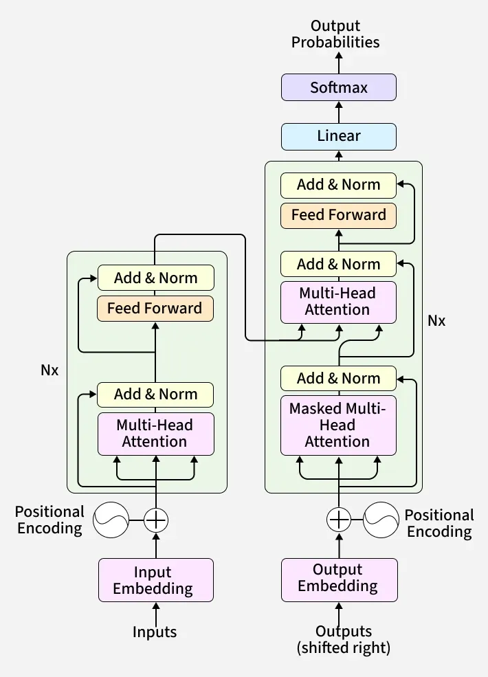

## Transformer Architecture: Encoder-Decoder

> The Encoder-Decoder architecture is the original Transformer design introduced in **"Attention Is All You Need" (2017)**.
>
> It is the foundation of modern sequence-to-sequence models such as:
>
> - Machine Translation
> - Text Summarization
> - Question Answering
> - T5
> - BART
>
> **Core Idea:**  
> The Encoder understands the input sequence, and the Decoder generates the output sequence using that understanding.



## Why Encoder + Decoder?

Suppose we want to translate:

```text
English : I love artificial intelligence
French  : J'aime l'intelligence artificielle
```

We need a system that:

1. Understands the input sentence.
2. Stores its meaning.
3. Generates another sentence in a different language.

This is exactly what the Encoder-Decoder architecture does.

```text
Input Sentence
      │
      ▼
  Encoder
      │
      ▼
Context Representation
      │
      ▼
  Decoder
      │
      ▼
Output Sentence
```

## High-Level Architecture

```text
                INPUT TOKENS
                      │
                      ▼
        ┌─────────────────────────┐
        │        ENCODER          │
        └─────────────────────────┘
                      │
              Context Vectors
                      │
                      ▼
        ┌─────────────────────────┐
        │        DECODER          │
        └─────────────────────────┘
                      │
                Next Token
                      │
                      ▼
              Generated Output
```

## Encoder Responsibilities

The Encoder's job:

> Convert raw tokens into rich contextual representations.

Input:

```text
The cat sat on the mat
```

Output:

```text
[
 Context(The),
 Context(cat),
 Context(sat),
 Context(on),
 Context(the),
 Context(mat)
]
```

Each output vector now contains information about:

- Previous words
- Future words
- Sentence meaning
- Relationships between words


## Decoder Responsibilities

The Decoder's job:

> Generate output tokens one at a time.

Example:

```text
Input:
I love AI

Output Generation:

<J'aime>
<J'aime l'>
<J'aime l'intelligence>
<J'aime l'intelligence artificielle>
```

The Decoder predicts:

```text
Current Token
      │
      ▼
Next Token
```

until:

```text
<END>
```

is generated.


## Complete Data Flow

```text
Input Sentence
      │
      ▼
Tokenization
      │
      ▼
Embeddings
      │
      ▼
Positional Encoding
      │
      ▼
Encoder Stack
      │
      ▼
Encoder Outputs
      │
      ▼
Decoder Stack
      │
      ▼
Linear Layer
      │
      ▼
Softmax
      │
      ▼
Predicted Token
```


## Example Walkthrough

Input:

```text
The cat sat
```

Goal:

```text
Le chat s'est assis
```

### Step 1: Encode

Encoder processes:

```text
The
cat
sat
```

and builds contextual vectors.

```text
E1
E2
E3
```

where:

```text
E1 = meaning(The)
E2 = meaning(cat)
E3 = meaning(sat)
```

These vectors contain sentence-level understanding.


### Step 2: Decoder Starts

Decoder receives:

```text
<START>
```


### Step 3: First Prediction

Decoder predicts:

```text
Le
```


### Step 4: Continue

Input to decoder becomes:

```text
<START> Le
```

Predicts:

```text
chat
```


### Step 5: Continue

```text
<START> Le chat
```

Predicts:

```text
s'est
```


### Step 6: Continue

```text
<START> Le chat s'est
```

Predicts:

```text
assis
```


### Step 7: Stop

Model predicts:

```text
<END>
```

Generation complete.


## Information Flow

### Encoder Side

```text
Token
  │
Embedding
  │
Position
  │
Self Attention
  │
Feed Forward
  │
Output
```

The Encoder can look:

```text
← Past
Current
Future →
```

It sees the entire sentence.


## Decoder Side

```text
Generated Tokens
       │
Masked Attention
       │
Cross Attention
       │
Feed Forward
       │
Prediction
```

The Decoder can only see:

```text
Past Tokens
Current Token
```

It cannot peek into future tokens.

## Why Does Decoder Need Encoder Output?

Consider translation:

```text
English:
The bank is near the river
```

The word:

```text
bank
```

could mean:

- Financial institution
- River side

Only the Encoder understands the full sentence.

The Decoder consults Encoder outputs and learns:

```text
bank = river bank
```

This is achieved using:


### Cross Attention

Decoder asks:

```text
Which input word should I focus on?
```

Example:

```text
Input:
The cat sat

Output:
Le chat ...
```

While generating:

```text
chat
```

the Decoder attends strongly to:

```text
cat
```

inside Encoder outputs.


## Self Attention vs Cross Attention

### Encoder Self Attention

```text
Input Sentence
```

```text
cat ↔ sat
cat ↔ mat
sat ↔ mat
```

Every token attends to every token.


### Decoder Self Attention

```text
Le chat s'est
```

Each token attends only to previous tokens.

```text
Le ← chat ← s'est
```

Future access is blocked.


### Cross Attention

```text
Decoder Token
      │
      ▼
Encoder Outputs
```

Decoder attends to Encoder representations.


## Full Encoder-Decoder Layer

```text
Decoder Layer

Masked Self Attention
          │
          ▼
Cross Attention
          │
          ▼
Feed Forward Network
```

This structure repeats many times.


### Multiple Layers

Original Transformer used:

```text
6 Encoder Layers
6 Decoder Layers
```

Modern models may use:

```text
12
24
48
96+
```

layers.


### Training Process

During training:

Input:

```text
I love AI
```

Target:

```text
J'aime AI
```

Decoder receives:

```text
<START> J'aime
```

and learns to predict:

```text
AI
```

This process is called:

### Teacher Forcing

Because the correct previous token is supplied.


## Inference Process

During generation:

```text
<START>
   ↓
Token 1
   ↓
Token 2
   ↓
Token 3
   ↓
...
```

Each new token becomes input for the next step.


## Architecture Summary Diagram

```text
                    INPUT
                      │
               Token Embedding
                      │
              Positional Encoding
                      │
                      ▼

            ┌─────────────────┐
            │    ENCODER      │
            │ Self Attention  │
            │      FFN        │
            └─────────────────┘
                      │
              Context Memory
                      │

                      ▼

            ┌─────────────────┐
            │    DECODER      │
            │ Masked Attention│
            │ Cross Attention │
            │      FFN        │
            └─────────────────┘
                      │
                 Linear Layer
                      │
                   Softmax
                      │
                  Next Token
```


## Encoder vs Decoder

| Feature | Encoder | Decoder |
|----------|----------|----------|
| Purpose | Understand Input | Generate Output |
| Self Attention | Yes | Yes (Masked) |
| Cross Attention | No | Yes |
| Can See Future Tokens | Yes | No |
| Produces Output Tokens | No | Yes |
| Produces Context Vectors | Yes | No |


## Real-World Models

### Encoder Only

Used for understanding tasks.

Examples:

- BERT
- RoBERTa
- DeBERTa

Tasks:

- Classification
- Search
- Retrieval
- Embeddings


### Decoder Only

Used for generation.

Examples:

- GPT
- LLaMA
- Mistral
- Gemma

Tasks:

- Text Generation
- Chatbots
- Coding


### Encoder-Decoder

Used for sequence-to-sequence problems.

Examples:

- T5
- BART
- FLAN-T5
- Pegasus

Tasks:

- Translation
- Summarization
- Paraphrasing
