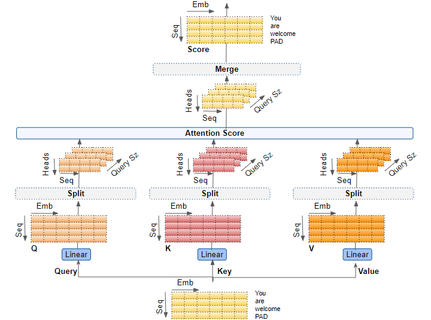

## Multi-head Attention


> Multi-Head Attention (MHA) is one of the most important innovations in the Transformer architecture.
>
> Instead of learning a single relationship between tokens, the model learns multiple relationships simultaneously through multiple attention heads.
>
> This allows the Transformer to capture different patterns, contexts, and dependencies at the same time.



## Why Do We Need Multi-Head Attention?

A single attention mechanism can only focus on one aspect of the input at a time.

Consider:

```text
The animal didn't cross the street because it was too tired.
```

To understand the word:

```text
it
```

the model must learn:

- Pronoun reference
- Grammar relationships
- Contextual meaning
- Long-distance dependencies

A single attention map may struggle to capture all these relationships effectively.

Multi-Head Attention solves this by allowing several attention mechanisms to work in parallel.

---

## Intuition

Think of multiple heads as multiple experts.

```text
Head 1 → Grammar
Head 2 → Subject-Verb Relations
Head 3 → Long-Term Dependencies
Head 4 → Semantic Meaning
Head 5 → Entity Relationships
Head 6 → Context
Head 7 → Position-Based Patterns
Head 8 → Rare Token Dependencies
```

Each head learns a different view of the same sentence.


## High-Level Architecture

```text
Input Embeddings
        │
        ▼
 ┌─────────────┐
 │   Head 1    │
 └─────────────┘

 ┌─────────────┐
 │   Head 2    │
 └─────────────┘

 ┌─────────────┐
 │   Head 3    │
 └─────────────┘

        .
        .
        .

 ┌─────────────┐
 │   Head h    │
 └─────────────┘

        │
        ▼

 Concatenate Heads
        │
        ▼

 Output Projection
        │
        ▼

 Final Output
```


## Attention Refresher

Each attention head performs:

$$
Attention(Q,K,V)
=
softmax\left(
\frac{QK^T}{\sqrt{d_k}}
\right)V
$$

where:

- Q = Query
- K = Key
- V = Value

Output:

```text
Weighted Combination
of Important Tokens
```

Multi-Head Attention simply performs this operation multiple times in parallel.


## Multi-Head Attention Formula

The complete equation:

$$
MultiHead(Q,K,V)
=
Concat(head_1, ..., head_h)W^O
$$

where:

$$
head_i
=
Attention(Q_i,K_i,V_i)
$$

Each head operates on a different projection of the input.


## Input Projection

The input embedding is not directly fed into every head.

Instead, separate weight matrices are learned.

For each head:

$$
Q_i = XW_i^Q
$$

$$
K_i = XW_i^K
$$

$$
V_i = XW_i^V
$$

where:

- $W_i^Q$ = Query matrix
- $W_i^K$ = Key matrix
- $W_i^V$ = Value matrix

These matrices are different for every head.


## Why Use Different Projection Matrices?

Different projection matrices allow each head to learn a different representation.

Example:

```text
Input:
The cat sat on the mat
```

One head might learn:

```text
cat ↔ sat
```

Another head might learn:

```text
cat ↔ mat
```

Another head might learn:

```text
The ↔ cat
```

Every head discovers unique relationships.


## Splitting the Embedding Space

Assume:

```text
Embedding Size = 512
Heads = 8
```

Then:

$$
d_k=\frac{512}{8}=64
$$

Each head receives:

```text
64 dimensions
```

instead of:

```text
512 dimensions
```

This reduces computation while allowing specialization.


## Computational Flow

```text
Input X
  │
  ▼

Linear Projection

  │
  ▼

Q K V

  │
  ▼

Split Into Heads

  │
  ▼

Scaled Dot Product Attention
for Each Head

  │
  ▼

Head Outputs

  │
  ▼

Concatenate

  │
  ▼

Output Projection

  │
  ▼

Final Representation
```


## Detailed Example

Suppose:

```text
Sentence:
The cat sat
```

Input Embedding:

```text
X
```

Generate:

```text
Q1 K1 V1
Q2 K2 V2
Q3 K3 V3
...
Q8 K8 V8
```

Every head computes attention independently.

Results:

```text
Head 1 Output
Head 2 Output
Head 3 Output
...
Head 8 Output
```

Then:

```text
Concatenate
```

into one large vector.

Finally:

```text
Linear Projection
```

produces the final output.


## What Does Each Head Learn?

No one explicitly tells the heads what to learn.

Through training they automatically learn patterns.

Some heads may learn:

```text
Pronoun Resolution
```

Example:

```text
John went home because he was tired.
```

A head learns:

```text
he → John
```

---

Some heads may learn:

```text
Subject-Verb Relationship
```

Example:

```text
Dogs are running.
```

A head learns:

```text
Dogs ↔ are
```

---

Some heads may learn:

```text
Long-Range Context
```

Example:

```text
The book that I bought yesterday is amazing.
```

A head connects:

```text
book ↔ amazing
```

despite large distances.


## Multi-Head Attention Visualization

```text
Token A
   │
   ├────Head 1──► Grammar
   │
   ├────Head 2──► Context
   │
   ├────Head 3──► Meaning
   │
   ├────Head 4──► Position
   │
   └────Head 5──► Long Dependencies
```

All heads operate simultaneously.


## Concatenation

After every head finishes:

```text
Head1 Output
Head2 Output
Head3 Output
...
Headh Output
```

they are joined:

$$
Concat(
head_1,
head_2,
...
head_h
)
$$

Result:

```text
Rich Combined Representation
```

containing information from all heads.


## Output Projection

After concatenation:

$$
Concat(head_1,...,head_h)W^O
$$

where:

$$
W^O
$$

is a learnable matrix.

Purpose:

- Mix information from different heads
- Produce final Transformer representation
- Prepare input for next layer

## Multi-Head Attention Inside the Transformer

Multi-Head Attention is the core building block of Transformer architectures. The same Multi-Head Attention mechanism is used differently in the Encoder and Decoder.

---

### Encoder

Encoder uses:

```text
Multi-Head Self Attention
        │
        ▼
Feed Forward Network
```

In Encoder Self-Attention:

```text
Q = K = V
```

All are generated from the same input sequence.

Example:

```text
The cat sat on the mat
```

Each token can attend to every other token.

```text
The  ↔ cat
The  ↔ sat
The  ↔ mat

cat  ↔ sat
cat  ↔ mat

sat  ↔ mat
```

This allows the Encoder to build contextual understanding of the entire sentence.

Purpose:

- Learn relationships between words.
- Capture context from the whole sequence.
- Understand long-range dependencies.
- Build contextual embeddings.

Output:

```text
Context-Aware Representations
```

Example:

```text
The bank is near the river.
```

The attention mechanism learns:

```text
bank ↔ river
```

allowing the model to infer:

```text
bank = river bank
```

instead of a financial institution.

---

### Decoder

Decoder uses:

```text
Masked Multi-Head Self Attention
               │
               ▼
Multi-Head Cross Attention
               │
               ▼
Feed Forward Network
```

The Decoder generates tokens one by one.

Unlike the Encoder, it must not see future tokens.

---

### Masked Multi-Head Self Attention

Example:

```text
I love AI
```

When predicting:

```text
AI
```

the Decoder can only see:

```text
I
love
```

and not future words.

Visibility:

```text
✓ Previous Tokens
✓ Current Token
✗ Future Tokens
```

This is enforced using a causal mask.

Example mask:

```text
1 0 0 0
1 1 0 0
1 1 1 0
1 1 1 1
```

Meaning:

```text
Token 1 → Can see Token 1

Token 2 → Can see Token 1, Token 2

Token 3 → Can see Token 1, Token 2, Token 3

Token 4 → Can see Token 1, Token 2, Token 3, Token 4
```

Purpose:

- Prevent cheating during training.
- Enable autoregressive generation.
- Support next-token prediction.

---

### Multi-Head Cross Attention

Cross Attention exists only in Encoder-Decoder Transformers.

Examples:

- Transformer (Original)
- T5
- BART
- FLAN-T5

Cross Attention connects:

```text
Decoder
    │
    ▼
Encoder Outputs
```

Here:

```text
Q → Decoder

K → Encoder

V → Encoder
```

Unlike Self-Attention:

```text
Q ≠ K ≠ V
```

because they come from different sources.

---

### Why Cross Attention Is Needed

Suppose we are translating:

```text
English:
The cat sat
```

into:

```text
French:
Le chat s'est assis
```

When generating:

```text
chat
```

the Decoder needs information from:

```text
cat
```

inside the input sentence.

Cross Attention allows the Decoder to ask:

```text
Which input tokens are most relevant
for generating the current output token?
```

and retrieve the correct information.

---

### Encoder Layer Structure

A complete Encoder block:

```text
Input
  │
  ▼

Multi-Head Self Attention
  │
  ▼

Add & Norm
  │
  ▼

Feed Forward Network
  │
  ▼

Add & Norm
```

---

### Decoder Layer Structure

A complete Decoder block:

```text
Input
  │
  ▼

Masked Multi-Head Self Attention
  │
  ▼

Add & Norm
  │
  ▼

Multi-Head Cross Attention
  │
  ▼

Add & Norm
  │
  ▼

Feed Forward Network
  │
  ▼

Add & Norm
```

---

### Encoder vs Decoder Attention

| Feature | Encoder | Decoder |
|----------|----------|----------|
| Self Attention | Yes | Yes |
| Masked Attention | No | Yes |
| Cross Attention | No | Yes |
| Can See Future Tokens | Yes | No |
| Uses Encoder Outputs | No | Yes |
| Main Goal | Understanding | Generation |

---

### Attention Flow

```text
Input Sentence
      │
      ▼

Encoder
(Self-Attention)

      │
      ▼

Context Representation

      │
      ▼

Decoder
(Masked Self-Attention)

      │
      ▼

Cross Attention

      │
      ▼

Next Token Prediction
```

---

### Encoder-Only Models

Use Multi-Head Self-Attention only.

Examples:

```text
BERT
RoBERTa
DeBERTa
```

Purpose:

- Classification
- Search
- Embeddings
- Retrieval

---

### Decoder-Only Models

Use Masked Multi-Head Self-Attention.

Examples:

```text
GPT
LLaMA
Gemma
Mistral
Claude
```

Purpose:

- Text Generation
- Chatbots
- Coding Assistants

---

### Encoder-Decoder Models

Use:

```text
Encoder Self-Attention
+
Decoder Self-Attention
+
Cross Attention
```

Examples:

```text
Transformer
T5
BART
FLAN-T5
```

Purpose:

- Translation
- Summarization
- Question Answering
- Text Transformation

---
