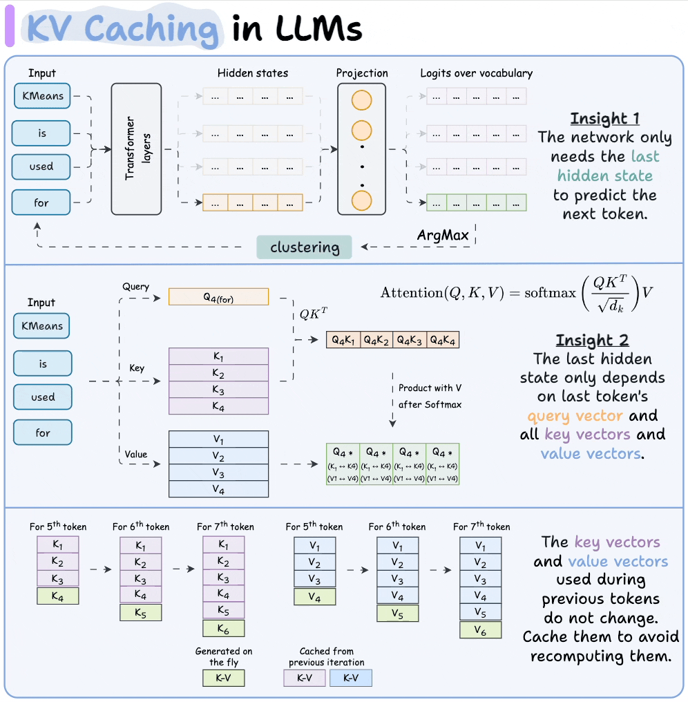
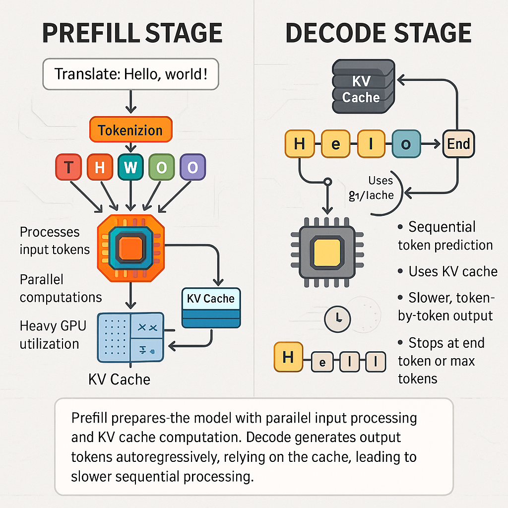
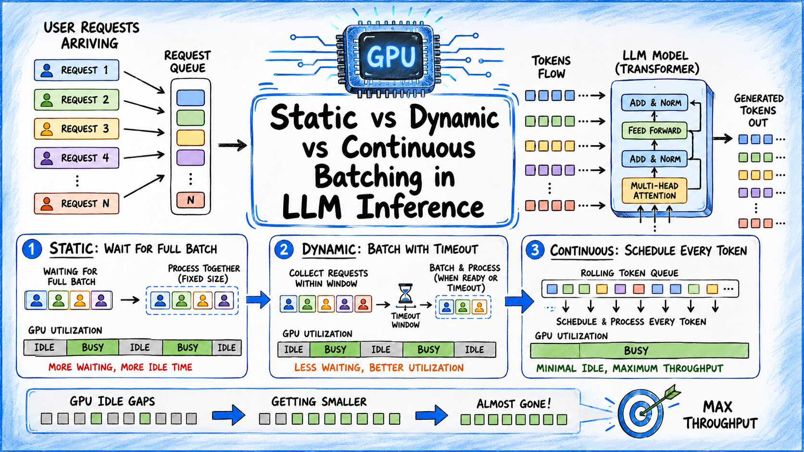

## Transformer Inference

> Training teaches a Transformer how to predict the next token.
>
> Inference is the process of actually generating text using the trained model.

When you ask ChatGPT:

```text
Explain Transformers
```

the model enters inference mode.

The model repeatedly performs:

```text
Input
   ↓
Predict Next Token
   ↓
Append Token
   ↓
Predict Again
```

until generation stops.


## The Inference Pipeline

A modern LLM inference system consists of:

```text
User Prompt
      │
      ▼

Tokenization
      │
      ▼

Prefill Phase
      │
      ▼

KV Cache Creation
      │
      ▼

Decode Phase
      │
      ▼

Token Generation
      │
      ▼

Response
```

Understanding this pipeline is essential for:

```text
ChatGPT
Claude
Gemini
LLaMA
Mistral
DeepSeek
```


## KV Cache

### What Problem Does KV Cache Solve?

During generation, every new token attends to all previous tokens.

Example:

```text
The cat sat on the mat
```

When generating:

```text
mat
```

attention must look at:

```text
The
cat
sat
on
the
```

Without optimization, the model would recompute all previous Keys and Values every time.

This is extremely wasteful.

### Core Idea

Store previously computed:

```text
K = Keys

V = Values
```

inside memory.

Instead of:

```text
Recompute Again
```

we simply:

```text
Reuse Them
```

This stored information is called:

```text
KV Cache
```


### Intuition

Without KV Cache:

```text
Token 1 → Compute

Token 2 → Recompute Token 1

Token 3 → Recompute Tokens 1,2

Token 4 → Recompute Tokens 1,2,3
```

Huge waste.

---

With KV Cache:

```text
Token 1 → Store KV

Token 2 → Reuse Token 1 KV

Token 3 → Reuse Token 1,2 KV

Token 4 → Reuse Token 1,2,3 KV
```

Only the newest token must be processed.

---

### Visualization

Without Cache:

```text
Prompt
   │
   ▼
Attention Over Entire History
Again
And Again
And Again
```

---

With Cache:

```text
Old K,V
Stored

+
New Token

=
Next Prediction
```

---

### Why KV Cache Is Important

Without KV Cache:

```text
Generation becomes extremely slow.
```

With KV Cache:

```text
Massive speed improvement.
```

Modern LLM inference would be impractical without it.

---
### What Is Stored?

For every Transformer layer:

```text
K Matrix

V Matrix
```

Example:

```text
Layer 1 KV

Layer 2 KV

Layer 3 KV

...
Layer N KV
```

All are stored in GPU memory.

---

### Cost of KV Cache

KV Cache saves compute but uses memory.

Longer conversations require larger caches.

Example:

```text
100 Tokens
→ Small Cache

10,000 Tokens
→ Large Cache

100,000 Tokens
→ Very Large Cache
```

Thus:

```text
Context Length
=
Memory Cost
```


## Prefill Phase

### What Is Prefill?

Prefill is the first stage of inference.

The prompt is processed all at once.

Example:

```text
Explain how transformers work.
```

Tokens:

```text
Explain
how
transformers
work
.
```

The model processes the entire prompt simultaneously.

---

### Purpose

During prefill the model:

```text
Builds Attention States

Creates KV Cache

Understands Context
```

---

### Visualization

```text
Prompt

      │

      ▼

Tokenization

      │

      ▼

Forward Pass

      │

      ▼

KV Cache Created
```

### Characteristics

#### Highly Parallel

All prompt tokens are processed together.

```text
GPU Friendly
```

---

#### Compute Intensive

Large prompts require substantial computation.

Example:

```text
100 Tokens
```

is easy.

```text
100,000 Tokens
```

is expensive.

---

#### Done Once

Prefill occurs only once per request.


## Decode Phase

### What Is Decode?

After prefill:

```text
KV Cache Exists
```

Now the model starts generating.

This stage is called:

```text
Decode
```

---

## Example

Prompt:

```text
What is AI?
```

Model predicts:

```text
Artificial
```

Next:

```text
Artificial Intelligence
```

Next:

```text
Artificial Intelligence is
```

and so on.

---

### Process

For every new token:

```text
New Token
   │
   ▼

Use Existing KV Cache

   │
   ▼

Compute Attention

   │
   ▼

Generate Next Token
```

---

### Why Decode Is Different

During prefill:

```text
Many tokens processed simultaneously.
```

During decode:

```text
One token generated at a time.
```

Generation becomes inherently sequential.

---

### Visualization

```text
Prompt
      │
      ▼

Prefill
      │
      ▼

Decode Token 1
      │

Decode Token 2
      │

Decode Token 3
      │

Decode Token 4
```

---

### Bottleneck

Most inference latency comes from:

```text
Decode Phase
```

because generation cannot be fully parallelized.


## Batching

### What Is Batching?

Instead of serving one user:

```text
User A
```

the GPU serves multiple users together.

Example:

```text
User A

User B

User C

User D
```

processed simultaneously.

---

### Why Batching Matters

GPUs work best when fully utilized.

Without batching:

```text
GPU Mostly Idle
```

With batching:

```text
GPU Fully Utilized
```

---

### Visualization

Without batching:

```text
GPU
 │
 └── User A
```

---

With batching:

```text
GPU
 ├── User A
 ├── User B
 ├── User C
 └── User D
```

---

### Continuous Batching

Modern inference engines use:

```text
Continuous Batching
```

New requests can join already running batches.

This improves:

```text
Throughput
GPU Utilization
Cost Efficiency
```

---

### Engines Using Continuous Batching

```text
vLLM
TensorRT-LLM
TGI
SGLang
```

## Memory Management

### Why Memory Matters

Modern LLMs are huge.

Example:

```text
7B Parameters

70B Parameters

400B+ Parameters
```

Memory becomes a primary challenge.

---

### Memory Components

#### Model Weights

Store:

```text
Neural Network Parameters
```

---

#### KV Cache

Store:

```text
Keys
Values
```

for each token.

---

#### Activations

Temporary tensors used during inference.

---

#### Batch Storage

Multiple users increase memory usage.

---

### Memory Breakdown

```text
Total GPU Memory

      │

      ├── Model Weights

      ├── KV Cache

      ├── Activations

      └── Runtime Buffers
```


## Why Long Contexts Are Expensive

Consider:

```text
1,000 Tokens
```

Small KV Cache.

Now:

```text
100,000 Tokens
```

Huge KV Cache.

The model weights stay the same.

The KV Cache grows dramatically.

## Common Optimization Techniques

### Quantization

Store weights using:

```text
INT8

INT4

FP8
```

instead of:

```text
FP16
```

Reduces memory consumption.

---

### KV Cache Quantization

Compress cache memory.

Example:

```text
FP16 KV Cache

→

INT8 KV Cache
```

---

### Paged Attention

Store KV Cache efficiently using memory paging.

Used by:

```text
vLLM
```

---

### Offloading

Move unused cache to:

```text
CPU RAM
```

when GPU memory becomes limited.


## End-to-End Inference Flow

```text
User Prompt
      │
      ▼

Tokenization
      │
      ▼

Prefill
(Process Entire Prompt)
      │
      ▼

KV Cache Creation
      │
      ▼

Decode
(Generate One Token At A Time)
      │
      ▼

Batching
(Multiple Users Together)
      │
      ▼

Memory Management
      │
      ▼

Final Response
```

---

## Real-World Stack

Modern LLM serving systems:

```text
LLaMA
Mistral
Gemma
DeepSeek
Qwen
Claude
GPT
```

typically rely on:

```text
KV Cache
+
Continuous Batching
+
Paged Attention
+
FlashAttention
+
Quantization
```

to achieve fast and cost-efficient inference.
